# Technical Report: what AION-1 learned about galaxies, measured

Three reading rules. First, every quantitative claim is tagged **[measured]** (a number an artifact contains) or **[interpreted]** (our reading of it); the overview and per-part summary paragraphs restate numbers that are tagged and sourced in their home sections and carry no tags of their own. Second, every numbered section ends with an **Artifacts** line naming the script, the results file, and the figure behind it, so any number can be traced in one step. Third, corrected results are presented in their corrected form only; Appendix A lists every correction, what the earlier value was, and what caught it. Numbers in this report were re-read from the artifacts on 2026-07-09, after a full adversarial review and correction pass of all Phase 1 and Track code, and then machine-audited against those artifacts.

Contents:
1. Overview
2. Data
3. The model and the embeddings
4. Shared methods and statistics
5. Phase 1: the geometry of the embedding (5.1 to 5.10)
6. Track A: orientation angles live on closed loops
7. Track B: the Hubble tuning fork
8. Track C: redshift translation, property angles, and the age-metallicity degeneracy
9. Track D: sparse-autoencoder dictionaries and reducibility
10. Findings index (every claim, its numbers, its artifact)

- Appendix A: corrections ledger. 
- Appendix B: glossary. 
- Appendix C: artifact index. 
- Appendix D: environment and compute.

---

## 1. Overview

AION-1 is a multimodal foundation model for astronomy (Polymathic AI). It compresses a galaxy's image, photometry, and catalog numbers into a single embedding vector. Its authors state that the embedding "organizes objects along physically meaningful directions" but did not measure its geometry. We did, in two stages.

Phase 1 measured the global geometry of the embedding for 48,398 galaxies: its effective dimension, its metric behavior, its topology, its curvature, how well physics can be read out of it, and what concepts a sparse autoencoder finds in it. Tracks A to D then asked four sharper questions on the same frozen embeddings: whether angles that wrap around are stored as closed loops (A), whether galaxy morphology forms the classic tuning-fork shape (B), whether the redshift direction behaves like a translation and whether the model inherits the age-metallicity degeneracy (C), and whether the sparse-autoencoder dictionary contains irreducibly two-dimensional features (D).

The single strongest result is Track A. AION-1 stores galaxy orientation as a closed mod-180 loop readable to about 2 degrees, and when we physically rotate or mirror the input images and re-encode them, the readout follows the applied transformation with slope -0.999 and degree-level errors: the full O(2) symmetry group, verified by intervention. The weakest results are also stated plainly: global loop topology (H1) is unresolved and metric-dependent, curvature has no metric-stable sign, and stellar age is barely readable from images at all (R² = 0.07), which is itself a finding about what photometry can know.

## 2. Data

Everything in this section sits on local disk and was re-verified against the files on 2026-07-09 (row counts, shapes, and ranges recomputed, not quoted from notes).

### 2.1 Imaging and the anchor sample

The imaging comes from the DESI Legacy Imaging Surveys. The southern sky was imaged by DECam on the 4-m Blanco telescope at CTIO (the DECaLS and DES programs); the northern sky by the 90Prime camera on the 2.3-m Bok telescope (BASS, g and r bands) and the Mosaic-3 camera on the 4-m Mayall telescope (MzLS, z band). Pixel scale is 0.262 arcsec per pixel. Each galaxy is a 96 x 96 pixel cutout in the four bands g, r, i, z, so the field of view is 25.15 arcsec. Fluxes are in nanomaggies with zeropoint 22.5 (the AION-1 convention).

The parent catalog is Galaxy Zoo DESI (GZD-8): 8,689,370 galaxies selected from Legacy Surveys DR8 as extended, r < 19.0, surface brightness mu > 18 mag/arcsec², non-PSF sources (Walmsley et al. 2023, selection chain verified against the paper). From the parent we drew 50,000 galaxies with 0 < z < 1 and valid coordinates, seeded at 0 (`buildSample.py`; a plain seeded draw, not stratified). Cutouts were fetched from the DR10 cutout service; 48,398 of 50,000 (96.8%) returned complete images, and those 48,398 are the anchor for every measurement in this report. All 48,398 `dr8_id` values are unique, and the embedding, image, and label arrays share one row order through `ok_index.npy`. [measured]

The anchor's sky split matters because the two hemispheres are different instruments: 35,919 galaxies are south (DECam, the AION-1 training domain), 12,371 are north (BASS/MzLS), and 108 have no DR10 counterpart within 1.44 arcsec (left unmatched). The i band is missing for every northern galaxy (BASS/MzLS has no i) and for 24.5% of southern ones (8,812 by the depth flag); missing i appears as an all-zero image channel, which is exactly how the model saw it. Counted directly in the image array: 21,029 of 48,398 frames (43.5%) have an all-zero i channel, against 3 all-zero g frames as a control, so the blankness is specifically i-band coverage, not a fetch artifact. [measured]

### 2.2 Redshifts, resolutions, and observing conditions

Anchor redshifts run from 0.0011 to 0.688 with median 0.174. They are mostly photometric: 48,340 galaxies carry a photo-z and only 6,699 have a spectroscopic z. Photo-z quality, measured on 6,693 galaxies with both: normalized bias about zero (-1e-4), scatter sigma_NMAD = 0.0115, and 0.075% outliers beyond |dz|/(1+z) = 0.15. This is the standing caveat on every redshift label in the report. [measured]

Image resolution and depth per galaxy come from the DR10 tractor catalog (48,290 of 48,398 matched, median separation 0.011 arcsec): r-band seeing (psfsize_r) spans 1.06 / 1.38 / 2.17 arcsec at the 1st / 50th / 99th percentile; 5-sigma r-band point-source depth spans 23.36 / 24.24 / 25.87 mag; Galactic extinction E(B-V) spans 0.008 / 0.031 / 0.148. These covariates later turn out to be readable from the embedding itself (Section 6.6), so they double as the instrument-confound inventory. [measured]

### 2.3 Labels

| Label set | Source | Coverage of 48,398 |
|---|---|---|
| Morphology vote fractions (smooth, featured, spiral, strong/weak bar, merger, edge-on) | Galaxy Zoo DESI CNN, volunteer-calibrated | full |
| g, r, z magnitudes; colors g-r, r-z | Legacy Surveys DR8 catalog | full (3 bad-mag rows) |
| redshift (photo-z dominated) | GZ DESI external catalog | 48,340 photo / 6,699 spec |
| stellar mass log M* (elpetro), sSFR, Sersic n | NSA / SDSS crossmatch | 3,728 / 4,473 / 3,730 |
| Position angle, ellipticity, inclination | DR10 tractor shape fit (e1, e2, r) | 48,290; 15,893 with ellip > 0.3 |
| Stellar age + metallicity (joint) | SDSS DR16 eBOSS Firefly VAC (full-spectrum fitting, Chabrier IMF, MILES) | 5,512 |
| Stellar age (at scale) | DESI DR1 FastSpecFit iron v3.0 | 13,044 (metallicity column exists but is unpopulated, verified all-zero) |
| WISE W1-W2 color, Stern-wedge AGN proxy | WISE via tractor | 47,566 finite; 357 AGN candidates |

The sSFR count of 4,473 excludes 287 sentinel values at or below -90 that had contaminated one Phase 1 probe (Appendix A). Position angle is derived from the tractor ellipticity components: PA = 0.5 atan2(e2, e1) mod 180 degrees; it is only defined for elongated galaxies, and the working cut ellip > 0.3 keeps 15,893. Firefly ages span 0.03 to 15.0 Gyr (the tail above the age of the universe is direct evidence the labels carry noise) and metallicities 0.008 to 2.0 solar. Catalog labels are measured references with their own errors, not exact truth; the exact interventions in this report are the image transformations, which we control. [measured]

### 2.4 Spectra and the faint extension (in hand, not yet embedded)

Two datasets were acquired for the planned next experiments and are described here because Matt asked what data we hold. Neither has been through the model yet.

Spectra: 20,986 optical spectra covering 17,643 anchor galaxies (36%), retrieved through SPARCL. By release: DESI-DR1 13,915 (DESI spectrograph, 4-m Mayall), SDSS-DR17 4,724 and BOSS-DR17 1,501 (2.5-m Sloan telescope), DESI-EDR 846. 3,079 galaxies have two or more spectra, and 2,381 have spectra from two different instruments. The stored grids are the surveys' native ones: DESI spectra are linear at 0.8 Angstrom steps over 3600 to 9824 Angstrom (7,781 samples each); SDSS and BOSS keep their log-spaced grids (steps 0.82 to 2.40 Angstrom, with BOSS reaching 3546 to 10416 Angstrom), so per-spectrum length varies from 3,834 to 7,781 samples. Spectral resolution is the instruments' native R of a few thousand; we store the calibrated flux, wavelength, and inverse variance as delivered. [measured]

Faint extension: 150,000 galaxies at r = 19 to 21 from DR10-South (random_id draw; r percentiles 19.06 / 20.42 / 20.99), with catalog shapes and 136,407 good cutouts (90.9% fetch yield). Plus 7,061 FastSpecFit ages on this sample. [measured]

### 2.5 The model shelf

Eight representations are local and verified for the planned model-grid comparison: aion-base (768-d), aion-large (1024-d, the model under study), aion-xlarge, AstroCLIP, Stein MoCo-v2 (authenticated ResNet-50 checkpoint, 3-band), Zoobot convnext-nano, DINOv2-base, and a pixel-PCA floor that needs no weights. Only aion-large and aion-base have embedded the anchor so far. [measured]

**Artifacts:** `code/buildSample.py`, `code/anchor/fetch*.py`, `data/` inventory; verification rerun 2026-07-09 (runLog).

## 3. The model and the embeddings

AION-1 (large) is a transformer encoder-decoder trained by multimodal masked modeling over Legacy Surveys images, photometry, catalog scalars, and spectra. Each input modality passes through a codec that turns it into tokens; the encoder mixes them; we take the encoder output. The public weights are frozen throughout; we never fine-tune.

The embedding recipe, identical everywhere: tokenize with `CodecManager.encode`, run `model.encode(tokens, num_encoder_tokens=600)`, and average over the output tokens (mean pooling). A 96 x 96 four-band image becomes 576 tokens, so 600 keeps every image token. One documented deviation: AION-1 was pretrained with a 256-token input budget, so running 600 tokens at inference is a train/test shift the API permits but the paper does not characterize; results should be read as properties of this documented recipe. Mean pooling is our choice as well; the paper's attentive pooling is a learned layer that would need its own training target. [interpreted]

Two embedding spaces are used, and the distinction carries the leakage logic of the whole report:

**E_img** (48,398 x 1024): image tokens only. Nothing but pixels goes in, so any physics read out of E_img was learned from the image. This is the leakage-free probe space and the default for Tracks A to D.

**E_full** (48,398 x 1024): image plus scalar g, r, z fluxes (converted from magnitudes as flux = 10^((22.5 - m)/2.5) nanomaggies) plus the catalog redshift token. E_full is NOT image plus spectra, and it also does not include the i-band scalar flux or WISE, so it is a reduced version of the paper's full input set. Probing E_full for redshift or color partly reads back its own inputs; we use it for exactly that ablation (Section 5.5) and for the SAE substrate.

Both arrays are float32 with no NaN or infinity. Norms concentrate near a shell (mean |x| about 48 to 50 with 5% spread), but per-dimension standard deviations vary by a factor of 23, so every analysis first z-scores each dimension: x_d -> (x_d - mean_d) / std_d. Without this, a handful of dimensions would dominate every distance. [measured]

Embedding compute: the anchor was embedded once on an NVIDIA L40S (both spaces, 2,181 s, about 22 galaxies/s). Re-encoding for the causal tests runs locally on an RTX 5070 Ti Laptop GPU at about 17 images/s with batch size 32; aion-base runs at about 40 images/s. [measured]

**Artifacts:** `code/embed.py`, `data/E_img.npy`, `data/E_full.npy`, `data/ok_index.npy`; sanity numbers in `results/sanity.json`.

## 4. Shared methods and statistics

Four tools appear in almost every section. Their math is given once here.

**Preprocessing.** Every analysis starts from the z-scored embedding: each of the 1024 dimensions has its mean subtracted and is divided by its standard deviation. Section 3 gives the reason (a 23x spread in per-dimension scales).

**Linear probes.** A probe asks how much of a label y a linear map can read out of the embedding X. We fit ridge regression, which minimizes ||y - Xw||^2 + alpha ||w||^2, with alpha chosen by cross-validation over the grid 10^-2 to 10^4 (7 logarithmic steps). The fit uses a random 80% of the galaxies (seed 0); the score is R^2 = 1 - sum(y - y_hat)^2 / sum(y - y_bar)^2 on the held-out 20%. Confidence intervals come from bootstrap resamples of the held-out predictions (2.5th and 97.5th percentiles; 1,000 resamples in the Phase 1 probes, 200 in the Track machinery). These intervals capture test-set sampling only, not the variation from refitting or resplitting; we state this because it makes them somewhat narrow. R^2 near 1 means the label is linearly readable; 0 means not at all.

**Concept directions and angles.** A concept direction is the unit-normalized coefficient vector of a ridge fit (fixed alpha = 100) predicting one label. The angle between two concepts a and b is arccos(a . b). For context we also compute arccos(corr(y_a, y_b)), the angle the two labels' own correlation would suggest. We call the difference the "excess" and use it as a descriptive contrast only: the equality between probe angle and label correlation holds in an idealized whitened linear model, and our space is not whitened (the covariance is strongly anisotropic and ridge shrinkage rotates directions). A large positive excess suggests the model separates two concepts more than their labels force, but it is not a calibrated hypothesis test. Each direction is fit on its own natural population (this matters when one label covers 48k galaxies and the other 3k; Appendix A records the bug this rule fixed). Angle intervals are reported in two bootstrap forms: percentile, and "basic" (2p - hi, 2p - lo). Refitting directions on bootstrap samples adds noise that biases angles toward 90 degrees, and the basic interval undoes that to first order; where the two forms disagree, we say so.

**Circular statistics.** A quantity that wraps (position angle repeats every 180 degrees) cannot be regressed directly, because 179 and 1 are neighbors. We regress the doubled angle instead: two probes predict cos 2theta and sin 2theta, and the readout is theta_hat = 0.5 atan2(sin_hat, cos_hat). Errors are circular: wrap the difference into (-90, 90] and take the absolute value. A random guesser has median error 45 degrees on the mod-180 scale (90 degrees for a full-circle quantity like RA). We also report the fraction of galaxies within 20 degrees.

Controls follow one policy: every headline result is shown next to the null or control that could kill it (shuffled labels, matched random directions, energy-matched random feature sets, or paired samples), and scanning families (the SAE dictionary, the Track D census) use false-discovery-rate control (Benjamini-Hochberg over features, after Bonferroni over labels within each feature) rather than raw thresholds.

**Artifacts:** `code/analysis/trackUtils.py`, `code/analysis/common.py` (GPU kNN), per-section scripts below.

## 5. Phase 1: the geometry of the embedding

Ten measurements, run on the full 48,398 wherever the algorithm allows and on stated subsamples where it does not. Phase 1 code went through a full estimator-correction pass on 2026-07-09; the numbers below are the corrected ones (Appendix A maps old to new).

### 5.1 Sanity and linear structure

Both embeddings are clean: no NaN or infinity anywhere. Vector norms sit near a shell (E_full mean 48.37, standard deviation 2.52; E_img 49.58 and 2.46), so plain and L2-normalized analyses would behave similarly. Per-dimension scales are not uniform: standard deviations run from 0.129 to 2.93 (a factor of 23), which is what forces the z-scoring. [measured]

Linear dimension gives the first size estimate. The PCA participation ratio, defined as PR = (sum of eigenvalues)^2 / sum of squared eigenvalues, counts how many principal components effectively carry the variance: 7.4 for raw E_full and 8.2 for raw E_img, rising to 11.2 and 11.9 after z-scoring. Half the variance lives in the first 3 components, 90% in 25, and 99% needs 143 (E_full) or 137 (E_img). The cumulative variance curve is a linear-spread diagnostic, and its tail is noise-sensitive; it does not by itself prove nonlinearity. [measured]

**Artifacts:** `code/analysis/sanity.py`, `results/sanity.json`; figures `figures/17_pca_variance.png`, `figures/18_manifold_galaxy_montage.png` (an illustrative, label-assisted montage, as its caption states).

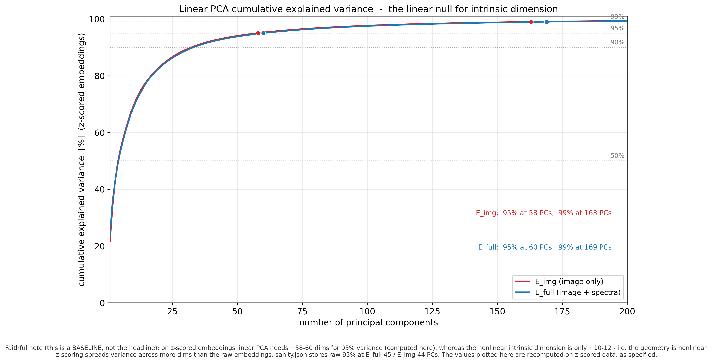
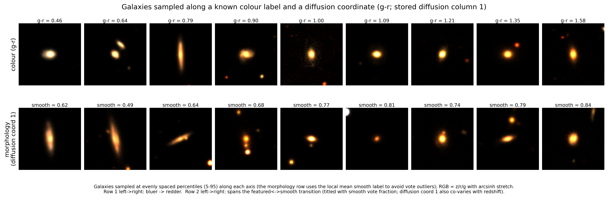

### 5.2 Which distance to trust: the metric diagnostic

High-dimensional distances can "concentrate": all pairs become nearly equidistant, and then nearest neighbors mean little. Before using any distance we measured concentration for five metrics on a fixed 2,000-galaxy subsample (seed 0, k = 15 graphs): plain Euclidean, cosine (1 - cosine similarity), Isomap (shortest path through the kNN graph), Fermat with p = 2 (shortest path with edge lengths squared, which favors dense regions), and diffusion distance (distance between eigenvalue-scaled spectral coordinates of the symmetrically normalized kernel; same spectrum as the random-walk operator).

Four statistics per metric, all over the off-diagonal pairwise distances: RDR = (max - min)/min, the relative distance range; NN/mean, the mean first-neighbor distance divided by the mean pairwise distance (closer to 1 = more concentrated); the coefficient of variation (std/mean); and the 95th/5th percentile ratio. [measured]

| metric (E_full) | RDR | NN/mean | CV | p95/p5 |
|---|---|---|---|---|
| Euclidean | 14.7 | 0.400 | 0.297 | 3.17 |
| cosine | 76.8 | 0.166 | 0.353 | 4.07 |
| Isomap | 42.1 | 0.166 | 0.421 | 5.04 |
| Fermat p=2 | 281.0 | 0.140 | 0.515 | 9.77 |
| diffusion | 95.0 | 0.223 | 0.264 | 2.35 |

E_img behaves the same (Euclidean NN/mean 0.398, Fermat RDR 259). Fermat spreads distances the most on all four statistics. Euclidean is the most concentrated on the two neighbor-facing statistics (RDR and NN/mean), while diffusion is actually the most concentrated on the two bulk-spread statistics (CV and p95/p5). That motivated the working assignment: Fermat for topology, diffusion for coordinates, Euclidean as the control. One honest limit: spread is not the same as semantic quality, and Section 7.5 shows a case where an intrinsic-metric proxy does not beat Euclidean at a local task. [interpreted]

**Artifacts:** `code/analysis/metric.py`, `results/metric.json`, `figures/03_metric_concentration.png`.

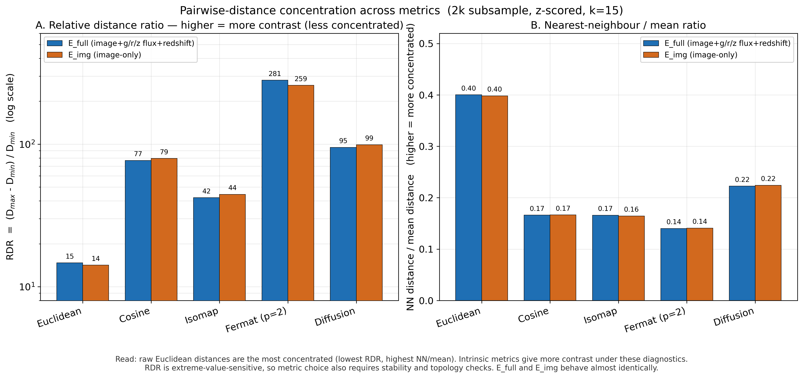

### 5.3 Intrinsic dimension

The intrinsic dimension (ID) is the number of degrees of freedom the data actually uses, as opposed to the 1024 it is stored in. No single estimator is trustworthy alone, so we run four with different assumptions and require agreement.

TwoNN uses only each point's first and second neighbor: for a locally uniform d-dimensional cloud the ratio mu = r2/r1 satisfies P(mu > x) = x^(-d), so d comes from a maximum-likelihood fit, d = (N-1) / sum(log mu_i) (the rare pairs with r2 = r1, where the log vanishes, are dropped before the sum). Gride generalizes this to neighbor pairs (n, 2n) at growing n: with mu_n = r_2n / r_n, the estimate per scale is d = (psi(2n) - psi(n)) / mean(log mu_n), where psi is the digamma function. The Levina-Bickel local MLE gives each galaxy the estimate m_i = (K - 2) / sum_{j=1}^{K-1} log(d_K / d_j) from its K nearest neighbors, combined across galaxies by the harmonic mean and swept over K. The PCA participation ratio (Section 5.1) is the linear reference. All neighbor searches run on the GPU over the full 48,398.

The estimators were certified first on synthetic clouds of the same size: a 5-d sphere came back 4.96, a 2-d Swiss roll 1.95, a 5-d linear subspace 5.08, and a two-blob control 212 (TwoNN reads blob width there, as expected). PCA-PR read 6.0 on the curved sphere and 3.0 on the Swiss roll, so it is a linear-spread measure, not a manifold-ID estimator, and we use it only as the linear reference. [measured]

On AION-1 the small-scale estimates are inflated by noise (TwoNN 16.56 for E_full, CI 16.43 to 16.70; E_img 16.05) and fall with scale: Gride reaches 10.10 (CI 10.08 to 10.13) at its largest tested scale n = 256 for E_full and 9.89 for E_img; the local MLE reaches 11.40 (CI 11.37 to 11.43) at K = 226 and 11.16 for E_img; z-scored PCA-PR sits at 11.2 and 11.9. Both curves are still declining at their endpoints, so the honest statement is: **ID is about 10 to 11.4 at the largest tested scales, not a proven plateau.** The intervals are conditional bootstraps on the fixed neighbor graph (they do not refit neighbors) and understate total uncertainty. Either way the embedding uses roughly one hundredth of its 1024 dimensions, and the nonlinear estimates land close to the linear PCA-PR, an early sign that large-scale curvature is weak. [measured; wording interpreted]

**Artifacts:** `code/analysis/intrinsicDim.py` + `synthetic.py`, `results/intrinsicDim.json`, figures 01, 02.

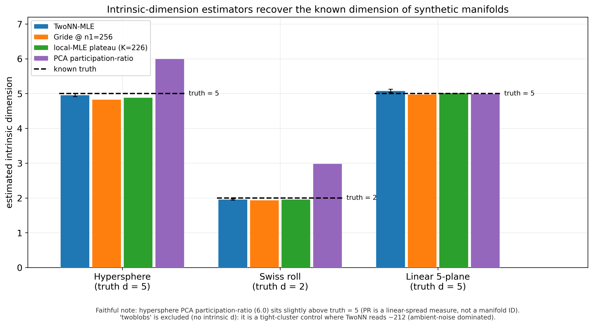
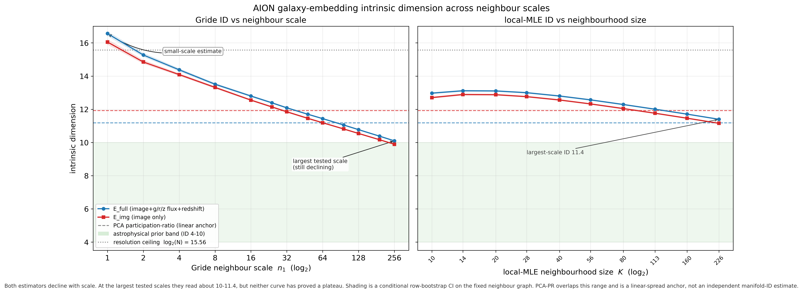

### 5.4 Diffusion map

A diffusion map builds a random walk on the kNN graph and uses the walk operator's slowest eigenvectors as coordinates; nearby coordinates mean "easy to diffuse between", which makes it a good global picture of a manifold. We use the alpha = 1 (Laplace-Beltrami) normalization, which removes the effect of uneven sampling density, with a self-tuning bandwidth: the kernel is W_ij = exp(-d_ij^2 / (sigma_i sigma_j)) with sigma_i the distance to point i's 7th neighbor. The coordinates are the operator's right eigenvectors scaled by their eigenvalues (diffusion time t = 1). A single global bandwidth had failed outright (it fragmented the graph; Appendix A), and a connected-components check is now part of the script.

The k = 64 graph is a single connected component for both embeddings, and stays connected at k = 32, 48, and 96. The spectrum decays smoothly (E_full eigenvalues 1, 0.9989, 0.9772, 0.9607, 0.9598, ...); the largest nontrivial gap is small and sits after mode 1 for E_full (0.022) but after mode 5 for E_img (0.028), and both grow mildly with k. Because the two embeddings disagree on the gap location and harmonics are present (regressing each coordinate on polynomials of the first three explains R^2 = 0.90 and 0.94 for E_full coordinates 4 and 5), we read the spectrum as descriptive: **a smooth continuum with no dominant cluster gap, not a spectral dimension estimate.** The leading nontrivial eigenvalue near 1 (0.9989) was checked directly: its coordinate's participation ratio is 45,374 of 48,398 galaxies (93.8%, recomputed 2026-07-09 from the saved coordinates), so it is a genuine slow global gradient, not an outlier mode. [measured]

The physics content of the coordinates is what the figures show: coordinate 1 tracks morphology and redshift, coordinate 2 tracks color and star formation, and the sparse labels (mass, sSFR) paint smoothly across the same plane. [measured]

**Artifacts:** `code/analysis/diffusionMap.py`, `results/diffusionMap.json`, `results/diffcoords_*.npy`; figures 04, 05, 06.

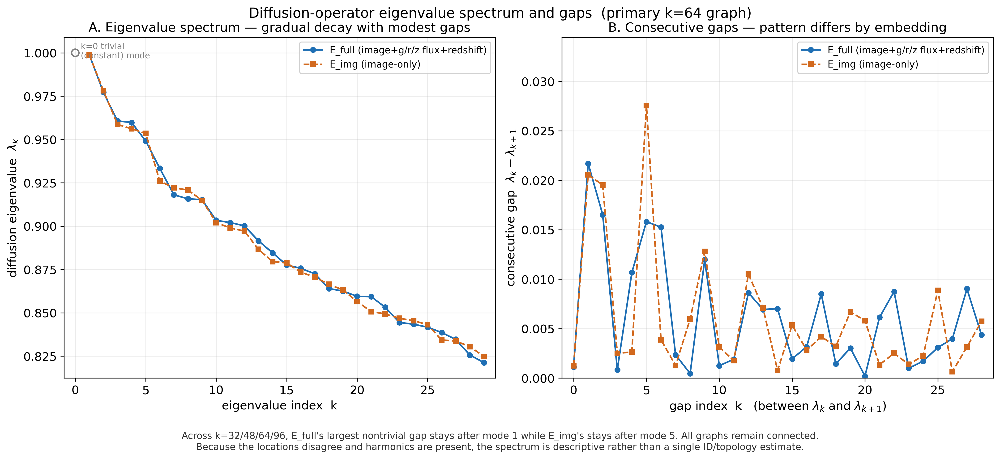
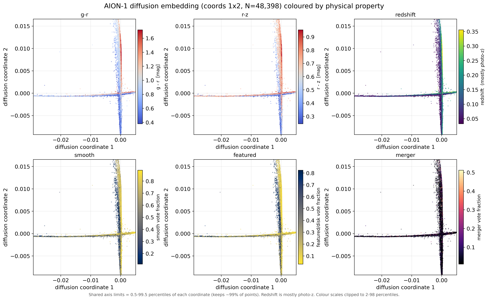
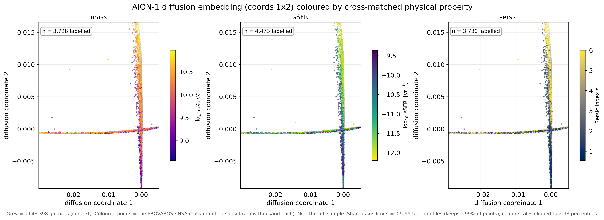

### 5.5 Decodability and disentanglement

This is the direct test of "physically meaningful directions". All headline probes run on E_img, the image-only space, so nothing can leak from the inputs.

From pixels alone [measured; R^2 held-out; n from Section 2.3 where sparse]:

| label | E_img R^2 | 95% CI |
|---|---|---|
| g-r color | 0.958 | [0.957, 0.960] |
| r-z color | 0.911 | [0.903, 0.918] |
| redshift | 0.800 | [0.792, 0.809] |
| featured fraction | 0.794 | [0.783, 0.804] |
| smooth fraction | 0.792 | [0.782, 0.802] |
| merger fraction | 0.681 | [0.658, 0.702] |
| stellar mass (n=3,728) | 0.721 | [0.659, 0.772] |
| sSFR (n=4,473) | 0.761 | [0.726, 0.790] |
| Sersic n (n=3,730) | 0.664 | [0.608, 0.713] |
| bar, branch (n=3,034) | 0.554 | [0.476, 0.625] |
| spiral, branch (n=3,034) | 0.252 | [0.153, 0.334] |

Mass and sSFR are not model inputs in any space, so reading them at 0.72 and 0.76 from images alone is the cleanest evidence that AION-1 learned galaxy physics rather than memorizing its inputs. The redshift number carries a caveat: the label is mostly photo-z, which is itself color-derived, so image-to-redshift partly rides through image-to-color. The modality ablation confirms the leakage logic: on E_full, which ingests fluxes and redshift, redshift probes at 0.976 and sSFR at 0.781; the E_img numbers are the honest ones. [measured; last sentence interpreted]

Direction angles (E_img, descriptive contrast per Section 4): the redshift and smooth directions sit at 93.0 degrees against a label contrast of 73.7 (excess +19.3); redshift against r-z, excess +18.5; redshift against g-r, excess +13.1; merger pairs sit near zero (-2.0 against redshift). The model separates concepts at least as much as their labels require. A model-free check agrees (run on E_full, the one part of this section not on the image-only space): among 20 nearest neighbors with confident labels, a confidently smooth galaxy's neighbors are 99.1% smooth (n = 34,289, mean 18.0 usable neighbors); confidently featured, 71.4% (n = 2,224, mean 10.4 usable). This is purity among confidently labelled neighbors, not raw purity. [measured]

**Artifacts:** `code/analysis/probes.py`, `results/probes.json`; figures 07, 08, 09, 10.

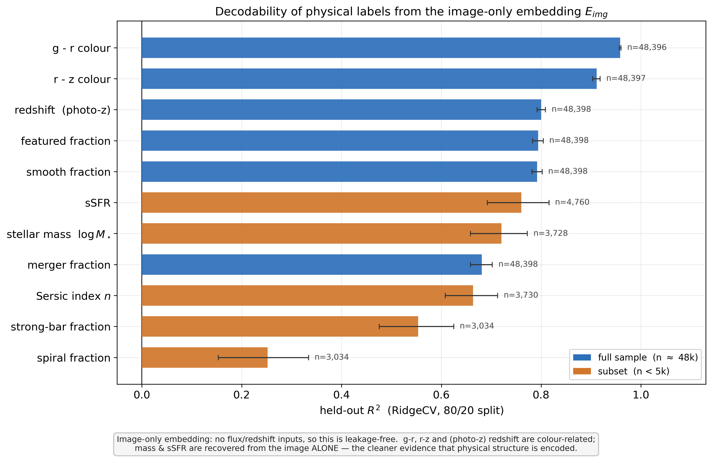
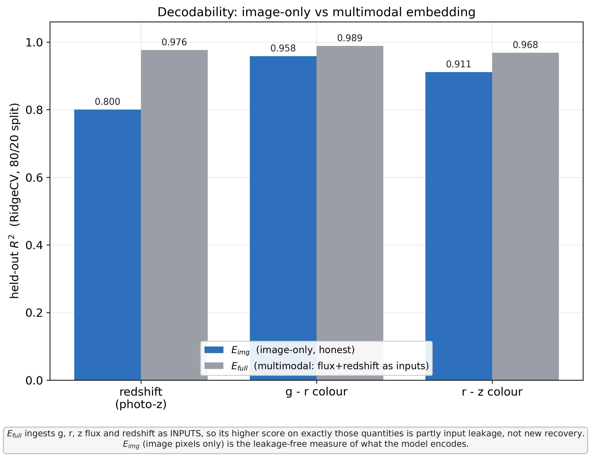
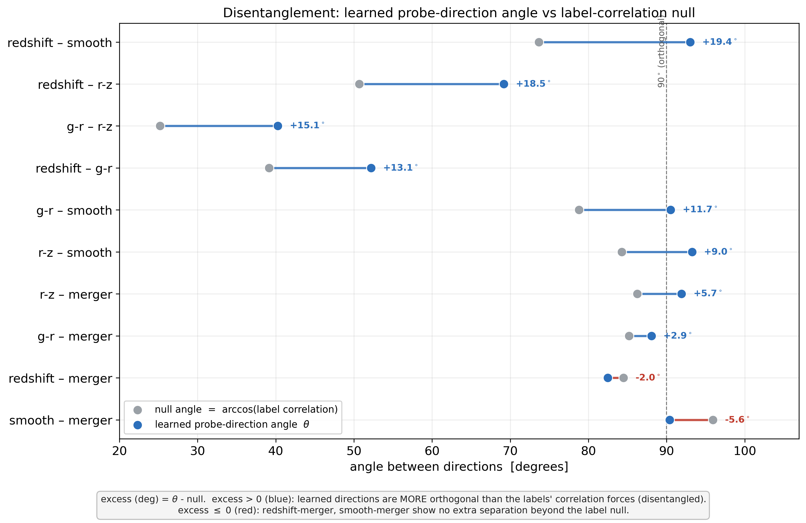
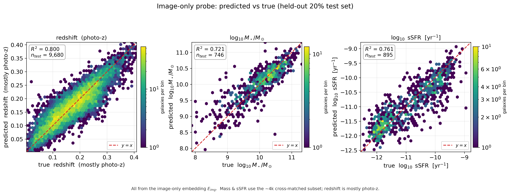

### 5.6 Curvature

Three measures, each with a control, and the summary is deliberately modest.

Delta-hyperbolicity measures how tree-like a metric space is: for each set of four points, sort the three pairwise-sum combinations and take half the gap between the two largest; an exact tree gives delta = 0. We sample one million quadruples and normalize by the diameter (estimated from 100,000 random pairs; exact for the tree control). The validation uses exact binary-tree path distances and returns exactly 0.0. AION-1: E_full Euclidean median 0.0136, E_img 0.0138, against a matched-covariance Gaussian cloud at 0.0177. True cosine distance gives 0.0410 (an earlier chord-distance implementation had reported 0.0273; Appendix A). So the embedding is about 24% more tree-like than a random Gaussian cloud, and far from an actual tree. [measured]

Ollivier-Ricci curvature compares the transport cost between neighboring points' neighborhoods to their distance: kappa(u, v) = 1 - W1(mu_u, mu_v) / d(u, v), where mu_u keeps half the mass on u (alpha = 0.5) and spreads the rest uniformly over its k neighbors, and W1 is the exact earth-mover distance. Positive values mean overlapping, dense neighborhoods. On one seeded 2,000-galaxy E_full sample: the Euclidean kNN graph has mean +0.155 with 4.2% negative edges at k = 10, stable across k = 8/10/15 (means 0.159 / 0.155 / 0.155; negative fractions 5.0% / 4.2% / 2.8%). But the same 2,000 points under the Fermat p = 2 metric (the k = 15 shortest-path graph of Section 5.2, edge lengths squared, then the same k = 10 transport) give mean +0.023 with 41.8% negative edges. **Curvature sign is metric-dependent; the "mostly positively curved" statement holds for the Euclidean graph only and is not a manifold-wide claim.** This is sensitivity on one sample, not a population interval. Forman-Ricci curvature is a purely combinatorial variant: for an edge (u, v) of the symmetrized, binarized k = 15 graph it is F(u, v) = 4 - deg(u) - deg(v) + 3 t(u, v), where t(u, v) is the number of triangles through the edge (the triangle-augmented form). It is structurally negative on kNN graphs (99.7% negative here, computed on the full 48,398-node graph rather than the 2,000-point transport sample) and is kept as a summary-statistic control only, never as a sign indicator. [measured; bolded sentence interpreted]

**Artifacts:** `code/analysis/curvature.py`, `results/curvature.json`, `figures/14_curvature.png`.

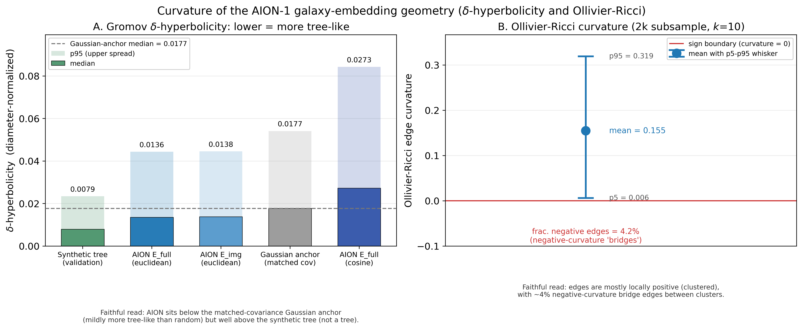

### 5.7 Sparse-autoencoder concepts

A sparse autoencoder (SAE) learns an overcomplete dictionary: it reconstructs the embedding as a sum of a few dictionary directions, and the hope is that individual directions align with concepts. Architecture: TopK with k = 32 active latents per galaxy, dictionary size m = 4 x 1024 = 4096 (R = 4; an R = 8 variant is trained as a check), an auxiliary loss that revives dead latents (a latent counts as dead after 12 steps without firing; the loss reconstructs the residual from up to 512 such latents, weight 1/32), Adam at 1e-3, batch 8192, 80 stochastic epochs on z-scored E_full. Health: the fraction of variance unexplained, FVU = sum over galaxies of ||x - x_hat||^2 divided by sum of ||x - x_bar||^2, sits at 0.035 to 0.036 across five seeds with 65 to 71% of latents alive; the R = 8 variant reaches the same FVU with about 34% alive. The sparsity frontier (k = 4 to 128, ten points) runs from FVU 0.141 down to 0.015; k = 32 is the operating point. [measured]

Concept scoring, corrected on 2026-07-09: each feature's activation is rank-correlated (tie-aware Spearman rho, meaning average ranks for ties, the valid choice for zero-inflated activations) against six labels (redshift, g-r, r-z, smooth, featured, merger). Each correlation is turned into a p-value through the Spearman t-statistic t = |rho| sqrt((n-2)/(1-rho^2)) on n-2 degrees of freedom; the per-feature p-value keeps the smallest across the six labels and multiplies by six (Bonferroni), and Benjamini-Hochberg then holds the false-discovery rate at q <= 0.05 across the 2,648 active features. Results: **1,686 features are FDR-aligned to a physical label** (523 of them with |rho| > 0.1; the maximum alignment is 0.41), and **380 are both aligned and seed-stable** (each one's decoder direction has an absolute cosine >= 0.6 to some feature in at least half of the four other seeds). Named by their top label: redshift 382 (104 stable), g-r 379 (71), featured 267 (63), smooth 228 (50), r-z 224 (44), merger 206 (48). Redshift spreads over many weak features rather than one strong one (top alignment 0.31, against 0.41 for r-z). [measured]

The earlier claim of "roughly 59 alien features" is retired. Under correct tie handling almost all of those features turn out to be label-aligned, and only **3 stable features remain unexplained** by the six labels (novelty > 0.7, where novelty = 1 - R^2 of the ordinary-least-squares fit of the feature's activation on the six z-scored labels: the fraction of its activation variance the labels cannot account for). They are descriptive candidates with no confirmatory p-value. Alignment is correlational throughout; the removal tests live in Track D. [measured; last sentence the caveat]

**Artifacts:** `code/analysis/sae.py`, `results/sae.json` + `sae_*.npy`; figures 11, 12, 13.

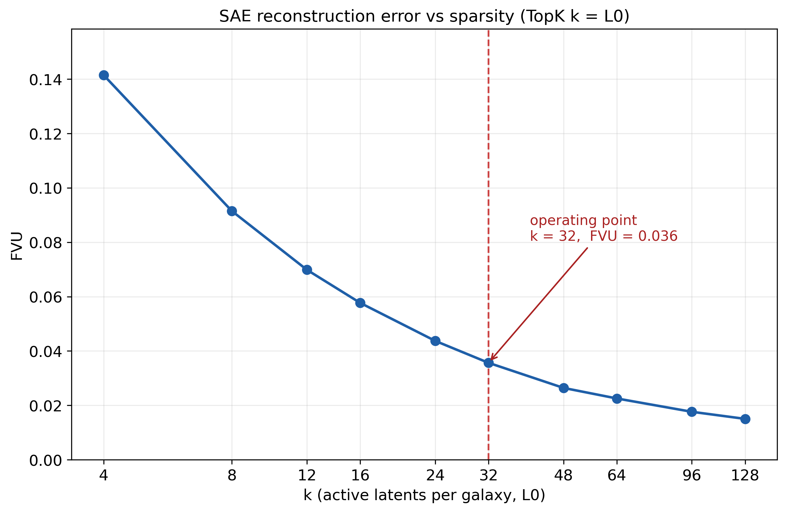
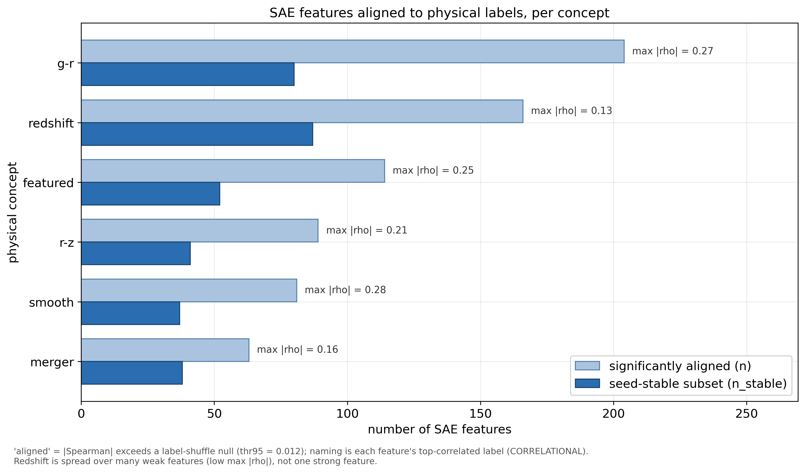
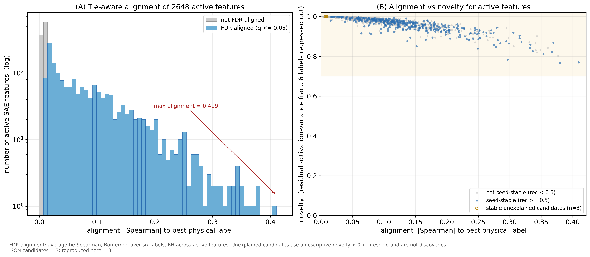

### 5.8 Topology: connectivity and loops

Two questions: does the embedding fall apart into pieces (Betti number b0), and does it contain loops (b1)?

Connectivity is answered on the full 48,398, with a stated estimator: the symmetric 15-NN graph is one connected component, and cutting the largest edges of its minimum spanning tree peels off single outliers (splits of sizes [48397, 1], then [48396, 1, 1]), never a balanced two-cluster split. The graph stays connected at k = 10, 15, and 20. This is a connectivity-and-split diagnostic, not an exact persistent-homology computation of b0 (a sparse-graph MST is not provably the full Euclidean MST); the practical conclusion is that red and blue galaxies form one connected gradient, not two islands. [measured; interpretation bounded]

Loops are harder, because persistent homology at n = 48,398 is not computable; we use ten paired 2,000-galaxy subsamples (the same galaxies under every metric) and compute H1 persistence diagrams (H1 is first homology, whose rank is b1, the loop count) under Euclidean, Fermat, and the alpha = 1 self-tuned diffusion metric (the same Laplace-Beltrami normalization and 7th-neighbor bandwidth as Section 5.4, built here on the shared k = 15 subsample graph and using its full set of nontrivial diffusion coordinates rather than the leading ten, so the three metrics are compared on identical neighborhoods). Each subsample's distance matrix is divided by its own diameter before persistence, so a bar's lifetime (death minus birth) is a fraction of that diameter; we count how many of the ten subsamples contain any H1 bar longer than a descriptive 0.1 line. Euclidean exceeds it in 1 of 10 subsamples (longest bar 0.105), Fermat in 5 of 10 (0.183), diffusion in 10 of 10 (0.197). **Global H1 is unresolved and metric-dependent at this sample size.** The earlier "b1 = 0" claim rested on unpaired subsamples, an inconsistent diffusion construction, and a bootstrap band that was not a calibrated confidence set; all three were fixed, and the claim did not survive (Appendix A). Note the tension resolved in Section 6: a thin loop confined to a low-variance subspace is exactly what this global test cannot see, and a supervised probe then finds one. [measured; bolded sentence the finding]

**Artifacts:** `code/analysis/topology.py`, `code/analysis/persistence.py`, `results/topology.json`, `results/persistence.json`; figures 15, 19.

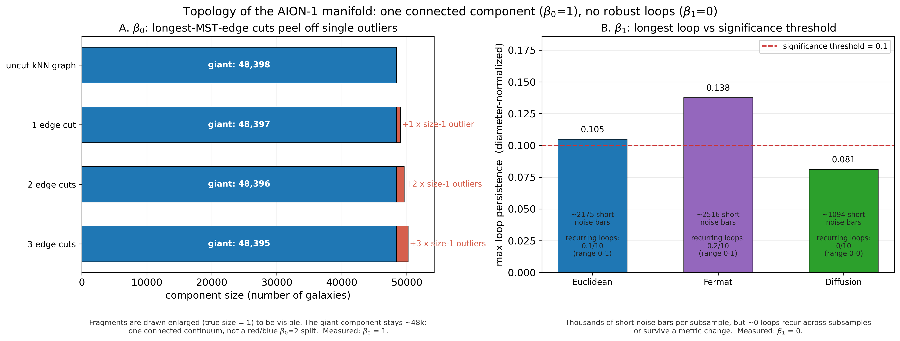
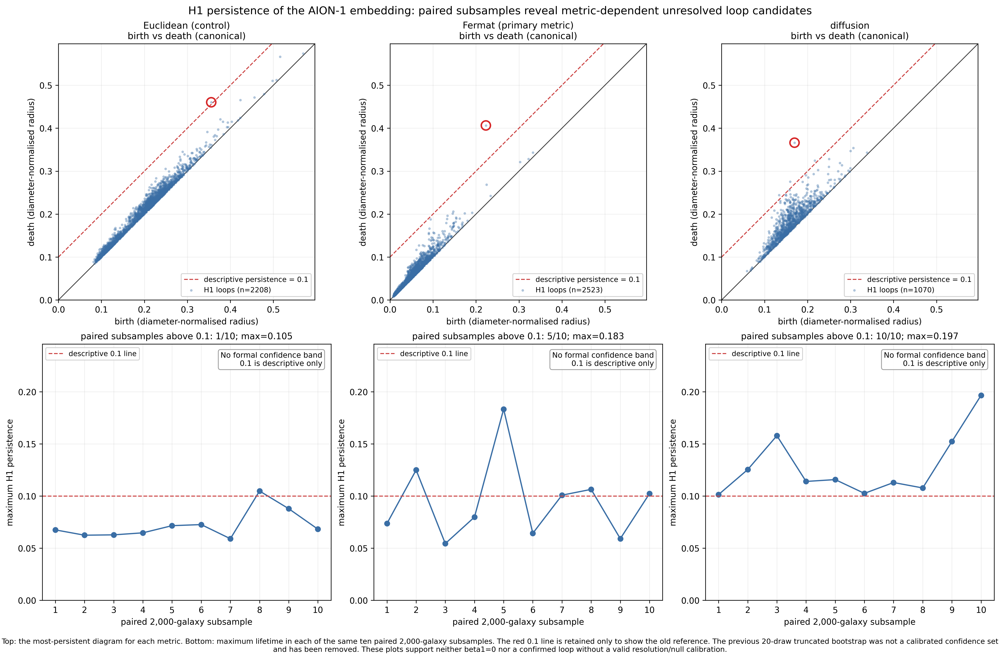

### 5.9 Stratified intrinsic dimension

Do different galaxy populations use different numbers of degrees of freedom? A two-component Gaussian mixture on g-r color splits the anchor at its posterior decision boundary of 1.025 into 25,782 star-forming (blue) and 22,614 passive (red) galaxies. TwoNN per population: passive 17.19, star-forming 15.53, difference **Delta-ID = 1.66 with CI [1.38, 1.96], excluding zero**. The absolute values are small-scale and noise-inflated (Section 5.3); the relative difference is the signal. The interval is a conditional bootstrap of the neighbor ratios (no GMM refit, no neighbor recompute), so it is narrower than the full uncertainty. Passive galaxies occupy a slightly higher-dimensional region. [measured; last sentence interpreted]

**Artifacts:** `code/analysis/stratifiedId.py`, `results/stratifiedId.json`, `figures/16_stratified_id.png`.

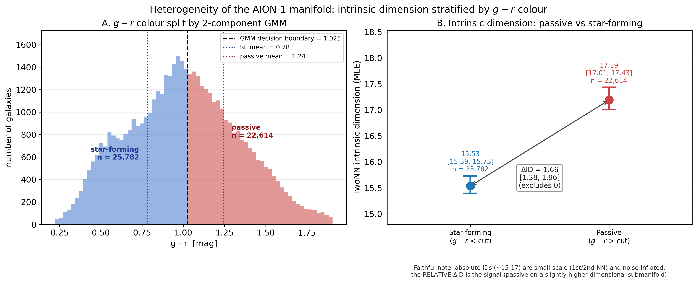

### 5.10 Geometry of concepts (exploratory null)

Inspired by Park et al.'s hierarchy result for language models, we asked whether the "spiral" concept decomposes as the "featured" direction plus an orthogonal spiral-specific part. This is a project-specific analogue (whitened class-mean contrasts on a pooled encoder embedding), not an implementation of their theorem, which is defined under a causal inner product and left open for internal layers. The construction: whiten the z-scored E_full by W = Z C^(-1/2) (C the covariance), then form each concept as a unit class-mean contrast, the normalized difference of whitened means between the positive and negative galaxies. The parent axis is featured-minus-smooth; the child axis is spiral-minus-(featured-but-not-spiral). Parent-alignment is the absolute cosine between the two, |v_parent . v_child| = 0.072, against a size-matched random-subset null (200 random spiral-sized subsets drawn within the featured population) whose 95th percentile is 0.084. Not above the null. No linear featured-to-spiral hierarchy is detected, and we report that as an honest exploratory null. [measured]

**Artifacts:** `code/analysis/geometryOfConcepts.py`, `results/geometryOfConcepts.json`.

### Phase 1 in one paragraph

The embedding is clean, low-dimensional (about 10 to 11.4 effective dimensions at the largest tested scales), and forms one connected continuum with no hard cluster split. Physics reads out of the image-only space strongly, including quantities the model never saw as inputs, and concept directions separate at least as much as their labels force. Curvature and global loop structure are metric-dependent and not settled. A corrected sparse-autoencoder census finds physics-aligned structure across most of the active dictionary, and almost nothing stable that the labels cannot explain. What Phase 1 could not see, by construction, is thin structure confined to low-variance subspaces. That is where the tracks begin.

## 6. Track A: orientation angles live on closed loops

A galaxy's position angle (PA) is the sky direction of its long axis. It has an unusual shape as a quantity: it wraps at 180 degrees, because a galaxy rotated by half a turn looks the same. The faithful geometric home for such a quantity is a closed loop (formally the projective line RP1), not a number line. Track A asks whether AION-1 stores PA that way, and then tests it by physically transforming the input images. All Track A work uses E_img (image-only, so the shape catalog never enters the embedding) and the 15,893 elongated galaxies with ellipticity above 0.3, since PA is undefined for round objects. The truth label is the tractor shape fit: PA = 0.5 atan2(e2, e1).

### 6.1 The loop, and what fails to see it

The doubled-angle probe (Section 4) recovers PA on held-out galaxies with a median circular error of **2.03 degrees** (CI [1.95, 2.10]), 99.7% of galaxies within 20 degrees, and R^2 = 0.97 / 0.97 on the cos 2theta and sin 2theta components. E_full replicates at 2.15 degrees. Chance is 45 degrees. [measured]

Three controls say what this is not. Shuffled PA labels give 44.1 degrees (the machinery finds nothing when there is nothing, and calibrates chance). The top two principal components give 43.2 degrees: the loop is invisible to the dominant variance directions, which is why Phase 1's global topology scan (Section 5.8) could never have found it. A plain linear probe on raw PA reaches R^2 = 0.77, good but visibly hurt at the wrap, which is the point of the doubled angle. A quality cut on shape measurement (ellipSnr > 5) excludes zero of the 15,893, so it is recorded as vacuous rather than as extra evidence. [measured]

Recovery sharpens as the axis becomes better defined: median error 4.9 degrees at ellipticity 0.10 to 0.25 (below the working cut), 2.8 at 0.25 to 0.40, 2.0 at 0.40 to 0.55, 1.4 at 0.55 to 0.70, and 1.8 in the small most-elongated bin (n = 686). [measured]

Inclination, the tilt of a disk toward the line of sight, is bounded rather than wrapping, and behaves accordingly: a plain scalar probe reads it at R^2 = 0.845 (CI [0.830, 0.858]) from the axis ratio, 0.849 for the axis ratio itself, and 0.889 for the edge-on vote fraction. Periodic quantity, loop; bounded quantity, line. [measured]

### 6.2 Invariance across brightness and morphology

Two ways to ask whether the loop is one shared structure rather than something refit per galaxy type. Refitting a probe inside each stratum measures within-stratum decodability: errors 2.0 to 2.3 degrees across r-band brightness tertiles and 2.1 / 2.5 degrees for smooth / featured, loop radius 0.99 everywhere. (The loop radius is the median distance of the predicted (cos 2theta, sin 2theta) point from the origin; 1.0 means predictions land exactly on the unit circle, so a value near 0.99 says the readout uses the full loop rather than collapsing toward its center.) The stronger, leakage-free test holds ONE probe fixed (fit on the global training split) and evaluates each stratum's held-out galaxies only: bright / mid / faint errors 2.05 / 1.93 / 2.06 degrees with loop radii 0.988 / 0.995 / 0.982, and smooth / featured 1.97 / 2.47 degrees with radii 0.984 / 0.960 (featured is a small stratum, n = 176 held-out). One coordinate system serves every stratum. [measured]

### 6.3 The causal test I: rotate the galaxy, the readout follows

Decoding alone cannot show the model uses this coordinate the way physics does; for that we intervene on the input. The probe is fit once on the real, unrotated embeddings. Then every one of the 15,893 cutouts is physically rotated by a known angle (30, 60, 90, 120, 150, 180 degrees; bilinear interpolation; 95,358 re-encodings through the frozen encoder), and the fixed probe reads the new embeddings.

Sign bookkeeping, verified separately before the run: scipy's rotate(+phi) shifts the array-frame angle by -phi, and the catalog PA is same-handed with the array frame, so a physical rotation by +phi must move the readout by -phi. The measured shift tracks the applied rotation with **slope -0.999** (intercept -0.01 degrees, largest deviation of a median from the fitted line 0.05 degrees; on held-out galaxies only, slope -0.999, intercept +0.04, largest deviation 0.07). Per-galaxy circular errors against the expected shift are 2.4 to 2.7 degrees at each of the five angles from 30 to 150 (held-out: 2.57 to 2.76), the same size as the baseline readout noise; 180 degrees is even cleaner, below. [measured]

Two angles deserve their own sentences. At 90 degrees, +90 and -90 are the same point on a mod-180 loop, so a signed median is ill-defined there (it lands at -50.6 all-population and -78.6 held-out, both meaningless); the per-galaxy circular error at 90 degrees is 2.44 degrees, as clean as every other angle, and 90 is excluded from the slope fit for exactly this reason. At 180 degrees the rotation maps the galaxy onto itself, and the readout returns to -0.01 degrees (error 1.94): the mod-180 symmetry demonstrated by intervention rather than assumed. [measured]

The all-population summaries include the probe's own training rows; the held-out fields quoted in parentheses are the leakage-free versions, and they agree. [measured]

### 6.4 The causal test II: mirror flip and composition close O(2)

The symmetries of an angle on the sky form the group O(2): rotations plus reflections. Rotation is covered above; the mirror flip covers reflection, and it is the cleanest intervention available because flipping an image left-right is an exact pixel permutation, with no interpolation at all. Geometry fixed before running: a flip maps theta to -theta (mod 180), so the readout must go to -PA, galaxies at PA 0 or 90 should not move (fixed points), and galaxies at 45 or 135 should move the most.

Measured: flipped readout versus -PA truth, **1.99 degrees** median error, indistinguishable from the 2.03-degree unflipped baseline, so reflection costs the readout nothing; versus the negated unflipped readout, 2.38 degrees (CI [2.34, 2.43]), which is two stacked readout noises. Regressing each galaxy's recovered displacement on the predicted -2 theta gives slope 0.983 (the ideal is 1.0; n = 14,088 after excluding galaxies whose predicted shift exceeds the 80-degree mark, and the mild attenuation below 1 is wrap fold-back near +/-90). Fixed-point galaxies move a median 6.0 degrees where the law inside the 5-degree selection window itself predicts about 5; antinode galaxies move 83.9 degrees, expecting about 85 within the window. The residual frame offset comes out at -0.09 degrees, meaning the catalog-to-array angle convention is 90 degrees to better than a tenth of a degree, measured as a by-product. Held-out only: 2.50 / 1.96 degrees, displacement slope 0.975. [measured]

Composition: flip then rotate by 30 degrees should send the readout to -PA - 30, and does: 2.01 degrees against that truth, and 2.59 degrees (CI [2.54, 2.63]; held-out 2.73) against the composed prediction built from the unflipped readout itself. With rotations, reflection, the 180-degree fixed point, and one composition verified by input-space intervention, **the full O(2) group action on the internal angle coordinate is confirmed on AION-large**. [measured; bolded sentence the conclusion]

### 6.5 The same angle from a different modality, and RA/Dec through the native codecs

AION-1 also accepts the catalog shape triple (e1, e2, r) as its own input modality, separate from pixels. Feeding the anchor's shape values through that codec gives a second embedding, E_shape, and the same doubled-angle probe on it reads PA at 2.83 degrees (CI [2.72, 2.96]). Compared directly on the same held-out galaxies (n = 3,179), the image readout and the shape readout agree to **3.55 degrees** (CI [3.41, 3.72]). One caution stated in the artifact itself: these are two separately trained probes, so the agreement shows both modalities decode PA consistently, not that the two raw modalities occupy one shared plane in the embedding. [measured]

Sky coordinates run through AION's native Ra and Dec codecs (scalar catalog tokens, all 48,398 galaxies). RA genuinely wraps at 0/360 and comes back as a full-circle loop: median error 2.9 degrees, R^2 = 0.99 / 0.98 on cos RA and sin RA. Dec is bounded and reads as a plain scalar at R^2 = 0.99. A deliberately wrong circular treatment of Dec also scores well (1.7 degrees), but Dec has no wrap seam for a linear encoding to fail at, so that control is underpowered by design and we do not claim Dec is stored as a loop. These are codec-geometry results (the coordinate goes in and comes back out), weaker in kind than the image-learned PA loop, and they are labeled that way wherever cited. [measured; last sentence the qualifier]

### 6.6 Can you find the loop without the labels, and the sky-position leak

Unsupervised discoverability: scanning all 1,225 pairs among the top 50 principal components, the best pair (PCs 10 and 15) reaches ring R^2 = 0.41, against 0.97 for the supervised probe, and that scan itself uses the PA labels to pick the winner, so 0.41 is an optimistic bound. The Phase 1 SAE dictionary brushes the loop without isolating it: best single-feature correlation 0.50, with 15 of 4,096 features above 0.3. The loop is real, low-variance, and must be looked for; passive methods recover only part of it. [measured]

The negative control that became a finding: RA decodes weakly from the image embedding (R^2 = 0.41 and 0.17 for its cosine and sine), which should be impossible from a north-up cutout unless the sky position leaks through something visible. Partialling out the observing-condition covariates (extinction, depth, seeing) -- residualizing each RA component on the covariates by ridge regression and then re-probing that residual from E_img -- drops the R^2 by 42% and 52% (the drop is 1 minus residual R^2 over the original), and a residual signal survives (0.24 / 0.08). The drop numbers compare R^2 on targets with different variances, so they are a crude measure, not a mediation fraction (the artifact says the same). Read: part of the leak is observing conditions imprinted on the pixels, and the rest is plausibly sky-correlated galaxy-population structure; either way it is indirect. The side-finding matters on its own: the observing conditions themselves are strongly readable from E_img (seeing R^2 = 0.69, depth 0.44, extinction 0.30), a quantified instrument confound that any survey-to-survey comparison with this model has to manage. The PA loop is untouched by all of this (its shuffle control passed). [measured; reading interpreted]

**Artifacts:** `code/analysis/trackA.py`, `trackA_causal.py`, `trackA_flip.py`, `trackA_crossmodal.py`, `trackA_radec.py`, `trackA_unsupervised.py`, `trackA_ra.py`; `results/trackA*.json`; figures below.

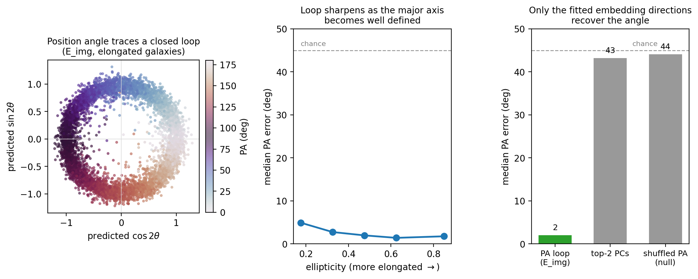
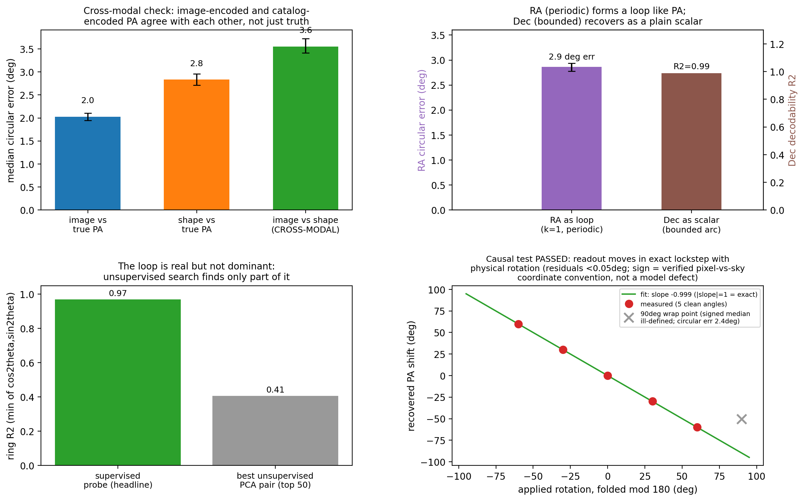
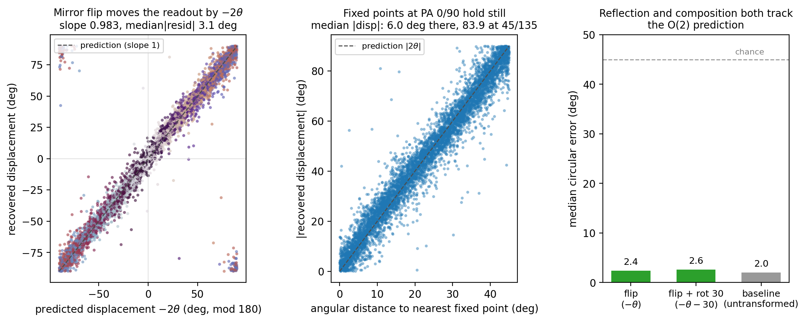

## 7. Track B: the Hubble tuning fork

Hubble's classic diagram arranges galaxies along a handle of ellipticals that forks into disk branches, with bars as a separate property of disks. Track B asks whether that shape exists inside E_img. The working populations: all 48,398 galaxies for the main sequence; the "branch" population of clearly featured, not edge-on galaxies (featured fraction > 0.5, edge-on < 0.5; 3,555 galaxies, 3,034 with finite bar and spiral votes) for bar and spiral structure, since those labels only exist there.

### 7.1 The handle: a validated, monotonic sequence

A ridge direction fit on the featured fraction defines the sequence axis. Its projection correlates +0.89 with featured, -0.87 with smooth, and -0.32 with Sersic concentration, and the rank (Spearman) correlations are nearly the same (+0.87 / -0.81 / -0.30), so the ordering is monotonic, not just linearly correlated: the axis genuinely runs from ellipticals to disks and tracks an independent concentration measure with the expected sign. Decodability of the ingredients: featured 0.794 (CI [0.783, 0.802]), edge-on 0.889, Sersic 0.664, bar 0.554 (CI [0.483, 0.624]), spiral 0.252 (CI [0.146, 0.336]). Spiral-arm structure is the weakest morphology signal in the embedding, and every spiral number downstream inherits that. [measured]

### 7.2 The bar is its own axis

In 1,024 dimensions two random directions sit near 90 degrees (measured here: median 89.9, 5th to 95th percentile 87.4 to 92.9), so a raw angle near 90 means little; the informative quantity is the comparison with the angle the labels' own correlation would force (Section 4's descriptive contrast). The bar direction stands at 86.6 degrees from the sequence against a label contrast of 74.6: an excess of **+11.9 degrees** (percentile CI [9.6, 15.1], basic CI [8.7, 14.3]; both exclude zero). The spiral direction shows excess +27.5 (this pair is the bootstrap-bias case Section 4 warns about: its raw embed angle, 79.45 degrees, falls below its own percentile interval [79.55, 84.47], so the basic intervals are the quotable ones here; excess basic [22.1, 28.0]). Bar and spiral sit at 86.3 degrees from each other, slightly MORE aligned than their labels predict (excess -5.2, significant under both constructions): two nearly independent axes, not one. [measured]

The sequence axis is not perfectly clean: its excess against redshift is -20.9 (CI [-22.7, -19.1]), meaning it is more entangled with redshift than the label correlation forces. Higher-redshift disks are harder to resolve, so some of the "sequence" is plausibly resolution and selection; we carry this as a standing caveat on reading it as pure Hubble type. [measured; reading interpreted]

### 7.3 The fork opens

The claim "the fork opens at the disks" becomes measurable as: the spread of galaxies along the bar direction should grow when moving from confident ellipticals to confident disks. It does, from 0.48 to 0.82, a ratio of **1.70** (34,289 ellipticals, 1,820 disks). Two defenses make this non-circular. Directions refit on shuffled bar votes never fan (five seeds: ratios 0.70 to 0.93). Directions fit on half the branch and evaluated only on held-out disks still fan (1.53 to 1.79, mean 1.65). The fan is bar-specific: the spiral direction does not open (ratio 0.76). So the fork is a soft branching where a bar degree of freedom activates in the disk regime, not a discrete split. [measured; last sentence interpreted]

### 7.4 The handle bends

Walking along the sequence in ten quantile bins and connecting the bin centroids gives a path 1.248 times longer than the straight chord (1.220 after correcting each segment's squared length by subtracting the sampling-noise power of its two endpoint centroids, floored at zero; the chord itself is left uncorrected). A matched null answers what a genuinely straight sequence would show with our exact centroid spacings and noise: 1.038 with spread 0.001 over 20 draws. The sequence is genuinely curved, about 20% excess path. The null's spread covers only those noise draws (not direction-fit or binning choices), so we state the gap qualitatively rather than as a sigma count. [measured; last sentence the limit]

### 7.5 What the fork is not, and two honest negatives

Dimensionality: after removing the sequence direction from the disk population, the residual's top two principal components carry 26.3% and 22.3% of the variance, with a steep drop after (next three: 6.7, 5.0, 4.1%). That is consistent with a low-dimensional branch but does not establish two-dimensionality, and the spectrum comes with a genuinely open puzzle: **the dominant disk-specific direction is orthogonal to the bar direction** (|cos| = 0.005). Whatever the model's biggest disk-only degree of freedom is, it is not bar strength, and we have not identified it. Relatedly, an independently fit concentration (Sersic) direction stands at 91.1 degrees from the vote-based sequence: correlated labels, geometrically distinct axes. [measured; puzzle stated as open]

Negative one: neighbors in the ten leading diffusion-map coordinates (a diffusion-distance proxy, not true shortest-path geodesics) track morphological similarity WORSE than plain Euclidean neighbors, on both similarity targets: geodesic-proxy wins only 42.8% of 1,401 queries against a Sersic target (paired sign test p = 8.7e-8 in Euclid's favor) and 36.8% of 1,233 against the full vote vector (p = 1.7e-20). This is the reconciliation promised in Section 5.2: intrinsic metrics spread global distances better, and still lose at local semantic neighborhoods, which fits the weak-curvature picture (Section 5.6) where Euclidean neighborhoods are already almost right. [measured; reconciliation interpreted]

Negative two is the orthogonal-PC1 puzzle above, kept open rather than smoothed over.

**Artifacts:** `code/analysis/trackB.py`, `results/trackB.json`; figures below.

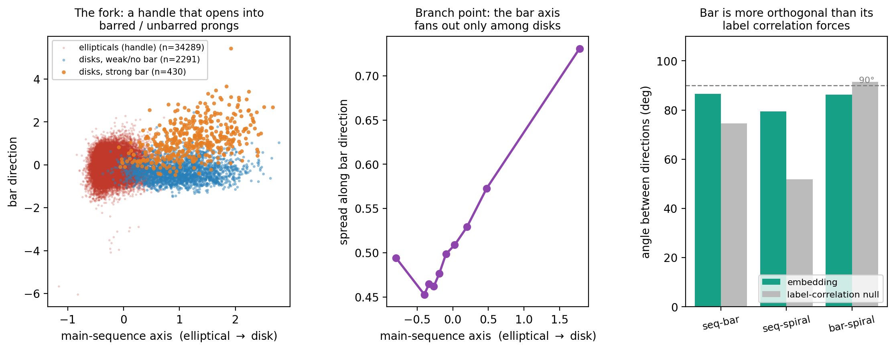
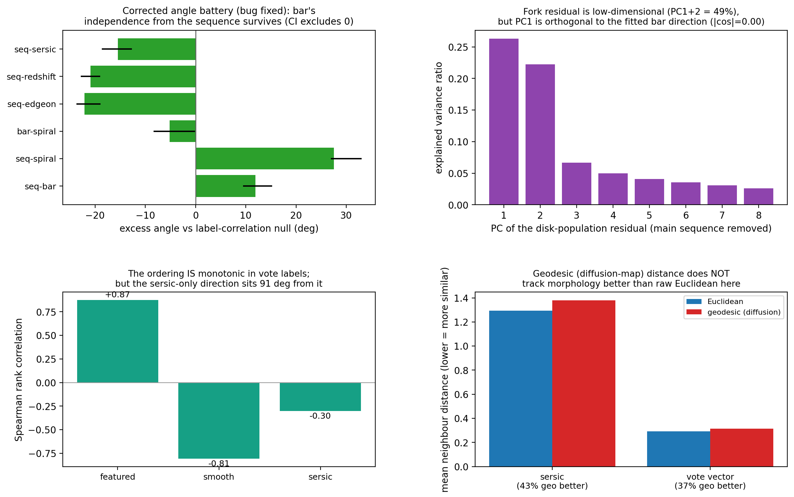

## 8. Track C: redshift translation, property angles, and the age-metallicity degeneracy

Track C treats the embedding as a space you can move around in. Three questions: does moving along the redshift direction land you among genuinely higher-redshift galaxies; how do the directions for different physical properties sit relative to each other; and does the model inherit the age-metallicity degeneracy, the classic result that broadband colors cannot separate a stellar population's age from its metal content? The stellar-population labels are the 5,512 Firefly galaxies (Section 2.3), with age and metallicity both log-transformed; treating metallicity linearly over its 200x range had produced a retracted conflation claim (Appendix A, row 5), and the consistent transform is part of the corrected record.

### 8.1 What images know, and what they cannot

Decodability from E_img with CIs: redshift 0.800 [0.791, 0.809], g-r 0.958, r-z 0.911, featured 0.794, sSFR 0.761 [0.721, 0.787], mass 0.721 [0.660, 0.774], then a cliff: **metallicity 0.251 [0.196, 0.297] and age 0.072 [0.034, 0.100]** (n = 5,512 for both). The model reads colors, morphology, mass, and star formation well, and can barely read stellar age at all. [measured]

Whether that cliff IS the age-metallicity degeneracy is stated carefully, and the artifact carries the same note: low decodability shows weak recovery of the Firefly estimates, and Firefly label noise (fitted ages reach 15 Gyr, older than the universe), aperture and selection effects, dust, and probe capacity are not separated here. "The image pathway inherits the degeneracy as missing information" is the physically expected reading, and it stays an interpretation until a label-noise or spectrum-side analysis pins it down. [interpreted, bounded]

The angle side is cleaner: the age and metallicity directions sit at 93.7 degrees against a label contrast of 91.5, excess +2.3 (percentile CI [-4.2, 5.8], basic [-1.3, 8.8]). The mass-weighted variant gives -2.2 ([-5.7, 4.7] / [-9.2, 1.2]) and the z >= 0.15 variant +3.7 ([-2.7, 6.8] / [0.7, 10.1], marginally positive under the basic construction only). The honest summary is **no consistent extra entanglement**: the three variants scatter in sign within about 6 degrees, so whatever little age and metallicity information the embedding has, it does not tangle them together beyond what the labels already share. [measured; summary wording the finding]

### 8.2 The property-angle sweep

All 28 pairs among the eight labels, each with both CI constructions. The strong structural pairs are stable under both: redshift and the colors are the most aligned directions (redshift-to-g-r excess +13.1, redshift-to-r-z +18.5), while mass, sSFR, and morphology separate from redshift and color beyond their label correlations (g-r-to-mass excess +36.8, redshift-to-mass +25.9). Five of the 28 pairs flip significance between the percentile and basic constructions, and all five involve the weak age or metallicity probes; those pairs are quotable only with both intervals shown, and the sweep as a whole is exploratory (no family correction), a descriptive map rather than 28 hypothesis tests. [measured; status statement the caveat]

### 8.3 Moving along the redshift direction

The test is embedding-level, and labeled as such in the artifact: it moves points in embedding space, not physical inputs, so it is a translation diagnostic, weaker in kind than Track A's input-space interventions. Take the mean embedding shift between low-redshift (0.06 to 0.11) and high-redshift (0.16 to 0.21) galaxies, add a scaled copy of it to 1,500 mid-band queries (z between 0.10 and 0.16), and look up each moved point's 20 nearest real neighbors. The mean redshift of those neighbors, taken at its median across the 1,500 queries, tracks the intended move with **slope 0.318 (CI [0.308, 0.331]) per unit of intended dz**, against five matched-norm random directions whose slopes are all within +/-0.02 of zero. So the direction is genuinely redshift-bearing but the translation is partial: a unit of intended shift buys about a third of a unit of neighborhood redshift. [measured]

Morphology survives the move: shifting by +0.1 in z changes the neighbors' featured fraction by 0.079, against a 0.073 floor from the kNN lookup itself at zero shift and 0.073 for the random direction, an excess of 0.006. The shift vector necessarily carries every difference between the two redshift bins (selection, color, resolution, population mix), and the slope CI resamples queries only; both limits are recorded in the artifact. A linear "steer and read out" block exists in the JSON but is flagged DERIVED: with linear probes it restates the angle battery algebraically (the readouts move by cos(angle) times norms: g-r responds at +0.90 sigma, r-z +0.58, featured +0.42, mass and sSFR at zero), so it is intuition, not independent evidence. [measured; limits stated]

### 8.4 Selection or physics?

A redshift readout could just be a flux readout in disguise, since surveys select bright things. Three checks say it is more than that. Within apparent-magnitude tertiles (fixed flux to first order), redshift still decodes at 0.775 / 0.737 / 0.752 (n about 16,100 each) against 0.800 overall. Regressing out apparent magnitude, log angular size, and both colors (which together carry R^2 = 0.747 of redshift) leaves a residual that E_img still reads at **0.352 (CI [0.335, 0.369], n = 47,780)**: a real signal beyond the obvious imaging channels, with surface-brightness dimming and resolution as the plausible carriers. The exploratory downsizing check (true Firefly age against redshift at fixed mass) is null (Spearman -0.02 and +0.04, n = 1,392 and 663), as expected in a narrow-redshift bright sample with noisy photometric ages. [measured; carrier attribution interpreted]

**Artifacts:** `code/analysis/trackC.py`, `results/trackC.json`, `results/trackC_steer.npy`; figure below.

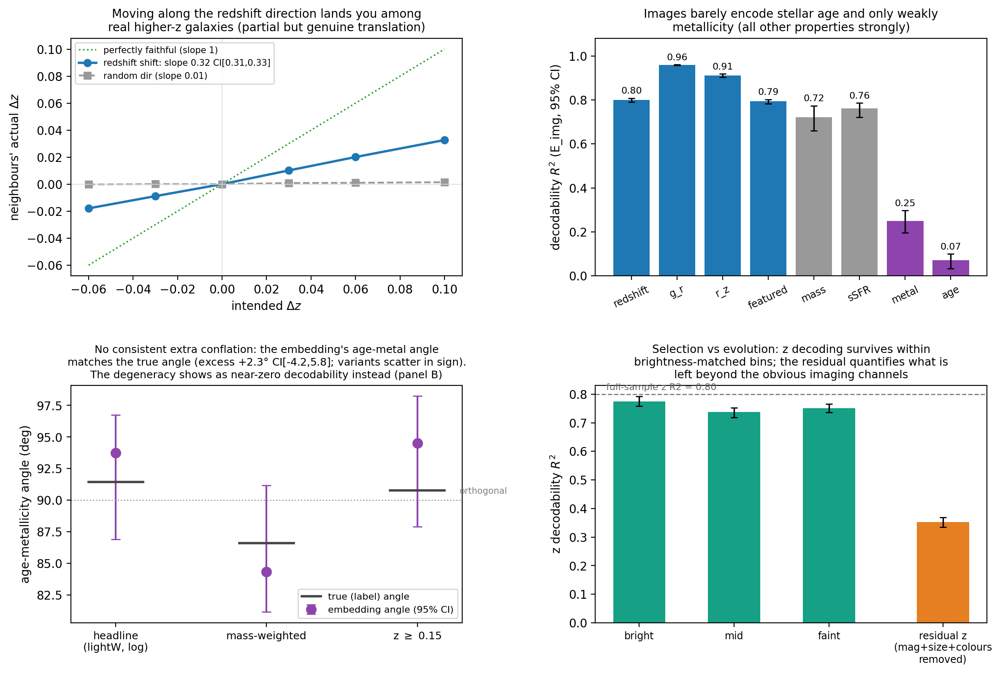

## 9. Track D: sparse-autoencoder dictionaries and reducibility

Track A showed a two-dimensional circular feature exists in the embedding. Track D asks whether the SAE dictionary contains it, or anything like it, as an object: following Engels et al. (arXiv 2405.14860), are there groups of dictionary features that form irreducibly multi-dimensional structures mapping to astrophysical concepts? Having Track A's loop as known ground truth makes this a sharper test than the original LLM setting, where ground truth had to be guessed.

Phase 1 saved SAE activations but not decoder matrices, so stage one retrains the SAEs with the identical protocol and saves the weights: five seeds on z-scored E_full (FVU 0.035 to 0.036, alive 0.646 to 0.709, reproducing Phase 1's health) and five on E_img (FVU 0.033 to 0.034), the loop-bearing space Track A used. E_img is the primary substrate below; E_full replicates everything. [measured]

### 9.1 The reducibility pipeline, as implemented

Cluster the dictionary: connect each decoder direction to its two most-cosine-similar neighbors, drop links below tau, and take connected components. The tau sweep reproduces the paper's three regimes: at 0.4 one giant 903-member component swallows the dictionary, at 0.5 there are 74 clusters (largest 10), at 0.6 it fragments to 13; tau = 0.5 is the working point, and 72 clusters pass the size floors (at least 2 members and 500 active galaxies). For each cluster, reconstruct its contribution on the galaxies where it fires, take up to four principal components, and score the 2-D projections with the paper's two indices: separability S, the minimum over 1,000 rotations of the binned mutual information between the two axes (each plane first centered and scaled to root-mean-square radius sqrt 2, then histogrammed on a 40 x 40 grid clipped to +/-3, the MI reported in bits; higher = the two dimensions cannot be split apart), and mixture M, the largest fraction of points that any thin band |v . f + c| < 0.1 x rms(v . f + c) can capture (an irreducible ring scores low; a mixture of one-dimensional pieces scores high). Clusters are ranked by the paper's combined index (1 - M) x S, evaluated on each cluster's best PC pair. The paper's calibrations: a clean circle scored M near 0.18, a known mixture near 0.64. Documented deviations, stored in the artifact: our SAE is TopK (global top-32 selection precedes the cluster restriction), M is maximized on a dense deterministic grid rather than the paper's gradient descent, and ranking uses the best PC pair while the paper averages over planes (per-pair scores and their mean are stored beside the best). The paper's calibration values are reference points, not matched thresholds. [measured; method]

### 9.2 What the candidates are, and what they are not

The top-scoring clusters have S of 1.2 to 1.7 bits with M of 0.39 to 0.53: genuinely multi-dimensional structure, but nothing at the paper's clean-circle grade (M near 0.18). The best candidates partially match physics: cluster 18 tracks g-r color (2-D fit R^2 = 0.35), cluster 67 tracks featuredness (0.42); most are unnamed by any label, and their cross-seed stability is mixed (0.0 to 1.0 for the top ten). The projections in the figure look like ray-fans rather than rings, agreeing with the M index. [measured]

The known loop is not among them. The 72 cluster planes sit 79.2 to 89.5 degrees from Track A's supervised loop plane (measured as the smaller of the two principal angles between each cluster's 2-plane and the loop plane), straddling the random-plane null (median 87.0, 5th to 95th percentile 84.8 to 88.6; stored in the artifact); five clusters dip below the null's 5th percentile, against 3.6 expected by chance from 72 draws, and none approaches the loop. The best circular fit by any cluster is 9.6 degrees (cluster 39, the one the removal test in 9.3 targets), still far from the supervised 2.03; the best among the top-ten-score clusters is 13.2 degrees (cluster 33), whose cross-seed stability is 0.0, a seed artifact. [measured]

The AGN check on Matt's candidate list is a clean null: no cluster tracks the WISE W1-W2 AGN proxy above R^2 = 0.064 (E_full: 0.083). Physically plausible, since an unresolved active nucleus is diluted inside a bright 25-arcsec galaxy image, and the proxy itself is approximate (357 candidates, no S/N vetting). [measured; physics reading interpreted]

### 9.3 The loop is fractured across the dictionary

Two removal tests, stated carefully as information-removal, not causal use: we subtract chosen SAE terms from the embedding, refit the PA probe, and ask whether PA is still decodable. Controls are five random feature sets matched to the removed set's activation-energy profile (deciles of total squared activation), and feature selection uses only the probe's training rows, so no test labels touch the choice.

Removing the single best loop-candidate cluster does nothing: 2.35 to 2.41 degrees, controls 2.34 to 2.39. Removing the K most loop-correlated individual features degrades recovery monotonically: K = 15 gives 5.2 degrees, K = 50 gives 8.8, K = 200 gives 15.9, while every matched control stays flat at 2.3 to 2.5. E_full replicates (5.2 / 9.4 / 17.1). Even at K = 200, about 7% of the active dictionary, recovery stays far above the 45-degree chance floor, consistent with the SAE's unexplained 3.4% residual still carrying loop information. **The loop's information lives in superposition across hundreds of dictionary features rather than in any compact dictionary object**, unlike the consolidated circular features Engels et al. found for calendar concepts in language models. A physics reading: rotation is a symmetry that touches every oriented structure in an image, so many features end up orientation-sensitive and no single one needs to be the circle. [measured; bolded sentence the finding; last sentence interpreted]

### 9.4 The instrument-identity census

The same corrected statistics as Section 5.7 (tie-aware Spearman, Bonferroni over 11 labels, BH q <= 0.05 across active features), now against six physics labels plus five instrument covariates (seeing, depth, extinction, north/south, i-band blankness). Of 2,700 active E_img features, 1,745 are FDR-aligned to something; classifying each aligned feature by whether its best instrument correlation beats its best physics correlation gives **828 physics-first versus 917 instrument-first**, with 955 unaligned. The single largest family in the dictionary is i-band blankness: 566 features, 70 of them strong (correlation above 0.3), against 216 for depth (4 strong) and 92 for north/south (5 strong). E_full: 932 physics-first, 846 instrument-first (485 i-blank, 62 strong). The honest scale note: the median best correlation among active features is 0.02 on both sides, so most census members are individually weak, and the strong subset is the quotable core. The model dedicates real dictionary capacity to instrument identity, led by the most visible anomaly a cutout can have (an empty channel), and these feature lists are the exclusion set for any future concept-matching across surveys. [measured; last reading interpreted]

### 9.5 Across model scale

The same tests on aion-base (768 dimensions, anchor re-embedded, same SAE protocol, weights saved): the raw base embedding carries the PA loop at 2.52 degrees against 2.35 for aion-large under the same fixed probe (the matched comparison; Track A's 2.03 headline uses a cross-validated probe and is not the right baseline here). The fracture pattern replicates at base scale: removing the top 15 / 50 / 200 loop-correlated features gives 6.2 / 9.7 / 17.4 degrees with controls flat. The dictionaries themselves do not carry over: matching features by activation pattern over the shared 48,398 galaxies, only 22.3% of large-model features have a base twin at correlation 0.5 or better (19.9 to 22.7% across all five large seeds; median best correlation 0.23), yet the row-shuffled chance baseline is far lower (median 0.07, fraction above 0.5 under 1%). So the overlap is real and far above chance, and still leaves most of the vocabulary unshared. The geometry (loop, fracture) is conserved across scale; the dictionary vocabulary is only partially conserved, which matches the fact that even same-model different-seed dictionaries only partially overlap (Section 5.7's median best cosine 0.46). [measured; last sentence interpreted]

**Artifacts:** `code/analysis/trackD_sae.py`, `trackD.py`, `trackD_embedBase.py`, `trackD_scale.py`; `results/trackD_eimg.json`, `trackD_efull.json`, `trackD_scale.json`, `trackD_sae/health.json`; figure below.

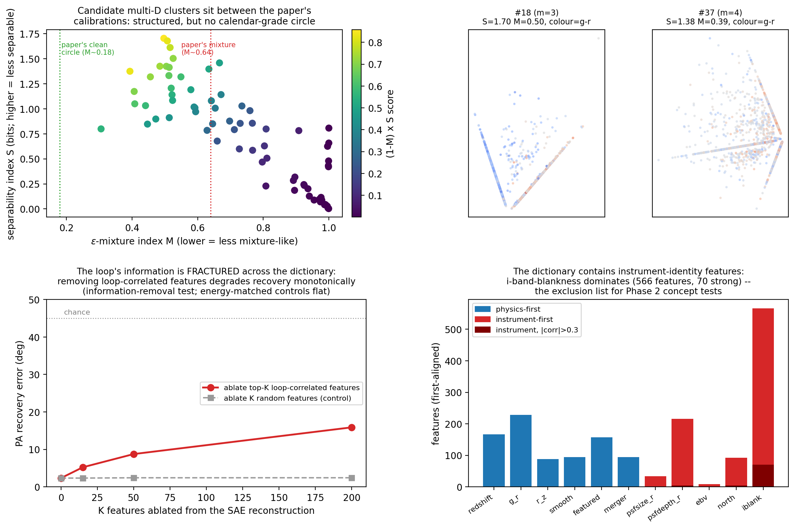

## 10. Findings index

Every headline claim in this report, in plain words, with where it is derived, its key numbers, and its artifact. The table stands on its own; the last column maps each row to the June/July slide decks for anyone reading them side by side, and flags where a corrected number differs from what a slide showed. Rows marked "post-deck" or "not on deck" were measured but never presented.

| # | Claim | Section | Key numbers | Artifact | Slide (delta if any) |
|---|---|---|---|---|---|
| 1 | The embedding uses ~10 to 11.4 effective dimensions at the largest tested scales (curves still declining) | 5.3 | Gride 10.10 [10.08, 10.13]; local MLE 11.40 [11.37, 11.43]; PCA-PR 11.2 | intrinsicDim.json | June deck said "10-12, 3 estimators agree"; corrected wording, no plateau claim |
| 2 | One connected continuum; no hard red/blue split | 5.8 | 15-NN graph 1 component (k = 10/15/20); MST splits peel singletons | topology.json | June deck (unchanged in substance, bounded wording) |
| 3 | Global loop topology (H1) is unresolved and metric-dependent | 5.8 | subsamples over the 0.1 line: Euclid 1/10, Fermat 5/10, diffusion 10/10 | topology.json, persistence.json | June deck said "beta1 = 0" - RETRACTED |
| 4 | Physics reads out of images alone, including non-inputs | 5.5 | mass 0.721, sSFR 0.761 (n = 4,473), redshift 0.800, colors 0.91-0.96 | probes.json | June deck showed sSFR 0.848 on E_full with sentinels; corrected 0.781/0.761 |
| 5 | Curvature has no metric-stable sign | 5.6 | Euclid Ollivier +0.155 (4.2% negative); Fermat +0.023 (41.8% negative) | curvature.json | June deck said "mostly positive" - now Euclidean-graph-only |
| 6 | Most of the active SAE dictionary aligns with physics; almost nothing stable is unexplained | 5.7 | 1,686/2,648 FDR-aligned; 380 stable; 3 unexplained (max align 0.41) | sae.json | June deck said "335 stable + ~59 alien" - counts corrected, aliens retired |
| 7 | Passive galaxies occupy a higher-dimensional region than star-forming | 5.9 | Delta-ID 1.66 [1.38, 1.96], excludes zero | stratifiedId.json | June deck (unchanged; conditional-CI note added) |
| 8 | Position angle is stored as a closed mod-180 loop, invisible to top PCs | 6.1 | 2.03 deg [1.95, 2.10]; 99.7% within 20; shuffle 44.1; top-2 PCs 43.2 | trackA.json | Slide 1 (radii on the slide were per-stratum refits 0.986-0.993; the leakage-free fixed-probe values span 0.960-0.995 with the 0.960 in the small featured stratum, same conclusion) |
| 9 | Physically rotating the galaxy rotates the readout one-for-one | 6.3 | slope -0.999, intercept -0.01, max median residual 0.05 deg; per-galaxy 2.4-2.7 deg; 180 deg returns to -0.01 | trackA_causal.json | Slide 2 (held-out fields added; identical conclusion) |
| 10 | Mirror flip and composition close the O(2) group | 6.4 | flip vs -truth 1.99 deg; displacement slope 0.983; flip+rot30 2.59 deg; frame offset -0.09 deg | trackA_flip.json | post-deck (run 2026-07-07) |
| 11 | Image-derived and catalog-derived angle readouts agree | 6.5 | img vs shape 3.55 deg [3.41, 3.72] | trackA_crossmodal.json | Slide 3 ("the same loop" narrowed to consistency of two separately trained readouts) |
| 12 | RA reads back as a full circle through the native codecs; Dec as a scalar | 6.5 | RA 2.9 deg, R^2 0.99/0.98; Dec 0.99 | trackA_radec.json | Slide 3 (now labeled codec-geometry, weaker in kind than the learned loop) |
| 13 | The loop is real but must be searched for | 6.6 | best PCA pair 0.41 vs supervised 0.97; best SAE feature 0.50, 15/4096 over 0.3 | trackA_unsupervised.json | Slide 4 |
| 14 | Sky position leaks weakly via observing conditions; conditions themselves are strongly encoded | 6.6 | RA 0.41/0.17; residual 0.24/0.08; seeing 0.69, depth 0.44, EBV 0.30 | trackA_ra.json | Slide 4 ("~42/52% explained" recast as R^2 drops, not mediation fractions) |
| 15 | The Hubble sequence exists as a validated, monotonic axis | 7.1 | corr +0.89/-0.87/-0.32; Spearman +0.87/-0.81/-0.30 | trackB.json | Slide 5 |
| 16 | The bar is an independent axis, beyond what labels force | 7.2 | excess +11.9 (percentile [9.6, 15.1], basic [8.7, 14.3]) | trackB.json | Slide 6 |
| 17 | The fork opens at the disks, and only for the bar | 7.3 | fan 1.70; held-out 1.53-1.79 (mean 1.65); shuffles 0.70-0.93; spiral 0.76 | trackB.json | Slide 5 (slide said held-out 1.66; exact mean 1.65) |
| 18 | The sequence is genuinely curved | 7.4 | path/chord 1.248 (noise-corrected 1.220) vs matched null 1.038 | trackB.json | Slide 7 |
| 19 | The diffusion-coordinate proxy loses to Euclidean at local morphology | 7.5 | wins 42.8% (p = 8.7e-8) and 36.8% (p = 1.7e-20) | trackB.json | Slide 7 (sign tests added) |
| 20 | The dominant disk-specific direction is not the bar (open) | 7.5 | \|cos(PC1, bar)\| = 0.005; PC1+PC2 = 48.6% | trackB.json | Slide 7 |
| 21 | Images barely encode stellar age; weakly metallicity | 8.1 | age 0.072 [0.034, 0.100]; metal 0.251 [0.196, 0.297] vs 0.72-0.96 for the rest | trackC.json | Slide 9 (interpretation now bounded: weak recovery of Firefly labels; degeneracy reading pending label-noise/spectrum analysis) |
| 22 | No consistent extra age-metal entanglement | 8.1 | excess +2.3 / -2.2 / +3.7 across variants; z >= 0.15 marginally positive under basic CI only | trackC.json | Slide 9 (slide said "consistent with zero"; honest summary is "no consistent excess") |
| 23 | The redshift direction is a genuine partial translation | 8.3 | slope 0.318 [0.308, 0.331] vs five random directions within +/-0.02 of 0; morphology excess 0.006 over floor | trackC.json | Slide 8 (null upgraded from one to five directions) |
| 24 | Redshift decoding is not just selection | 8.4 | tertiles 0.775/0.737/0.752; residual-z 0.352 [0.335, 0.369] | trackC.json | Slide 10 |
| 25 | The known loop is fractured across the SAE dictionary, not a dictionary object | 9.3 | best cluster null (2.35 to 2.41); top-K removal 5.2/8.8/15.9 deg, matched controls flat | trackD_eimg.json | not on deck |
| 26 | No calendar-grade irreducible cluster; best candidates partial | 9.2 | top S 1.3-1.7 bits, M 0.39-0.53; plane angles at the random-plane null (median 87 deg) | trackD_eimg.json | not on deck |
| 27 | The dictionary contains real instrument-identity capacity, led by i-band blankness | 9.4 | 917 instrument-first vs 828 physics-first; i-blank 566 (70 strong) | trackD_eimg.json | not on deck |
| 28 | AGN proxy: clean null | 9.2 | best cluster R^2 0.064 (E_full 0.083) | trackD_*.json | not on deck |
| 29 | Across model scale: geometry conserved, vocabulary partially | 9.5 | base loop 2.52 vs large 2.35 (same probe); fracture replicates; 20-23% matched >= 0.5 vs shuffled under 1% | trackD_scale.json | not on deck |

---

## Appendix A: corrections ledger

Every load-bearing correction in the project's record, oldest first. The main text carries only the corrected values; this table is the audit trail. "Review" means the independent adversarial review of 2026-07-09, which re-ran estimators directly; the correction pass that followed fixed the code and regenerated every affected artifact.

| # | What was believed | What is true | What caught it |
|---|---|---|---|
| 1 | Diffusion map with one global bandwidth (June): spectrum degenerate | Graph had fragmented; self-tuning local bandwidth + connectivity check | In-run check, June 2 |
| 2 | First SAE scoring: 0 aligned features at a fixed 0.4 threshold | Zero-inflated activations need a null-calibrated threshold | In-run contradiction with probe results, June 2 |
| 3 | Geometry-of-concepts first test "significant" | The construction was tautological (cos = 0 by construction); permutation null added, result null | In-run check, June 2 |
| 4 | Track B seq-bar excess +0.7 (CI straddling 0) after a rewrite | +11.9 [9.6, 15.1]; the rewrite had silently refit the sequence direction on the small branch population | Line-by-line audit, July 1 |
| 5 | Track C: "AION conflates age and metallicity beyond the true correlation (73.5 vs 87.6 degrees)" | Artifact of treating metallicity linearly over a 200x range; with both labels logged, excess +2.3, consistent with zero | Track C audit rewrite, July 2 |
| 6 | Track B curvature null 1.51 ("a straight line looks MORE curved than the data") | Null was computed in the wrong noise regime; matched null is 1.038 +/- 0.001, so the 1.248 bend is real | Pre-presentation audit, July 4 |
| 7 | Metric diagnostic NN/mean 0.433 / 0.430 | Second-neighbor indexing bug; true first-neighbor values 0.400 / 0.398 | Review, direct rerun |
| 8 | Phase 1 sSFR probe n = 4,760, E_full R^2 = 0.848 | 287 sentinel values (<= -90) had entered; n = 4,473, E_full 0.781, E_img 0.761 | Review |
| 9 | "Intrinsic dimension 10 to 12, plateau" | 10 to 11.4 at the largest tested scales; both curves still declining; conditional CIs added | Review |
| 10 | Cosine delta-hyperbolicity 0.0273; tree anchor from a random-walk cloud | Chord-distance bug; true cosine 0.0410; exact tree-path anchor returns exactly 0 | Review + corrected rerun |
| 11 | "Mostly positively curved manifold" | Euclidean-graph-only: the same sample under Fermat has 41.8% negative edges; sign is metric-dependent | Corrected rerun |
| 12 | "beta0 = 1 exact; beta1 = 0" | Connectivity diagnostic (not exact beta0); H1 unresolved and metric-dependent (1/10, 5/10, 10/10 subsamples over the 0.1 line under paired samples); the old band was not a calibrated confidence set | Review + corrected rerun |
| 13 | SAE: "717 significant, 335 stable, ~59 alien features" | Tie-broken ranks underestimated correlations and the threshold was uncorrected; tie-aware + FDR gives 1,686 aligned, 380 stable, max 0.41, and the "aliens" collapse to 3 stable-unexplained candidates | Review + corrected rerun |
| 14 | Stratified-ID recorded cut 1.012 (midpoint of GMM means) | The split actually used the posterior boundary (1.025); recorded cut and figure now match the analysis populations | Review |
| 15 | Track A causal summaries pooled probe-training rows; invariance shown via per-stratum refits | Held-out summaries added (identical conclusions: slope -0.999, flip 2.50); fixed-global-probe invariance added (2.05/1.93/2.06; 1.97/2.47) | Review + rerun |
| 16 | Track A frame convention ~91.3 degrees (rough moment fit) | 90.05 +/- 0.05 degrees, measured by the flip test's offset estimate | Flip run, July 7 |
| 17 | Track D census "452 physics / 442 instrument / 321 i-blank"; ablation "causal"; fracture 5.7/9.3/16.7 | FDR census 828 / 917 / 566 (strong core: 70 i-blank); information-removal language; train-only selection + energy-matched controls give 5.2/8.8/15.9 (conclusion unchanged) | Review + corrected rerun |
| 18 | Figure labels: E_full "image+spectra"; fig 04 "k=15"; fig 06 "PROVABGS"; trackD example colored by the wrong label | E_full = image + g/r/z flux + redshift; k = 64; NSA labels; coloring bug fixed | Review + regeneration |

## Appendix B: glossary

| Term | Meaning here |
|---|---|
| AION-1 | Multimodal astronomy foundation model (Polymathic AI); frozen throughout |
| embedding | The 1,024-number vector AION-1's encoder produces for one galaxy (mean-pooled) |
| E_img / E_full | Image-only embedding / image + g,r,z flux + redshift embedding (Section 3) |
| z-score | Per-dimension standardization: subtract mean, divide by standard deviation |
| ridge regression | Linear fit with an L2 penalty alpha ||w||^2; RidgeCV picks alpha by cross-validation |
| probe | A ridge fit reading a label out of the embedding; scored by held-out R^2 |
| R^2 | Fraction of label variance explained; 1 = perfect, 0 = none |
| concept direction | Unit-normalized ridge coefficient vector for one label (alpha = 100) |
| excess angle | Probe-direction angle minus arccos(label correlation); descriptive contrast, not a calibrated null |
| percentile / basic CI | Two bootstrap interval constructions; basic corrects the toward-90-degrees refit bias in angles |
| circular error | Absolute angular difference wrapped into the quantity's period |
| doubled angle | Regressing (cos 2theta, sin 2theta) so a mod-180 quantity becomes learnable |
| RP1 / S1 | The mod-180 circle (projective line) / the ordinary full circle |
| intrinsic dimension (ID) | Number of degrees of freedom the data occupies, estimated from neighbor distances |
| TwoNN / Gride / Levina-Bickel | Three neighbor-ratio ID estimators (first/second neighbors; (n, 2n) pairs; K-neighborhood MLE) |
| participation ratio (PR) | (sum of eigenvalues)^2 / sum of squared eigenvalues; effective count of variance-carrying components |
| diffusion map | Coordinates from the slowest eigenvectors of a kNN random-walk operator |
| RDR / NN-over-mean / CV | Distance-spread statistics: relative range, first-neighbor over mean, coefficient of variation |
| Fermat distance | Shortest path through the kNN graph with edge lengths raised to a power (p = 2 here) |
| delta-hyperbolicity | Four-point tree-likeness defect; 0 for exact trees |
| Ollivier-Ricci | Graph curvature from optimal transport between neighborhoods |
| Forman-Ricci | Combinatorial graph curvature; structurally negative on kNN graphs, rank-use only |
| Betti numbers b0, b1; H1 | Counts of connected components and independent loops; H1 is the first homology group, whose rank is b1 |
| persistence / lifetime | How long a topological feature survives across scales; long lifetime = robust feature |
| SAE | Sparse autoencoder: reconstructs the embedding from few active dictionary directions |
| TopK / k | The sparsity rule: keep the k largest latent activations (k = 32) |
| FVU | Fraction of variance unexplained by the SAE reconstruction |
| alive fraction | Share of dictionary features that ever activate |
| tie-aware Spearman | Rank correlation with average ranks for ties; required for zero-inflated activations |
| Bonferroni / BH / FDR | Multiple-testing corrections: within-feature over labels; across features controlling false discovery rate |
| seed-stable | Feature recurs (decoder cosine >= 0.6) in at least half the other training seeds |
| separability S / mixture M | Engels reducibility indices: rotational mutual information (bits) / thin-band capture fraction |
| information-removal test | Subtract chosen SAE terms, refit the probe; tests decodability, not causal use |
| energy-matched control | Random feature set matched to the removed set's activation-energy profile |
| GMM | Gaussian mixture model; two components split red/blue here |
| PA / ellipticity / inclination | Long-axis sky angle (mod 180); elongation; disk tilt toward the line of sight |
| sSFR / Sersic n | Specific star-formation rate; light-profile concentration index |
| photo-z / sigma_NMAD | Photometric redshift; its normalized median absolute scatter |
| psfsize / psfdepth / EBV | Seeing FWHM; 5-sigma point-source depth; Galactic extinction |
| nanomaggy | Legacy Surveys flux unit; magnitude 22.5 = 1 nanomaggy |
| tractor | The Legacy Surveys model-fitting catalog (source shapes, fluxes, conditions) |
| i-blank | All-zero i-band channel where the survey has no i coverage |
| Stern wedge | WISE W1-W2 > 0.8 color cut, a rough AGN indicator |
| O(2) | The symmetry group of rotations and reflections in the plane |
| fixed point / antinode | Angles a transformation leaves unchanged / moves the most |

## Appendix C: artifact index

| Section | Script(s) | Results file(s) | Figure(s) |
|---|---|---|---|
| 2, 3 | `code/buildSample.py`, `code/embed.py`, `code/anchor/fetch*.py` | `data/` arrays and parquets | - |
| 5.1 | `code/analysis/sanity.py` | `results/sanity.json` | 17, 18 |
| 5.2 | `code/analysis/metric.py` | `results/metric.json` | 03 |
| 5.3 | `code/analysis/intrinsicDim.py`, `synthetic.py` | `results/intrinsicDim.json` | 01, 02 |
| 5.4 | `code/analysis/diffusionMap.py` | `results/diffusionMap.json`, `diffcoords_*.npy` | 04, 05, 06 |
| 5.5 | `code/analysis/probes.py` | `results/probes.json` | 07, 08, 09, 10 |
| 5.6 | `code/analysis/curvature.py` | `results/curvature.json` | 14 |
| 5.7 | `code/analysis/sae.py` | `results/sae.json`, `sae_*.npy` | 11, 12, 13 |
| 5.8 | `code/analysis/topology.py`, `persistence.py` | `results/topology.json`, `persistence.json` | 15, 19 |
| 5.9 | `code/analysis/stratifiedId.py` | `results/stratifiedId.json` | 16 |
| 5.10 | `code/analysis/geometryOfConcepts.py` | `results/geometryOfConcepts.json` | - |
| 6 | `code/analysis/trackA*.py` (7 scripts), `trackUtils.py` | `results/trackA*.json` (7 files) | trackA_loop, trackA_supplement, trackA_flip |
| 7 | `code/analysis/trackB.py` | `results/trackB.json` | trackB_fork, trackB_supplement |
| 8 | `code/analysis/trackC.py` | `results/trackC.json` | trackC |
| 9 | `code/analysis/trackD_sae.py`, `trackD.py`, `trackD_embedBase.py`, `trackD_scale.py` | `results/trackD_*.json`, `trackD_sae/health.json` | trackD |

Phase 1 figure scripts live in `code/plots/fig01..fig19*.py`; track figures in `code/plots/figTrack*.py`. Code, results JSONs, and figures are git-tracked; the large arrays in `data/` and `results/*.npy` are local (regenerable from the scripts).

## Appendix D: environment and compute

Analysis environment (`interp`, full lock in `envInterp.txt` at the repo root): Python 3.11.14, NumPy 1.26.4, pandas 2.1.4, SciPy 1.17.0, scikit-learn 1.8.0, PyTorch 2.10.0+cu128, POT 0.9.7, ripser 0.6.15, polymathic-aion 0.0.2. All randomness is seeded (seed 0, with fixed offsets where independent streams are needed); train/test splits use seed 0 throughout.

Compute: the anchor was embedded once on an NVIDIA L40S (cloud, June 2; 2,181 s for both spaces, then torn down). Everything since runs on one RTX 5070 Ti Laptop GPU (12 GB): AION-large re-encoding at ~17 images/s (batch 32; the causal tests total ~127,000 re-encodings), aion-base at ~40 images/s, SAE training ~35 s per dictionary, and the full corrected Phase 1 + track analysis suite in minutes per script. CPU-bound pieces (ridge batteries, persistent homology on 2k subsamples) run on the same laptop.

The corrected code, results, and figures behind this report are pushed at commits `6a0dfb4` (correction pass) and `890346c` (claim-document corrections) on `main`.
