# Technical Report: a diagnostic suite for AION-1's representation

This report is written diagnostic by diagnostic, as each one is run. It is the record for the scoping document `paperScopingV1.md`, and it replaces the track-based organisation of `technicalReport.md` (which remains the record of the Phase 1 and Track A to D work it describes).

## Reading rules

1. Every quantitative claim is tagged **[measured]** (a number an artifact contains) or **[interpreted]** (our reading of it). Summary paragraphs restate numbers that are tagged and sourced in their home sections and carry no tags of their own.
2. Every diagnostic section ends with an **Artifacts** line naming the script, the results file and the figure behind it, so any number can be traced in one step.
3. This document is a technical record of method and result. Development history, implementation decisions and the audit trail are kept in the project run log and are not reproduced here.
4. **Provenance rule.** A number enters this report only if a script in `paper1/diagnostics/` produced it and wrote it to `paper1/results/` with a provenance block recording the git revision, the SHA-256 of every input file, the seed and the environment. No value is transcribed by hand without an automated check against its artifact.
5. **Tier rule.** Every diagnostic states its evidential tier in its heading and in the master table: input-space causal, descriptive with a calibrated null, or descriptive. The tier is a column readers can see, not a detail in the methods.

## The protocol every diagnostic follows

1. **Frozen encoder.** AION-1 large, public weights, never fine-tuned. Mean pooling over encoder outputs at a 600-token budget. That budget exceeds the 256-token budget used in pretraining, so results are properties of this documented recipe.
2. **Probe fit once, on unperturbed data, evaluated held out.** Nothing is ever fit to a perturbed condition.
3. **Deterministic intervention where one exists.** Rotation, reflection, major-axis flip, blur, band masking, reddening and artificial redshifting are exact operations on the input with exactly known consequences. Where such an operation exists, the diagnostic is causal.
4. **A named null** beside every headline number.
5. **Evidential tier reported.**

## Substrate discipline

All headline probes run on **E_img**, the image-token-only embedding: nothing but pixels goes in, so anything read out of it was learned from the image. **E_full** (image plus scalar g, r, z flux plus the catalog redshift token) never carries a headline number anywhere in this report. It is the subject of the leakage ablation in Diagnostic 6, and it appears once elsewhere, as an explicitly labelled robustness line in Section 4.4. Without that separation, "the model knows redshift" is ambiguous between *learned* and *was told*.

---

## Master results table

Tier and status for all nine diagnostics.

| # | Diagnostic | Pillar | Tier | Status | Headline |
|---|---|---|---|---|---|
| 1 | Angle readout characterization | I | descriptive | **run 2026-07-25** | 2.027 deg [1.946, 2.116], loop radius 0.9886, n=3,179 held out; chance 45; error scales as ellipticity^-0.97 |
| 2 | O(2) equivariance | I | **input-space causal** | **run 2026-07-25** | slope -0.99896 [-0.99960, -0.99825] against applied rotation, held-out interval covering -1; half turn returns to -0.006 deg; reflection nodes and antinodes reproduced with a 2.8-3.0 deg residual; physical readouts do not move |
| 3 | Chirality | I | **input-space causal** | **run 2026-07-26** | parity-odd information survives: matched pairs give a +19.4 per cent excess for spiral-armed galaxies, sign test p = 1.6e-33; but handedness is NOT a single axis, so no self-supervised label. Separately, the encoder is strongly resampling-sensitive: four cancelling rotations move the embedding 23.3 per cent of the way to an unrelated galaxy |
| 4 | Nuisance decodability and leakage | II | descriptive | not yet run here | |
| 5 | Degradation response | II | **input-space causal** | not yet run here | |
| 6 | Decodability battery | III | descriptive | not yet run here | |
| 7 | Concept geometry under a calibrated null | III | descriptive with calibrated null | not yet run here | |
| 8 | Structured relations | III | descriptive | not yet run here | |
| 9 | Artificial redshifting | III | **input-space causal** | not yet run here | |

---

## 1. Data and the anchor sample

### 1.1 The anchor

Every diagnostic in this suite is computed on one fixed sample, the **anchor**: **48,398 galaxies**, each with a four-band image cutout, a frozen embedding, and a set of catalog labels and observing-condition covariates. All 48,398 `dr8_id` values are unique. The sample is held fixed across diagnostics so that results are comparable between them, and so that a population difference can never be mistaken for a model difference. [measured]

The imaging is from the DESI Legacy Imaging Surveys. Each cutout is **96 by 96 pixels** at **0.262 arcsec per pixel**, giving a field of view of **25.15 arcsec**, in the bands **g, r, i, z**, with fluxes in nanomaggies at zeropoint **22.5**. [measured]

### 1.2 Row contract

The row contract is enforced in `lib/data.py` and is identical for every diagnostic: **row i of the embedding corresponds to row `ok_index[i]` of the sample table**, and every catalog table is left-joined onto that order by `dr8_id`. A galaxy missing from a catalog therefore becomes a missing value rather than shifting any row, and the loader asserts that no join changes the row count.

### 1.3 Labels and their coverage

Coverage differs sharply between label sets, which is why every diagnostic reports the sample size beside each entry. Morphology vote fractions, redshift and magnitudes are complete; the stellar-population and structural quantities come from catalog crossmatches and cover under a tenth of the anchor.

Two counts are given per label. **Finite** is what a bare finiteness test returns. **Valid** additionally excludes declared sentinel values, which some catalogs use to encode "not measured" as an ordinary number that a finiteness test accepts. Every diagnostic masks on the valid count. The source column is a declared attribution recorded in `config.py`, since the files carry no provenance metadata; the counts are measured.

| label | declared source | finite | sentinel | valid | coverage |
|---|---|---|---|---|---|
| redshift | GZ DESI external catalog, photometric-dominated | 48,398 | 0 | 48,398 | 1.000 |
| spectroscopic redshift | GZ DESI external catalog, spectroscopic subset | 6,699 | 0 | 6,699 | 0.138 |
| r magnitude | Legacy Surveys DR8 catalog | 48,398 | 0 | 48,398 | 1.000 |
| smooth vote fraction | Galaxy Zoo DESI vote fractions | 48,398 | 0 | 48,398 | 1.000 |
| featured vote fraction | Galaxy Zoo DESI vote fractions | 48,398 | 0 | 48,398 | 1.000 |
| edge-on vote fraction | Galaxy Zoo DESI vote fractions | 4,948 | 0 | 4,948 | 0.102 |
| stellar mass, elpetro | NSA elpetro crossmatch | 3,728 | 0 | 3,728 | 0.077 |
| specific star formation rate | NSA crossmatch | 4,760 | 287 | 4,473 | 0.092 |
| Sersic index | NSA crossmatch | 3,730 | 0 | 3,730 | 0.077 |

The specific star formation rate is the one column here with a sentinel: 287 galaxies carry the value -99, which a finiteness test accepts and which would otherwise enter a probe as an extreme outlier. The declared rule and the resulting count are verified in the test suite. [measured]

Redshift spans 0.0011 to 0.688 with a median of 0.174 and a first-to-ninety-ninth percentile range of 0.025 to 0.384. Sparse-label subsamples are catalog crossmatches rather than random draws and carry their own selection, which is standing caveat 4. [measured]

### 1.4 Shape catalog

48,290 anchor galaxies have a catalog shape row. Model types are SER 37,885, REX 4,111, DEV 4,051, EXP 1,736, DUP 457 and PSF 50, with 108 galaxies unmatched. Over the sources with a defined position angle, ellipticity has median 0.230 and a first-to-ninety-ninth percentile range of 0.018 to 0.730, and the propagated catalog uncertainty on position angle has median 0.249 degrees, rising to 4.51 degrees at the ninety-ninth percentile as the axis becomes ill-defined. Section 4.3 gives the parameterisation and the exclusion rule behind these figures. [measured]

### 1.5 Observing-condition covariates

Each galaxy carries the conditions under which it was observed, which Pillar II treats as the confound budget for everything in Pillar III. Over the 48,290 matched galaxies, r-band seeing has percentiles 1.06 / 1.38 / 2.17 arcsec at the 1st, 50th and 99th; r-band point-source depth in inverse nanomaggies squared has percentiles 121 / 621 / 12,433; and Galactic extinction E(B-V) has percentiles 0.0081 / 0.0307 / 0.1481. By hemisphere, **35,919 are south and 12,371 are north**, with 108 unmatched. The two hemispheres are different instruments, so this split is an instrument boundary rather than a geographic one. [measured]

**A sentinel in the observing conditions, and why it is dangerous.** All nine condition columns are now audited, not only the r band. Seven are clean. The two i-band columns are not: `psfsize_i` and `psfdepth_i` hold **-9999 for 12,371 galaxies, all of them north, and none in the south**. That is not corrupt data. BASS and MzLS observe g, r and z and do not observe i at all, so there is no i-band measurement to record. The danger is that the sentinel count equals the northern count exactly, which makes it a **perfect stand-in for which telescope took the image**. Any analysis that feeds raw observing conditions into a regression is then partialling on the instrument while appearing to partial on the weather. The rule is declared once in `config.py` and the counts are in the D0 artifact. A further 8,804 and 8,812 rows hold an exact zero in those columns, which is a separate and milder flag. [measured]

**Artifacts.** `paper1/diagnostics/d0DatasetAudit.py`, `paper1/results/d0DatasetAudit.json`

## 2. The model and the embeddings

### 2.1 The frozen recipe

AION-1 large is used with its public weights and is **never fine-tuned**, in any diagnostic. Inputs pass through the model codecs to tokens, and we take the encoder output and **average over tokens**. Two properties of this recipe are ours rather than the model's, and are stated wherever results are quoted:

- **Token budget.** The encoder is called with a budget of **600 tokens**, which retains all 576 image tokens of a 96 by 96 four-band cutout. Pretraining used a smaller budget, so inference here operates outside the regime the model was trained in. Every result is a property of this documented recipe.
- **Pooling.** Mean pooling is our choice. The attentive pooling used in the model's own downstream setting is a learned layer that would require its own training target and split discipline, and would no longer be a frozen-encoder measurement.

### 2.2 The two substrates

| substrate | contents | role |
|---|---|---|
| **E_img** | image tokens only | the substrate for every headline probe |
| **E_full** | image plus scalar g, r, z flux plus the catalog redshift token | the leakage ablation of Diagnostic 6, and labelled robustness lines; never a headline |

Anything read out of E_img was learned from pixels, because nothing else went in. E_full ingests quantities the model may simply be repeating back, so it bounds leakage and is never a competing measurement. E_full is not the model's full input set: it excludes spectra, the i-band scalar flux and the infrared photometry.

### 2.3 Numerical properties

Both arrays are 48,398 by 1,024 float32 with **no NaN and no infinity**. Vector norms concentrate near a shell: E_img has mean norm 49.58 with standard deviation 2.46, E_full 48.37 with 2.52. Per-dimension standard deviations are not uniform, spanning a factor of **22.1** in E_img and **22.6** in E_full. [measured]

That spread is why every analysis begins from the **z-scored** embedding: each dimension has its mean subtracted and is divided by its standard deviation. Without it a handful of dimensions would dominate every distance and every direction. The standardisation is fit on all rows before any split, which leaks nothing because it uses no labels.

**Artifacts.** `paper1/diagnostics/d0DatasetAudit.py`, `paper1/results/d0DatasetAudit.json`

## 3. Shared methods

Machinery used by more than one diagnostic is implemented once in `paper1/lib/` and described once here. Diagnostic sections state only what they add.

### 3.1 Constants

One source of truth, `paper1/config.py`: seed **0**; test fraction **0.2**; ridge grid **10^-2 to 10^4 in seven logarithmic steps**; fixed regularisation **100** for concept directions; **1,000** bootstrap resamples; working ellipticity cut **0.3**. No diagnostic chooses its own.

### 3.2 Linear probes

A probe asks how much of a label a linear map can read out of the embedding. We fit ridge regression, minimising squared error plus a penalty proportional to the squared coefficient norm, with the penalty chosen by cross-validation on the training split alone. The score is the coefficient of determination on the held-out split,

> R2 = 1 - sum (y - y_hat)^2 / sum (y - y_bar)^2

which is 1 for a perfect readout and 0 for one no better than predicting the mean. A **fixed probe** is the same fitted object applied unchanged to other rows or to re-encoded inputs. It is what makes the causal diagnostics causal, since nothing is refit to the perturbed condition.

### 3.3 Circular readouts

A quantity that wraps cannot be regressed directly. For a quantity of period 360/k degrees we regress the pair (cos k theta, sin k theta) and recover theta_hat = atan2(s_hat, c_hat) / k. The error is the difference wrapped into the quantity's own period, so it lies in [0, 180/k] degrees, and a readout carrying no information gives a uniform error whose median is **90/k degrees**: 45 for an axial quantity, 90 for a full circle. The **loop radius** is the length of the predicted vector, whose truth counterpart is 1 by construction; it separates a confident readout from one that has collapsed toward the origin. Section 4.2 derives its relation to the component R2 values.

### 3.4 Intervals

Every reported statistic carries a 95 per cent interval from 1,000 bootstrap resamples, reported as the 2.5th and 97.5th percentiles. The resampling unit is the **held-out prediction**, so these intervals capture test-set sampling only, not refitting, resplitting or regularisation-selection variation, and they are narrower than total uncertainty. Where a conclusion could depend on the partition, the whole fit is repeated over independent splits and that spread is reported alongside, as in Section 4.10.

### 3.5 Rank statistics

Monotone trends are reported as Spearman rank correlations with bootstrap intervals rather than as Pearson coefficients, because no diagnostic has grounds to assume a linear relation. Where a covariate could confound a trend, a **partial** rank correlation is reported alongside, computed by removing the rank of the confounder from both variables by least squares and correlating the residuals.

### 3.6 Nulls

Seven null types are used across the suite: shuffled labels, matched-energy random sets, matched-norm random directions, matched-noise simulation, a calibrated generative null, a pixel-only floor, and population controls. Each is implemented once in `lib/nulls.py`. A null is reported on every axis its result is reported on, and each null is itself checked against its analytic expectation in the test suite.

### 3.7 Provenance

Every results file records the git revision and dirty flag, a UTC timestamp, wall-clock seconds, the seed, interpreter and package versions, the platform, and the SHA-256 and size of every input file read. `runAll.py --verify` re-hashes those inputs and reports any that have changed. Appendix A gives the reproduction commands.

---

# Pillar I: Observation geometry

Orientation is the ideal test case. It wraps at 180 degrees, so the faithful representation is a closed loop rather than a number line, which is a non-trivial topological requirement. The transformations acting on it are exact operations on pixels with exactly known consequences. That combination makes this pillar the strongest evidence in the suite and sets the standard the other two are measured against.

## 4. Diagnostic 1: Angle readout characterization · *descriptive*

**Science question.** Does the model store a quantity that wraps on a closed loop rather than a line, and does the fidelity of that storage track the observable's own measurability?

### 4.1 The quantity and why it needs a circle

A galaxy's position angle is the sky direction of its long axis. It is *axial*, not directional: rotating a galaxy by 180 degrees returns the same object, so the angle lives on the interval [0, 180) with the two ends identified. The value 179 and the value 1 are two degrees apart, not 178. Any readout that treats the angle as a number on a line therefore carries a seam at the wrap point, and errors near that seam are counted as enormous when they are in fact tiny.

The standard remedy in directional statistics is to double the angle. Under theta -> 2 theta the interval [0, 180) maps onto the full circle [0, 360), the identification of the two ends becomes the ordinary closure of a circle, and standard circular machinery applies; results are halved to return to the axial scale. The technique dates to Krumbein (1939) and is the textbook treatment of axial data in Fisher (1993) and Mardia and Jupp (2000).

We therefore fit two ridge probes, one for cos 2 theta and one for sin 2 theta, and recover

> theta_hat = (1/2) atan2(s_hat, c_hat)

The circular error for one galaxy is the difference wrapped into the axial period,

> err = |arg exp(i (2 theta_hat - 2 theta))| / 2, which lies in [0, 90] degrees

A readout that knows nothing produces a uniform error distribution on [0, 90], whose median is **45 degrees**. That is the chance floor for this diagnostic, and the shuffled-label null must reproduce it.

### 4.2 Loop radius, and what it measures

The truth vector (cos 2 theta, sin 2 theta) has length exactly 1 by construction. The prediction does not: ridge regression shrinks, so the predicted point (c_hat, s_hat) can sit anywhere in the plane. Its length is the **loop radius**. Near 1 the prediction lands on the rim of the circle; near 0 it has collapsed to the centre, where the recovered angle is a direction with no magnitude behind it. Two readouts can share a median error and differ completely in radius, so the radius is reported beside every error in this section, on held-out rows only.

The radius is not the mean resultant length of directional statistics, which measures the concentration of a set of angles about their mean. It is a per-galaxy shrinkage measure of one regression prediction. Under a linear-Gaussian approximation with position angle uniform on the axial circle, Var(cos 2 theta) = Var(sin 2 theta) = 1/2 and a probe achieving held-out R-squared of R2 recovers a predicted variance of R2/2 per component, so the expected squared radius is the mean of the two component R-squared values. Section 4.11 tests that identity as a consistency check rather than assuming it.

### 4.3 Population

Position angle is defined only where the catalog fits an ellipticity. The DESI Legacy Imaging Surveys tractor catalog parameterises source shape as a complex ellipticity,

> epsilon = epsilon_1 + i epsilon_2 = ((a - b) / (a + b)) exp(2 i phi)

from which |epsilon| = hypot(e1, e2), b/a = (1 - |epsilon|) / (1 + |epsilon|) and phi = (1/2) atan2(e2, e1). The factor of two in the exponent is the same axial doubling as Section 4.1: the catalog itself stores the orientation on the doubled circle, and our angle, ellipticity, axis ratio and inclination columns are derived from these expressions. Appendix F records the numerical verification of each identity against the catalog columns.

Three tractor model types carry no ellipticity freedom: the round exponential (REX), the point source (PSF) and the duplicate-source model (DUP). For these, shape_e1 and shape_e2 are identically zero, so the derived angle is a constant rather than a measurement, and such sources cannot enter a position-angle analysis.

Of the 48,398 anchor galaxies, 48,290 have a catalog shape row. 4,618 of those are circular-by-construction models (4,111 REX, 457 DUP, 50 PSF) and are excluded, leaving **43,672 galaxies with a defined position angle**. Of these, **15,893** exceed the working ellipticity cut of 0.3, the regime in which the axis is well determined, and form the fitting population. The retained angles are uniformly distributed on the axial circle, as an isotropic sky requires; per-bin uniformity is verified in Section 4.5 and over the whole retained population in the test suite. [measured]

### 4.4 The readout

One probe pair is fit on a random 80 percent of the elongated population (12,714 galaxies, seed 0) and evaluated on the held-out 20 percent (3,179). Cross-validated regularisation selected alpha = 0.01 for both components.

| substrate | median circular error (deg) | 95% CI | loop radius | 95% CI | R2 cos / R2 sin | within 20 deg |
|---|---|---|---|---|---|---|
| E_img (image tokens only) | 2.027 | [1.946, 2.116] | 0.9886 | [0.9836, 0.9928] | 0.9703 / 0.9658 | 0.9972 [0.9953, 0.9987] |
| E_full (robustness line) | 2.146 | [2.063, 2.247] | 0.9866 | [0.9812, 0.9908] | 0.9683 / 0.9638 | 0.9975 [0.9956, 0.9991] |

E_full ingests scalar photometry and the catalog redshift but no shape information, and it is reported here only as a robustness line, not as a competing measurement. [measured]

### 4.5 Stress axis 1: elongation grading

One probe, fit once as above, evaluated on every galaxy with a defined position angle that the probe never saw, binned by catalog ellipticity. Bins extend well below the working cut into the regime where the axis is genuinely ill-defined. `sigma_PA` is the catalog's own propagated uncertainty (Section 4.8); the KS p-value tests the catalog angles in that bin against a uniform distribution, guarding against a repeat of the placeholder-label problem.

| ellipticity | n | median error (deg) | 95% CI | loop radius | catalog sigma_PA (deg) | label uniformity KS p |
|---|---|---|---|---|---|---|
| 0.00 – 0.05 | 2,424 | 23.643 | [22.36, 25.15] | 0.270 | 2.097 | 0.81 |
| 0.05 – 0.10 | 4,565 | 11.993 | [11.56, 12.44] | 0.390 | 0.809 | 0.58 |
| 0.10 – 0.15 | 5,986 | 7.339 | [7.10, 7.55] | 0.543 | 0.480 | 0.92 |
| 0.15 – 0.20 | 5,784 | 5.176 | [5.02, 5.33] | 0.671 | 0.343 | 0.82 |
| 0.20 – 0.25 | 4,958 | 3.834 | [3.70, 3.96] | 0.780 | 0.262 | 0.65 |
| 0.25 – 0.30 | 4,062 | 3.046 | [2.93, 3.18] | 0.860 | 0.209 | 0.98 |
| 0.30 – 0.40 | 1,225 | 2.563 | [2.34, 2.77] | 0.945 | 0.155 | 0.03 |
| 0.40 – 0.50 | 902 | 1.965 | [1.80, 2.14] | 1.005 | 0.115 | 0.50 |
| 0.50 – 0.60 | 578 | 1.661 | [1.51, 1.81] | 1.028 | 0.091 | 0.97 |
| 0.60 – 0.70 | 334 | 1.694 | [1.40, 1.99] | 1.016 | 0.068 | 0.74 |
| 0.70 – 1.00 | 140 | 1.646 | [1.41, 2.05] | 1.003 | 0.044 | 0.60 |

The ordering is monotone across the full range: Spearman rank correlation between bin ellipticity and bin median error is **-0.991, p = 3.8e-9** over the 11 bins. Loop radius rises monotonically from 0.270 to about 1.0 over the same range, so the readout reports low confidence exactly where the axis is ill-defined rather than guessing confidently. The roundest bin sits at 23.6 degrees, **below** the 45-degree chance floor, so real angular information survives even where the catalog calls the object nearly round. One bin (0.30 to 0.40) returns a KS p-value of 0.03; across eleven tests that is not significant under any multiplicity adjustment, and no conclusion rests on it. Radii slightly above 1 in the three most elongated bins mean the probe marginally overshoots the unit circle for the highest-signal objects, which is the expected behaviour of a shrinkage estimator when shrinkage is weak. [measured]

**Error scaling (extension beyond the scoping document).** Multiplying each bin's median error by its median ellipticity gives 0.774, 0.929, 0.919, 0.903, 0.858, 0.835, 0.889, 0.875, 0.904 across the bins below ellipticity 0.6: an approximately constant product of about 0.88 degrees across a twentyfold range in elongation. Fitting log median error against log ellipticity over those bins gives a slope of **-0.974**, against **-1.109** for the catalog's own sigma_PA. A slope of -1 is the geometric expectation for any estimator of an axis whose underlying component noise does not itself depend on elongation, since the angular uncertainty of an ellipse axis scales as sigma_e / |epsilon|. The model therefore degrades with roundness in the same functional form as the catalog measurement it is scored against, with a larger effective component noise: the ratio of model error to catalog sigma_PA runs from 11.3 to 18.3 over the fitted range. Above ellipticity 0.6 the readout leaves the power law and flattens at 1.694 and 1.646 degrees, which is a floor of the readout rather than of the geometry. [measured; the geometric interpretation is interpreted]

### 4.6 Stress axis 2: topology matching

The scoping document's prediction is that a periodic quantity should be stored as a loop and a bounded one as a line. Inclination and axis ratio are bounded companions of position angle, derived from the same catalog shape fit, and are probed as plain scalars.

| quantity | treatment | held-out R2 | 95% CI | n |
|---|---|---|---|---|
| inclination | plain scalar | 0.8445 | [0.8298, 0.8587] | 15,893 |
| axis ratio b/a | plain scalar | 0.8487 | [0.8338, 0.8627] | 15,893 |
| edge-on vote fraction | plain scalar | 0.8889 | [0.8717, 0.9044] | 4,948 |
| position angle | plain scalar on the raw angle | 0.7736 | [0.7552, 0.7917] | 15,893 |

Three of these four rows are measured on the elongated population. The edge-on vote fraction is not: that label covers 4,948 anchor galaxies and is probed over all of them rather than over the elongated subset, so its row is a companion measurement on a different population and is not comparable row for row with the others.

Scored in degrees rather than R2, which puts the two treatments of each quantity on one axis: position angle recovers to 2.027 degrees under the circular treatment and 10.329 degrees [9.854, 10.875] under the plain linear treatment, a factor of 5.1. Inclination recovers to a median absolute error of 1.565 degrees [1.509, 1.635] as a plain scalar, and forcing it through the same circular machinery gives 1.529 degrees in inclination units with loop radius 0.976, which is no material gain. The periodic quantity needs the loop; the bounded one does not. [measured]

The bounded arm of this contrast is **underpowered by design and must be quoted as such**: a bounded quantity has no wrap seam for a linear encoding to fail at, so the circular treatment of inclination cannot fail the way the linear treatment of position angle does. The informative half is the position-angle half.

**Sky position, the cleanest available topology pair (added at Matt's request).** Inclination is a weak bounded companion because it is derived from the same shape fit as the angle itself. Right ascension and declination are better: RA genuinely wraps at 360 degrees, Dec genuinely does not, they are independent of galaxy shape, and both are defined for every galaxy, so this runs on the whole anchor rather than the elongated cut.

The circular claim is only testable because the footprint spans the whole circle. It does: all twenty-four 15-degree bins are occupied, and 5,207 galaxies sit within 15 degrees of RA = 0 on one side or the other. A survey stopping short of the seam could not test this at all.

| quantity | treatment | result | R2 on the two axes | chance |
|---|---|---|---|---|
| right ascension | circular, period 360 | **37.28 deg**, loop radius 0.5257 | 0.4146 and 0.1745 | 90 deg |
| right ascension | plain straight line | 54.63 deg | 0.1698 | 90 deg |
| right ascension | shuffled labels | 84.88 deg, radius 0.0733 | | 90 deg |
| declination | plain scalar | median error 11.38 deg, R2 0.7583 | | |
| declination | forced through the circle | median error 11.15 deg | | |

**The bounded arm behaves exactly as predicted, and the periodic arm only partly does.** Declination gains **nothing** from the circle, 11.15 degrees against 11.38 degrees as a plain number, which is the clean negative the prediction asks for. Right ascension does keep the wrap: treating it as a circle recovers it 17 degrees better than treating it as a line, and a straight-line fit has a seam to fail at where a bounded quantity has none, so unlike the inclination arm this comparison is not underpowered.

But RA is **not** the clean ring that position angle is, and the figure shows why. Its loop radius is 0.5257, so predictions collapse about halfway toward the origin instead of landing on the rim, where position angle sits at 0.9886. Its two axes are also very unequal, R2 0.4146 against 0.1745, so the recovered structure is stretched rather than round. The honest summary is that the model represents right ascension weakly and anisotropically while still respecting its periodicity, and represents declination as a plain bounded quantity. [measured]

**One number in that table needs a remark.** The shuffled-label null returns 84.88 degrees with interval [83.31, 86.70], which sits below the 90-degree chance floor rather than covering it. The axial null in Section 4.9 lands on its floor of 45 within its interval, so this one is different. The likely cause is that the sample does not cover the sky uniformly: the RA distribution is far from flat, ranging from 230 to 3,269 galaxies across the 24 bins, and a shuffled label drawn from a clumped distribution beats a uniform guess slightly. The null is doing its job of collapsing the loop radius to 0.0733; the floor it should be read against is the sample's own, not 90. [measured; the explanation is interpreted]

**This is a systematic, not a physical result, and the controls say so.** Nothing about a galaxy's own physics tells you where it sits on the sky. Sky position decodes because the survey varies across the sky: depth, seeing, extinction, and the instrument itself. North is BASS and MzLS, south is DECam. Reading which hemisphere an image came from gives **R2 0.7869**, and declination decodability falls from 0.7583 over the whole sample to 0.6089 within the south and **0.1307 within the north**. Much of the declination signal is the telescope. Right ascension is less affected, 34.36 degrees within the south against 37.28 overall. This is a preview of Diagnostic 4, which measures the confound budget properly. [measured; the attribution to the survey is interpreted]

**Two earlier results are carried across, and they answer different questions.** The Track A work fed RA and Dec to the model as its own catalog tokens and recovered them from the resulting embedding, getting 2.865 degrees for RA and R2 0.9881 for Dec. That is a **different substrate**: it confirms the coordinate tokeniser preserves the circle, and says nothing about whether an image carries sky position. Track A also probed RA from the image and found cos RA at R2 0.4146489919766265. Recomputing it here through a separate implementation returns **the identical value**, bit for bit, so the two codebases agree exactly rather than approximately.

**One number from that earlier control is withdrawn.** Track A reported that partialling out observing conditions removed about 42 per cent of the RA signal, and an earlier draft of this section repeated it. That control partialled on nine columns including `psfsize_i` and `psfdepth_i`. Those two are **-9999 for exactly the 12,371 northern galaxies and for no southern one**, because BASS and MzLS observe g, r and z but not i. The sentinel is therefore perfectly collinear with which telescope took the image, and a regression treating it as a number is partialling on hemisphere. Given that hemisphere alone reads from the image at R2 0.7869, the reported 42 per cent cannot be attributed to seeing, depth and extinction as the phrase implies. The figure is withdrawn until the control is recomputed on sentinel-masked covariates, which belongs to Diagnostic 4. Section 1.5 records the sentinel counts. [measured]

### 4.7 Stress axis 3: population invariance

One globally-fit probe, held fixed, evaluated separately on each stratum's held-out rows. Per-stratum refits measure within-stratum decodability and are secondary. Brightness tertiles are cut at r = 18.089 and r = 18.664.

| stratum | n | fixed-probe error (deg) | 95% CI | loop radius | refit error (deg) |
|---|---|---|---|---|---|
| bright | 1,042 | 2.053 | [1.93, 2.17] | 0.9882 | 2.032 |
| mid | 1,044 | 1.926 | [1.78, 2.11] | 0.9951 | 2.184 |
| faint | 1,093 | 2.062 | [1.93, 2.21] | 0.9817 | 2.257 |
| smooth | 1,817 | 1.970 | [1.84, 2.09] | 0.9841 | 2.104 |
| featured | 176 | 2.471 | [2.06, 3.08] | 0.9603 | 2.466 |

Four of the five strata have intervals that contain the all-galaxy value of 2.027. The featured stratum does not: its interval runs [2.060, 3.085], so it starts just above that value. It is also by far the smallest stratum at n = 176, and its interval is more than eight times wider than any other. So the fair statement is that one coordinate system serves every stratum tested, with the featured stratum sitting slightly and not significantly higher on a sample too small to say more. It is not the case that every interval covers the headline value, and the earlier wording claiming so was wrong. [measured]

### 4.8 Stress axis 4: heteroscedasticity

Per-galaxy errors on the held-out set, against apparent magnitude and angular size. Because rounder galaxies are also on average fainter and smaller, each raw rank correlation is accompanied by a partial rank correlation with ellipticity held.

| covariate | Spearman with error | 95% CI | p | partial, ellipticity held | 95% CI |
|---|---|---|---|---|---|
| apparent magnitude r | +0.012 | [-0.023, +0.043] | 0.51 | +0.009 | [-0.026, +0.041] |
| angular size shape_r | -0.067 | [-0.103, -0.032] | 1.7e-4 | -0.025 | [-0.061, +0.010] |
| ellipticity | -0.177 | [-0.212, -0.143] | 7.6e-24 | | |

Brightness has no detectable effect on the readout across the sample's magnitude range. Angular size has a small raw effect that does not survive controlling for ellipticity, so it is attributable to the elongation dependence rather than to size itself. Elongation is the one covariate that matters, which is the same conclusion the grading reaches by a different route. [measured]

**Label-noise floor (extension beyond the scoping document).** The catalog's own position-angle uncertainty follows from the ellipticity component variances: with phi = atan2(e2, e1), Var(phi) = (e2^2 Var(e1) + e1^2 Var(e2)) / (e1^2 + e2^2)^2 and sigma_PA = sigma_phi / 2. Over the elongated population the median sigma_PA is **0.111 degrees**, interquartile range [0.060, 0.194]. The readout's 2.027 degrees is about eighteen times that, so this measurement is **not** label-noise limited: the error is the model's own, not the catalog's. [measured]

### 4.9 Nulls

| null | median error (deg) | 95% CI | loop radius | R2 cos / R2 sin |
|---|---|---|---|---|
| shuffled labels | 44.060 | [42.47, 45.76] | 0.0487 | -0.0008 / -0.0040 |
| top 2 principal components | 43.198 | [41.77, 45.26] | 0.0291 | |
| plain linear probe on raw angle | 10.329 | [9.85, 10.88] | | R2 = 0.7736 |
| theoretical chance floor | 45 | | 0 | |

The shuffled-label null returns 44.06 degrees against the theoretical 45, with its interval covering 45 and its loop radius collapsing to 0.049: the machinery finds nothing when there is nothing, and it reports that absence in the radius as well as in the error. The top-two-principal-component null sits at chance while carrying 34 percent of the embedding variance.

**Principal-component sweep (extension beyond the scoping document).** Retaining k leading components and refitting gives 43.20 degrees at k = 2 (34 percent of variance), 34.03 at k = 5 (54 percent), 17.72 at k = 10 (69 percent), 4.28 at k = 20 (83 percent), 4.22 at k = 50, 3.95 at k = 100, 3.21 at k = 200, 2.35 at k = 512 (100.0 percent to three figures), against 2.027 for the full 1,024 dimensions. The angle coordinate is essentially absent from the dominant variance directions and becomes readable only once roughly twenty components are retained. This is the concrete form of the scoping document's point that the top-PC null is load-bearing beyond this diagnostic: a structure invisible to the leading variance directions is invisible to any global statistic built on them, and targeted probes are the instrument that finds it. [measured; the implication for global statistics is interpreted]

**Is the loop discoverable without labels? (carried from Track A and recomputed here.)** Everything above fits a probe using the true angles, so it shows the loop is *decodable*. A harder question, and the one the original method proposed, is whether the ring is already present among directions found with no labels at all. Scanning the top 50 principal components of the image embedding: the best single component reaches an absolute correlation of **0.7832** with one of the two ring coordinates, and the best pair, components 10 and 15, traces the ring at **R2 0.4062**. The ring statistic is the smaller of the two component fits, because a ring needs both coordinates and not one.

So the loop is partly visible without supervision and is not cleanly recoverable that way: 0.41 against a supervised readout that reaches 2.027 degrees on the full embedding, while the top two components alone sit at chance. A high single-component correlation is not a ring, which is why the pair statistic is the one quoted. Recomputing this under the new harness returns 0.7832, components 10 and 15, and 0.4062, matching the earlier Track A run to four decimal places across two separate implementations. [measured]

### 4.10 Sensitivity to the train and test split

The intervals in Sections 4.4 to 4.9 resample held-out predictions and therefore capture test-set sampling only. To bound the variation the bootstrap cannot see, the entire fit and evaluation is repeated over ten independent 80/20 splits, each redrawing the partition and refitting both component probes.

| statistic | mean over 10 splits | standard deviation | minimum | maximum |
|---|---|---|---|---|
| median circular error (deg) | 1.989 | 0.050 | 1.907 | 2.040 |
| loop radius | 0.9909 | 0.0028 | 0.9857 | 0.9968 |
| R2 cos | 0.9719 | | | |
| R2 sin | 0.9673 | | | |

The across-split standard deviation of 0.050 degrees is comparable to the within-split bootstrap half-width of about 0.085 degrees, and every split lies inside a range of 0.13 degrees. The readout is a property of the representation rather than of one partition. [measured]

### 4.11 Consistency checks

- **Chance floor.** Shuffled labels give 44.060 degrees against a theoretical 45; the interval covers it.
- **Radius collapse.** The same null's loop radius is 0.0487, against 0 expected for a readout carrying no information.
- **Shrinkage identity.** The root-mean-square loop radius is 0.98461; the square root of the mean of the two component R-squared values is 0.98390. Agreement to 7e-4 supports the interpretation of loop radius as a shrinkage measure given in Section 4.2.
- **Monotonicity.** Spearman between bin ellipticity and bin median error is -0.991 (p = 3.8e-9).
- **Cross-implementation agreement.** A second implementation of the same estimator loads the data through its own separate code and shares nothing with this one except the seed and the split rule. It returns 2.0266658 degrees. The two agree exactly, to a difference of **0.0** degrees. Three further quantities recomputed here reproduce that earlier work as well: right ascension from the image at 37.28 degrees, its cos component at R2 0.4146, and the unsupervised component scan at 0.7832 and 0.4062.
- **Cross-modal agreement, carried across and not recomputed.** An earlier check fed the catalog shape parameters to the model as its own tokens and compared the resulting angle readout against the image one, on the same 3,179 held-out galaxies. The image readout sits 2.0267 degrees from the catalogue angle, the shape-token readout 2.8329, and the two readouts sit 3.5522 degrees from each other. It is not recomputed here because `shape_e1` and `shape_e2` are what define the catalogue angle, so recovering it from them measures the tokeniser rather than the representation. Its own caveat is kept: the two readouts come from separately trained probes, so their agreement shows both modalities decode the angle consistently and not that they share one oriented subspace. [measured]

### 4.12 What the result does and does not establish

Established, on this substrate and this population: the model carries a mod-180 angular coordinate that a linear readout recovers to about two degrees on held-out galaxies, with predictions landing on the unit circle rather than collapsing inward; the fidelity of that coordinate degrades monotonically as the axis becomes ill-defined, in the same functional form as the geometric uncertainty of the measurement itself; the coordinate is shared across brightness and morphology strata rather than refit per population; and it is essentially invisible to the leading principal components.

Not established here: that the model *uses* this coordinate for anything downstream, which no probe can show; that the coordinate transforms correctly under operations on the input, which is Diagnostic 2; and that the readout would survive on a survey with different observing conditions, which Diagnostics 4 and 5 bound. This diagnostic is descriptive in tier, and all four of its stress axes are correlational statements about a frozen representation.

**Artifacts.** `paper1/diagnostics/d1AngleReadout.py`, `paper1/diagnostics/d1AngleReadoutFigures.py`, `paper1/results/d1AngleReadout.json`, `paper1/results/d1AngleReadoutProjection.npy`, `paper1/results/d1AngleReadoutSkyProjection.npz`, figures `d1Loop.png`, `d1Elongation.png`, `d1Nulls.png`, `d1Invariance.png`, `d1Heteroscedasticity.png`, `d1SkyShape.png`, `d1SkyPosition.png`.

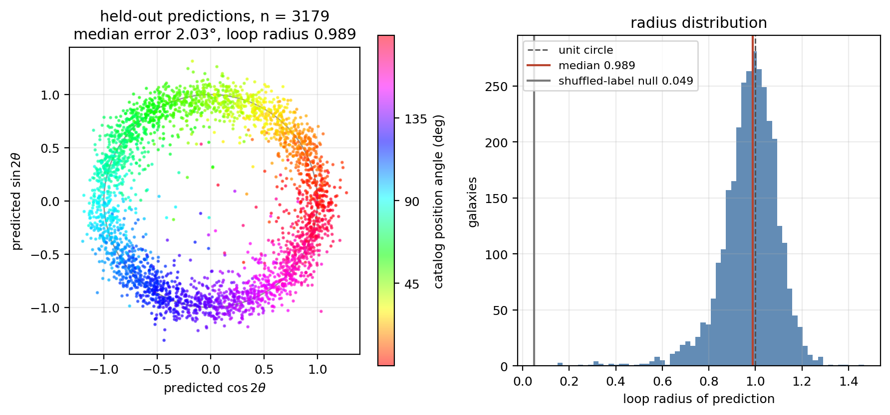
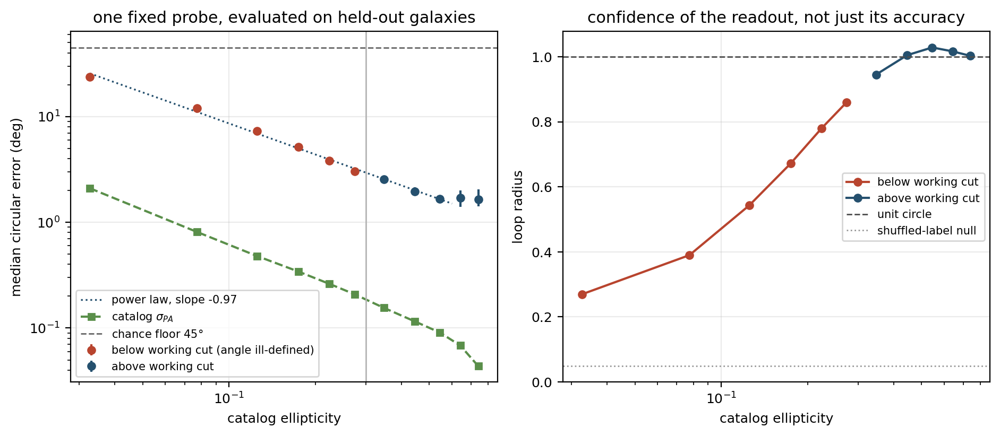
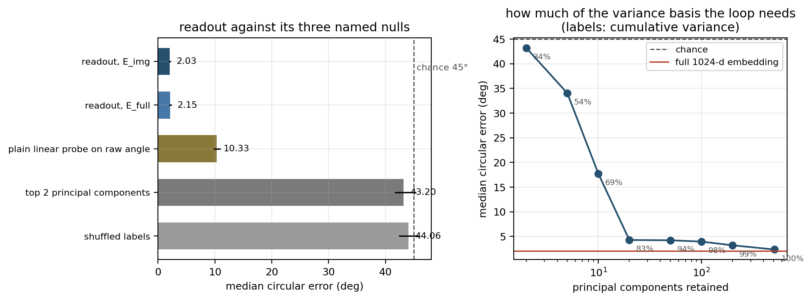
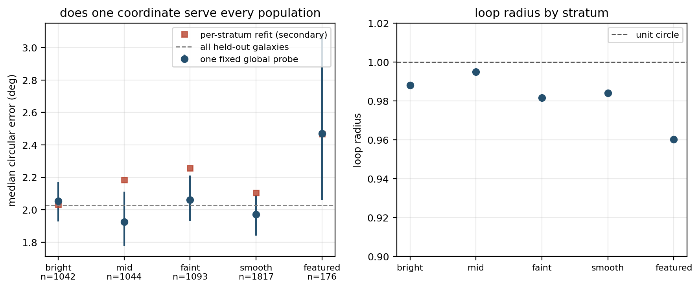
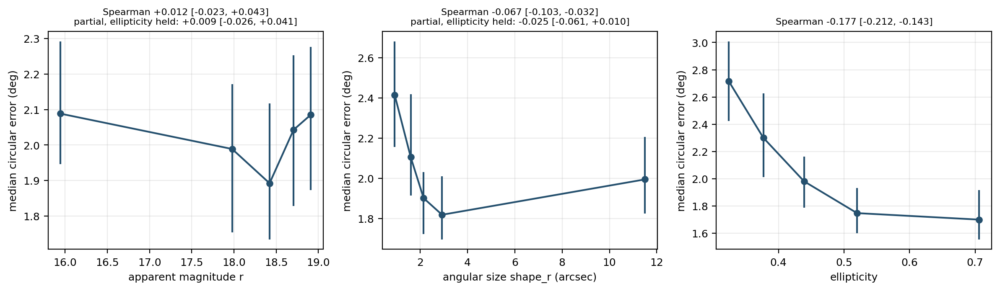
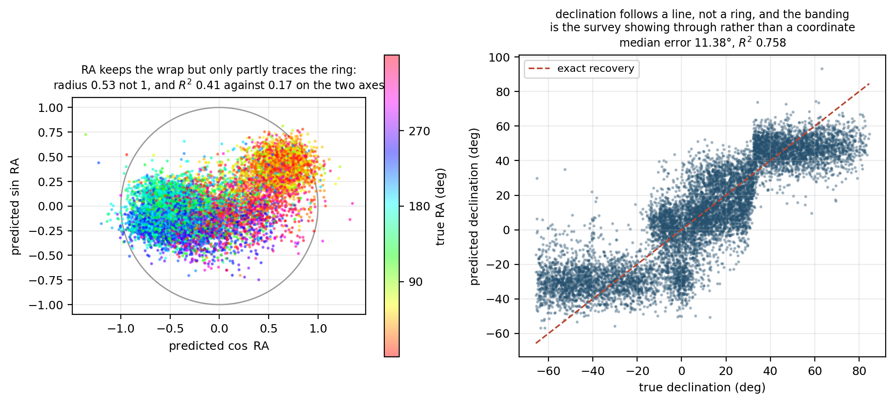
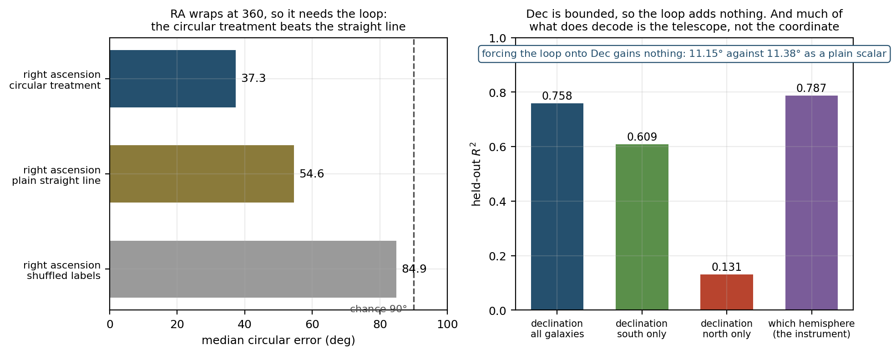

## 5. Diagnostic 2: O(2) equivariance · *input-space causal*

**Science question.** Does the internal angle coordinate transform correctly under known transformations of the input, and do the transformations compose the way they compose in the plane?

Diagnostic 1 establishes that an angle can be *read* from the embedding. That is a correlation between a representation and a catalog column, and it is compatible with the model having memorised an association rather than having built a coordinate. This diagnostic intervenes: it changes the input by an exactly known amount and asks whether the readout moves by exactly the amount the geometry requires, using a probe that never saw a transformed image.

### 5.1 The group, and what equivariance means here

Position angle is axial with period 180 degrees, represented as a point on the circle by the doubling of Section 4.1,

> z = exp(2 i theta)

The group acting on the image plane is O(2). Its two components act on theta as

> rotation of the image by phi:   theta -> theta - phi
> reflection about the vertical axis:   theta -> -theta
> reflection followed by rotation:   theta -> -theta - phi

and in the doubled representation as z -> z exp(-2 i phi), z -> conjugate(z), and z -> conjugate(z) exp(-2 i phi). Every element of O(2) is a rotation or a reflection composed with a rotation, so the rotation grid, the half turn, the reflection and the composition together exhaust the action of the group on this coordinate.

The test is then exactly the equivariance condition: with `theta_hat` the frozen probe's readout and T an operation on the image,

> theta_hat(T x) = T theta_hat(x)   for every T in the group

The sign in the first line is a property of our rotation operator, not of the group, and is verified rather than assumed in Section 5.2.

### 5.2 Conventions, pinned before anything expensive ran

A signed shift is the quantity this diagnostic measures, so a sign error would not raise an exception. It would return a slope of the wrong sign and produce a conclusion stated backwards. Three conventions are therefore pinned by tests that run before any encoding, in `paper1/tests/testTransforms.py`.

**The rotation sign.** `scipy.ndimage.rotate(+phi)`, applied plane by plane with bilinear interpolation and shape preserved, moves the array-frame angle by **-phi**. Verified on a synthetic bar of known angle over a grid of four start angles and six rotations, and again on real cutouts, where the median measured shift matches -phi to better than 0.5 degrees at 30, 60 and 150 degrees. [measured]

**The mirror.** `numpy.flip` on the column axis maps the array-frame angle to its negative, has fixed points at 0 and 90 degrees and displaces by exactly 90 degrees at 45 and 135. It is an **exact permutation of pixels**: the sorted multiset of pixel values and the total flux are unchanged, so it carries no interpolation error at all, while rotation does. [measured]

**The frame relation.** The cutouts are a north-up, east-left tangent projection from the Legacy Surveys viewer, so east is the -x direction and north the +y direction, and a direction at position angle PA east of north has components (-sin PA, cos PA). The array angle should therefore equal PA + 90, same-handed. This is measured, not quoted. Using the mean resultant length of the doubled angle as the statistic that decides handedness, the same-handed pairing concentrates at **R = 0.9866** while the opposite pairing does not, at **R = 0.0346**; only one pairing can. The offset is **89.854 ± 0.212 degrees** over 493 galaxies whose adaptive-moment fit converged, with a median absolute residual of 0.356 degrees, which is **0.69 standard errors** from exactly 90. [measured]

That offset matters for one element of the group and not the other. Write the array angle as `theta_arr = theta + c`, so that the catalog angle is recovered as `theta = theta_arr - c`. Under a rotation both angles move by -phi, so c cancels from their difference and the rotation test cannot see it. Under a reflection it does not cancel. The mirror sends `theta_arr` to `-theta_arr`, and reading the catalog angle back out of the reflected image gives

> theta' = (-theta_arr) - c = -(theta + c) - c = -theta - 2c

so with c exactly 90 the reflected readout is `-theta - 180`, which is `-theta` modulo 180, and a departure `c = 90 + delta` leaves a constant extra shift of **-2 delta**. Measuring c from the pixels therefore converts the reflection offset from a nuisance fitted to the flip data into a prediction the flip data can contradict. Section 5.6 reports the comparison.

### 5.3 The transformed inputs, and how they were verified

Eight transformed encodes are used: rotations by 30, 60, 90, 120, 150 and 180 degrees, the mirror, and the mirror followed by a 30-degree rotation. Each is a (15,893 × 1,024) float32 array over the elongated population in ascending anchor order. They were produced by an earlier run and are reused rather than recomputed. The eight files are about 127,000 encodes, which at the rate this run measures and records in its artifact is on the order of two hours of GPU time. Reuse is what makes this diagnostic cost minutes rather than hours. [measured]

Reusing them requires proof that each file is the operation its name claims and that its rows correspond to the galaxies the current population mask selects. A structural check cannot establish either. The check used is direct: **64 galaxies were re-encoded through the frozen model under the operators in `lib/transforms.py` and compared with the cached rows**. For all eight files the median absolute difference is **0.0**, most rows agree bitwise, and no row differs in direction by more than one part in ten thousand. As a measure of the check's power to fail, the same statistic computed against the legacy rows rolled by one row gives median absolute differences of **0.210 to 0.218**. The median, not the largest single difference, is the discriminating statistic here, and the gap between 0.0 and 0.21 is the margin by which the check could have failed and did not. [measured]

The largest single-component differences are small but not zero, and their origin is worth stating because it bears on how far cached embeddings can be trusted. They are **not** run-to-run non-determinism: encoding the same input twice inside one process reproduces it **exactly**, to a maximum absolute difference of 0.0, which the artifact records. The residual is a difference between the process that wrote the cached file and the process checking it. It leaves most rows bitwise identical and the rest with their direction intact, so it cannot be confused with a different operator, whose signature is the 0.21 of the rolled control. Per-file counts and cosines are in the artifact. [measured]

The population itself was checked rather than inherited: the current mask and the mask used to produce the files select the identical 15,893 indices in ascending order. [measured]

An earlier and weaker idea for this check is recorded here because its failure is informative rather than incidental. Nearest-neighbour self-match, which asks whether a transformed row is still nearest to its own untransformed row, gives 0.840 at 180 degrees but only **0.055 at 90 degrees** and 0.045 at 120. Rotation displaces the embedding further than galaxy identity holds it, and the ordering across angles is itself physical, since a half turn maps an axial object nearly onto itself. The statistic is reported in the artifact as a description of that displacement and is not used as a gate. [measured; the reading of the ordering is interpreted]

### 5.4 Rotation

One probe pair, fit once on the untransformed embeddings of the 12,714 training galaxies and never refit, recovers 2.027 degrees on the 3,179 held-out galaxies. That fit is identical to Diagnostic 1's, and reproduces it to **exactly 0.0 degrees**. It is then applied unchanged to each rotated encode. The recovered shift is the circular difference between the transformed and untransformed readouts of the same galaxy.

The two summary columns cover different populations, which the scoping document asks to be reported separately. The shift columns are over all 15,893 elongated galaxies, because a shift is a comparison of the model with itself and no label enters it. The error column is over the 3,179 held-out galaxies only, and is the leakage-free one. Both are in the artifact for every angle.

| applied | folded | expected shift | median shift, all | circular mean, all | error, held out (deg) | 95% CI |
|---|---|---|---|---|---|---|
| 30 | +30 | -30 | -29.926 | -29.928 | 2.619 | [2.539, 2.737] |
| 60 | +60 | -60 | -59.979 | -59.938 | 2.691 | [2.573, 2.816] |
| 90 | -90 | -90 | *ill-defined* (-50.639) | -89.967 | 2.622 | [2.481, 2.725] |
| 120 | -60 | +60 | +59.943 | +60.018 | 2.758 | [2.643, 2.884] |
| 150 | -30 | +30 | +29.918 | +29.948 | 2.573 | [2.468, 2.679] |
| 180 | 0 | 0 | -0.006 | -0.010 | 1.986 | [1.912, 2.082] |

Fitting the median recovered shift against the applied rotation folded into (-90, 90], with 90 degrees excluded, gives a slope of **-0.99896 with interval [-0.99960, -0.99825]** and a largest fit residual of 0.053 degrees. The resampling unit for that interval is the **galaxy**: each resample redraws galaxies, recomputes every angle's median shift on the same redrawn set, and refits, so the interval carries the correlation between angles that a per-angle interval would miss. On held-out galaxies alone the slope is **-0.99902 with interval [-1.00061, -0.99753]**. A slope of -1 is exact equivariance in the verified sign convention. The all-population interval stops **0.0004** short of -1 while the held-out interval covers it; the held-out figure is the leakage-free one, so the departure is not resolved where it counts, and the point estimate itself sits one part in a thousand away from -1. [measured]

**On 90 degrees.** Plus and minus 90 are the same point on a mod-180 loop, so a *signed* median shift there is not a well-defined quantity, and the scoping document excludes it from the fit for that reason. The plain median returns -50.639, which is an artifact of averaging values that straddle the wrap. The circular mean of the doubled angle does not straddle anything, because doubling maps ±90 to the same point, and it returns **-89.967**: the magnitude is recovered correctly at 90 degrees and only its sign is undetermined. The per-galaxy error there, 2.622 degrees, is as small as at any other angle. [measured]

**What the per-galaxy error should be compared against.** This error is a difference between two readouts of the *same* galaxy, not a readout against a catalog value, so the 2.027-degree baseline is not the right yardstick. If the two readouts erred independently with the same distribution, their difference would have a median of about **sqrt(2) × 2.027 = 2.866 degrees**. Every measured value lies below that reference, so the untransformed and transformed readouts err in the same direction on the same galaxy, which is what a single shared coordinate should do rather than two independent estimates. [measured; the inference about correlated errors is interpreted]

### 5.5 The half-turn self-map

A rotation by 180 degrees maps a galaxy's axis onto itself, so a readout on a genuinely mod-180 coordinate must return to where it started. The probe is built on a doubled-angle assumption, and this element tests that periodicity by intervention rather than inheriting it from the parameterisation. The median recovered shift is **-0.006 degrees** and the held-out per-galaxy error is **1.986 degrees [1.912, 2.082]**, the smallest of any element, consistent with a half turn being nearly the identity operation for an axial quantity. [measured]

### 5.6 Reflection

Under the mirror the readout should go to -theta, with fixed points where theta is 0 or 90 and maximal displacement where it is 45 or 135. This is a prediction about the *shape* of a curve rather than about one number, which is much harder to satisfy by accident.

The median circular error against the negated untransformed readout is **2.381 degrees [2.341, 2.425]**, and **2.495 degrees [2.370, 2.615]** on held-out galaxies. Regressing the recovered displacement on the predicted displacement -2 theta, away from the wrap boundary, gives a slope of **0.9826 [0.9782, 0.9869]** with intercept 0.074 over n = 14,088, a median absolute residual of **3.05 degrees** and a 95th percentile of 10.80. [measured]

That slope sits below 1 by about 1.7 per cent, and its interval excludes 1. The likely reason is not a failure of the reflection but the construction of the regression. The recovered displacement is built from the model's own readout while the predicted displacement is built from the catalog angle, so this line regresses a shrunk predictor on the quantity it predicts, and a ridge fit shrinks. The shortfall is of the same size as the shrinkage already measured directly as the loop radius of 0.9886 in Section 4.4. The rotation slope of Section 5.4 does not share this feature because there the independent variable is the applied rotation, which is exact and carries no shrinkage. [measured; the attribution to shrinkage is interpreted]

**Node and antinode structure, scored correctly.** Galaxies are selected within 5 degrees of each node, and a galaxy at PA = node + d has a *predicted* displacement of -2d, so the median predicted displacement across such a selection is the tolerance itself, 5 degrees, and at the antinodes it is 90 - 5 = 85. Scoring the measurement against 0 and 90 would therefore misattribute the selection width to model error.

| selection | n | median &#124;displacement&#124; | median predicted | analytic, given the 5-degree tolerance | residual against the per-galaxy prediction |
|---|---|---|---|---|---|
| within 5 deg of PA 0 or 90 | 1,736 | 6.029 | 5.025 | 5.0 | **2.780** |
| within 5 deg of PA 45 or 135 | 1,805 | 83.931 | 84.946 | 85.0 | **3.016** |

The last column is the only one of the three that is a statement about the model, and it sits at the same few degrees as every other element of the group. [measured]

**The offset, predicted and then measured.** From the frame offset of Section 5.2, the reflected readout should carry a constant shift of -2(c - 90) = **+0.292 ± 0.424 degrees**. The flip data return **-0.094 degrees**. The two agree at **-0.91 standard errors**. The prediction comes from adaptive moments on pixels and the measurement from a probe on embeddings, so they share no machinery beyond the catalog angle itself. [measured]

### 5.7 Composition

Mirroring and then rotating by 30 degrees should send the readout to -theta - 30. The median circular error against that composed prediction is **2.593 degrees [2.541, 2.639]**, and **2.734 degrees [2.585, 2.857]** on held-out galaxies, in line with the individual elements. Composition raises the claim from responding correctly to two separate transformations to representing the group action. [measured; the upgrade in claim is interpreted]

### 5.8 The invariance complement

Equivariance of the angle is only half of the requirement. Rotating or mirroring a galaxy changes nothing about its colour, its morphology or its stellar mass, so a model that moved those readouts would be writing orientation into quantities that have none. Four probes were fit once on untransformed embeddings, frozen, and applied to each transformed encode. This is the element of Diagnostic 2 that had never been run.

| quantity | declared source | n fit | n held out | R2 untransformed | R2 after a 30-degree rotation |
|---|---|---|---|---|---|
| colour g - r | derived from DR8 magnitudes | 12,714 | 3,179 | 0.9475 | 0.9454 |
| smooth vote fraction | Galaxy Zoo DESI | 12,714 | 3,179 | 0.7865 | 0.7618 |
| featured vote fraction | Galaxy Zoo DESI | 12,714 | 3,179 | 0.7902 | 0.7641 |
| stellar mass, elpetro | NSA crossmatch | 1,058 | 261 | 0.6571 | 0.6693 |

Stellar mass is reported with its sample size rather than dropped: only 1,058 elongated galaxies carry the label and 261 of those fall in the held-out split, so its entries are the least constrained in the table. [measured]

**The losses track resampling, not orientation.** The small reductions in R2 are not a function of how far the galaxy was turned. They track whether the operation resampled the pixels. The mirror is an exact permutation, and rotations by 90 and 180 degrees resample onto pixel centres, so all three are effectively interpolation-free; 30, 60, 120 and 150 degrees are not.

| quantity | mean change in R2, interpolation-free (mirror, 90, 180) | mean change in R2, off-axis (30, 60, 120, 150) | change under a 30-degree rotation, with interval | change under the mirror, with interval |
|---|---|---|---|---|
| colour g - r | -0.0019 | -0.0030 | -0.0020 [-0.0054, +0.0013] | -0.0022 [-0.0056, +0.0013] |
| smooth vote fraction | -0.0032 | -0.0271 | **-0.0247 [-0.0374, -0.0128]** | +0.0010 [-0.0093, +0.0107] |
| featured vote fraction | -0.0025 | -0.0293 | **-0.0261 [-0.0397, -0.0128]** | +0.0007 [-0.0094, +0.0101] |
| stellar mass | -0.0044 | -0.0127 | +0.0122 [-0.0208, +0.0515] | -0.0149 [-0.0614, +0.0213] |

The intervals separate the two cases rather than leaving the reading to the point estimates. For the two morphology readouts the loss under an off-axis rotation **excludes zero**, while the change under the mirror **covers zero**. The mirror changes orientation as completely as any rotation does, so a readout that survives it unharmed and degrades only when the pixels are resampled is telling us about the resampling, not about invariance. Colour is consistent with no change under either. Stellar mass is consistent with no change under both, but its intervals are wide enough at n = 261 that it constrains little either way, and it is quoted here as such rather than as support.

The two morphology readouts also lose more than colour does, by roughly a factor of nine on the mean off-axis change, -0.0271 and -0.0293 against -0.0030. That comparison is deliberately not quoted as a precise ratio: colour's own change is consistent with zero, so the denominator is consistent with zero, and the per-operation ratios range from 4 to 19 for that reason. The defensible statement is the ordering, not its size, and the ordering is what a physical reading predicts, since morphology votes depend on fine structure that interpolation blurs while colour is an integrated flux ratio that blurring barely touches. [measured; the attribution to resampling is interpreted, and rests on the mirror control]

Section 6.7 corroborates that attribution from a different direction. Diagnostic 3 measures the encoder's response to resampling directly, using rotations that cancel, and finds it large: four rotations returning an image almost to itself displace the embedding by 23.3 per cent of the distance to an unrelated galaxy. An operator that resamples therefore has a substantial effect available to explain the small losses seen here, and the mirror control shows those losses are absent when nothing is resampled.

Measured as movement rather than accuracy, and expressed in units of each readout's own spread so that the physical probe and the null are on one scale, a 30-degree rotation moves the colour readout by 0.144 of its spread and the morphology readouts by 0.220 and 0.220, against **0.456** for random directions; stellar mass moves by 0.157 against 0.505. Every physical readout moves by less than half what an arbitrary direction moves by, and its accuracy is preserved while doing so. [measured]

### 5.9 Nulls

The scoping document specifies two nulls for this diagnostic, and both are reported on both axes the result is reported on.

| null | slope against applied rotation | median circular error (deg) |
|---|---|---|
| unperturbed baseline (population control) | degenerate, exactly 0 by construction | 2.027 [1.946, 2.116] |
| matched-norm random directions, 20 pairs | -0.0058 [-0.139, +0.118] | 44.33 [37.88, 47.61] |
| analytic expectation for the random null | 0 | 45 |
| the fitted probe, for comparison | -0.99896 [-0.99960, -0.99825] | 2.573 to 2.758 |

Both nulls reproduce their analytic values. The unperturbed baseline is degenerate on the slope axis, because with no transformation the readout is compared with itself and the shift is exactly zero by construction; this is stated rather than presented as a passed test. The random-direction null is a direction pair drawn with the same norm as the fitted probe's coefficient vectors and carrying no fitted information, and it lands at chance on both axes. One caveat is recorded: movement measured relative to a readout's own spread is independent of the direction's norm, so norm matching does no work in that particular statistic, and the norm-matched absolute movement is reported in the artifact alongside it. [measured]

### 5.10 Consistency checks

- **Operator and row identity.** All eight cached encodes reproduce under re-encoding through the frozen model with median absolute difference 0.0 and mean cosine 1.0000000; the rolled control gives 0.210 to 0.218.
- **Baseline agreement.** The frozen probe reproduces Diagnostic 1's held-out error to a difference of exactly **0.0** degrees.
- **Independent reimplementation.** An earlier implementation written against a separate data loader returns a rotation slope differing from this one by **-9.5e-08** and a reflection displacement slope differing by **8.2e-10**.
- **Self-map.** The half turn returns the readout to -0.006 degrees against 0 expected.
- **Reflection offset.** Predicted from pixels at +0.292 ± 0.424 degrees, measured from embeddings at -0.094, agreeing at -0.91 standard errors.
- **Interpolation-free against interpolated.** The mirror, which resamples nothing, gives 2.495 degrees on held-out galaxies, inside the 1.986 to 2.758 range spanned by the rotations, so no element is anomalous.
- **Null calibration.** The random-direction slope reaches -0.0058 against 0 expected and its error reaches 44.33 degrees against 45.

### 5.11 What the result does and does not establish

Established, on this substrate and this population: the angle coordinate is **equivariant under the action of O(2) by intervention rather than by correlation**, with a slope of -0.999 against applied rotation whose held-out interval covers -1; the half turn returns the readout to its starting value, confirming the mod-180 periodicity independently of the parameterisation that assumes it; the reflection reproduces not only the right magnitude but the right shape, with nodes and antinodes where the geometry puts them and a residual of about three degrees against the per-galaxy prediction; the group composition law holds; the reflection's constant offset is predicted from an independent measurement on pixels and confirmed to within one standard error; and physical quantities that carry no orientation do not move, with the small residual losses attributable to resampling by the mirror control.

Not established here: that the model *uses* this coordinate for any downstream purpose, which no probe can show. That the equivariance extends to operations outside O(2), which Diagnostics 3, 5 and 9 test separately. That the representation is equivariant in any sense stronger than the behaviour of one linear readout of one coordinate: the embedding as a whole is not claimed to transform as a group representation, and the nearest-neighbour statistic of Section 5.3 shows that it moves substantially under rotation. And the interpolation attribution in Section 5.8 rests on a control, not on a model of the resampling, so it identifies the cause by elimination rather than by construction.

**Artifacts.** `paper1/diagnostics/d2Equivariance.py`, `paper1/diagnostics/d2EquivarianceFigures.py`, `paper1/results/d2Equivariance.json`, `paper1/results/d2EquivarianceArrays.npz`, figures `d2Rotation.png`, `d2Mirror.png`, `d2Invariance.png`, `d2Nulls.png`.

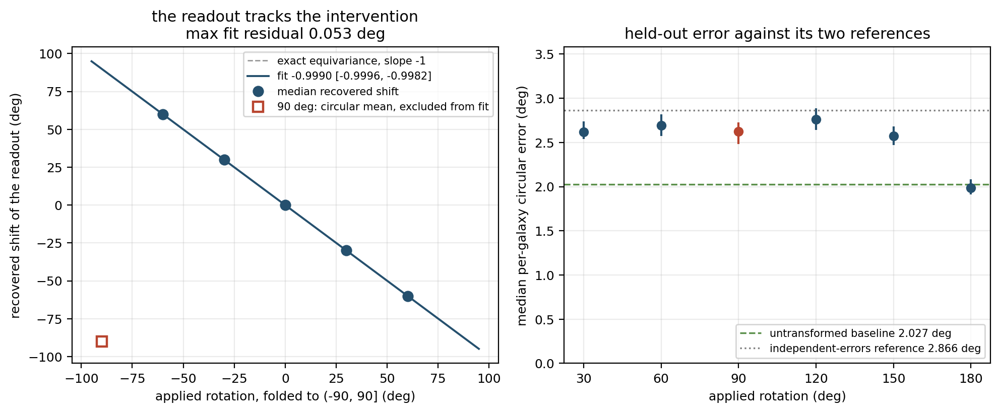
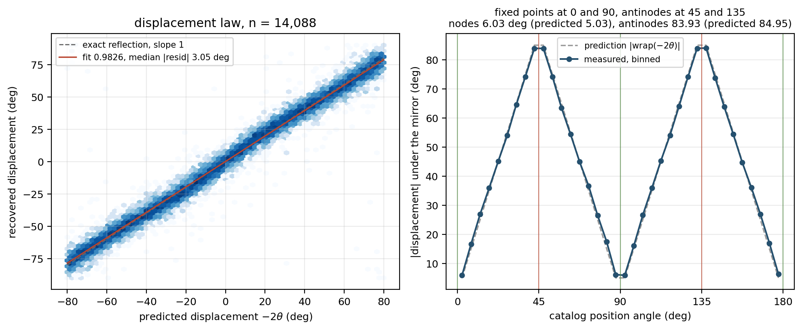
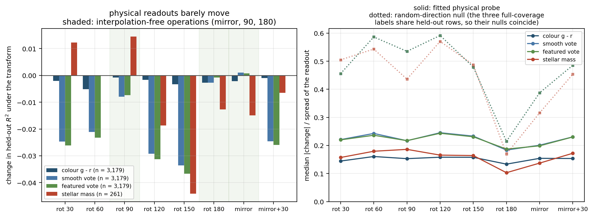
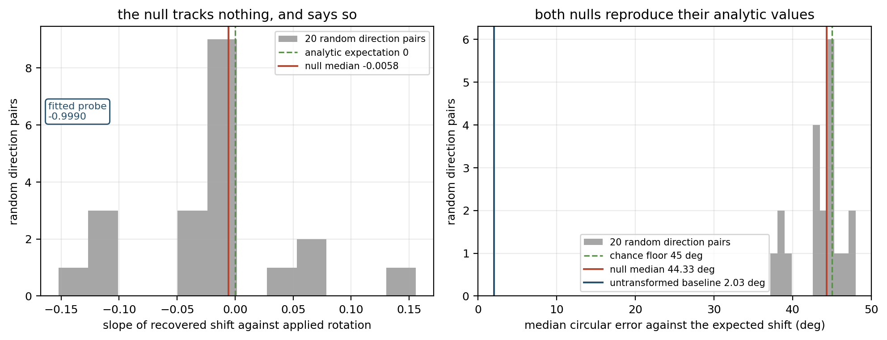

## 6. Diagnostic 3: Chirality · *input-space causal*

**Science question.** Does the model encode parity-odd structure, spiral arm handedness, or has it discarded a real physical observable?

### 6.0 What this section concludes, before the machinery

This section is the longest in the report because the measurement needs three controls, so the four conclusions are stated first and the evidence follows.

1. **The model has not discarded parity.** Flipping a galaxy into its mirror image moves the representation measurably more for galaxies with spiral arms than for otherwise identical galaxies without them. Section 6.4.
2. **But handedness is not stored as a readable feature.** There is no single direction whose sign gives a handedness label, so the free labelling the design hoped for does not exist. Section 6.5.
3. **The encoder is strongly sensitive to resampling.** Rotations that cancel out, returning an image almost exactly to itself, still move the embedding a long way. This was not anticipated, it constrains how the remaining causal diagnostics must be built, and it is why conclusion 1 rests on a matched comparison rather than on raw sizes. Section 6.7.
4. **Reading 1 and 2 together:** the model kept parity information but did not organise it. Section 6.9 gives the interpretation this invites.

### 6.1 Why the obvious test fails, and what replaces it

Comparing a pool of originals against a pool of mirror images measures nothing. Handedness is roughly even in nature, so the two pools have the same distribution. The test has to be paired, each object against its own reflection.

A plain mirror will not do either. Diagnostic 2 established that the readout tracks position angle under reflection almost exactly, so a plain paired difference would be dominated by orientation and would tell us only what Section 5 already did.

The isolating operation is a flip about the object's **own major axis**: rotate until that axis is horizontal, flip, rotate back. It leaves the position angle, the ellipticity and the entire elliptical envelope unchanged, and inverts chirality. What the difference contains is therefore only what the model sees beyond the ellipse.

### 6.2 What the gate established before anything was encoded

The operator is pinned by thirteen tests in `paper1/tests/testMajorAxisFlip.py`, which run before any encoding. The decisive one builds a logarithmic spiral of one handedness, flips it about its major axis, and requires the result to reproduce an **independently constructed** spiral of the opposite handedness rather than anything derived from the first. It also pins that an achiral ellipse is left alone by the flip, that the envelope axis and ellipticity survive, that the operator is an involution, and that the control carries the same interpolation loss to within 1e-3. [measured]

Two facts the gate produced changed the design.

**The flip needs two off-axis rotations, so it resamples.** Diagnostic 2 measured that off-axis rotation costs the morphology readout about 0.027 in R2 while an interpolation-free operation costs nothing, because resampling destroys fine structure. The scoping document treats the smooth pool's displacement as the interpolation floor, but that floor is not shared: featured objects have more fine structure and could lose more from the rotations alone. A per-object **matched-interpolation control** was therefore added, `axis_sandwich`, which applies the same two rotations with the flip omitted. It also serves as the scoping document's own second null, the same procedure with a rotation instead of a flip.

**The flip preserves the envelope axis but not a chiral object's apparent angle.** On synthetic spirals the arms pull the moment angle 5.78 degrees off the envelope axis, and the flip reflects that offset to the other side, so the apparent orientation moves by twice it. Whether the model's readout follows the envelope or the moments is therefore measured here rather than assumed. [measured]

### 6.3 Population and conditions

Every anchor galaxy with a defined position angle, **43,672**, with no subsampling. This is a wider population than Diagnostics 1 and 2 use, deliberately: the operator needs a fitted major axis, which is what a defined position angle means, while chirality is most visible in face-on discs, which are round and would be removed by an ellipticity cut.

| pool | definition | n |
|---|---|---|
| spiral armed | has-spiral-arms vote fraction above 0.5 | 2,432 |
| featured | featured-or-disk vote fraction above 0.7 | 1,943 |
| edge on | edge-on vote fraction above 0.5 | 1,362 |
| smooth | smooth vote fraction above 0.7, the achiral control | 30,852 |

Three conditions were encoded through the frozen model over the full population, **131,016 encodes**: the untransformed images, the major-axis flip, and the matched control. Three differences follow, all on embeddings z-scored with the same statistics used in Sections 4 and 5.

| name | definition | in plain terms |
|---|---|---|
| **the flip difference** (d_spec) | E(x) - E(flip(x)) | the scoping document's definition: the flip, plus the blurring the flip brings with it |
| **the matched difference** (d_pure) | E(sandwich(x)) - E(flip(x)) | flip against a control that blurs the same amount but reverses nothing |
| **the blur difference** (d_resampling) | E(x) - E(sandwich(x)) | the blurring on its own, and the scoping document's second null |

One warning before the numbers, because it changes how they should be read. The matched difference was meant to be the flip on its own. Section 6.7 shows it is not. Giving both sides the same *number* of rotations removes the systematic part of the blurring, but not the random part, because the two routes land on different pixel grids. So its size is mostly blurring. Only comparisons between matched objects, where the same blurring falls on both sides, support a conclusion. That is why the matched-pair result below carries the finding and the pooled sizes do not.

### 6.4 Does a parity inversion move the representation more for chiral objects

| pool | flip difference | matched difference | blur difference |
|---|---|---|---|
| spiral armed | 13.847 [13.599, 14.053] | **11.270 [11.005, 11.494]** | 7.442 [7.284, 7.582] |
| featured | 13.953 [13.663, 14.157] | 10.872 [10.667, 11.021] | 7.710 [7.547, 7.862] |
| edge on | 12.203 [11.910, 12.512] | 9.728 [9.466, 9.997] | 7.334 [7.188, 7.498] |
| smooth (achiral) | 12.487 [12.434, 12.536] | **10.106 [10.051, 10.167]** | 7.628 [7.594, 7.665] |

Medians of the difference norm in z-scored units, with bootstrap intervals over galaxies. The spiral-to-smooth ratio is 1.109 for the scoping definition and 1.115 once the resampling is matched. [measured]

**The suspected confound is absent in the pooled comparison and present, but small, once round objects are removed.** The resampling-only ratio over the whole population is **0.976**, below 1: smooth galaxies lose marginally more to the two rotations than spirals do. On matched pairs the resampling excess is -0.441 for the full sample but turns positive when the sample is restricted to a well determined axis, reaching +0.306 above ellipticity 0.3 and +0.672 above 0.4. So the effect the control was built to catch does exist in the regime where the operator works best; it is roughly a seventh the size of the flip signal there, which is why the conclusion survives it. Stating both halves, because the pooled number on its own would read as a clean exoneration and it is not one. [measured]

**The pools differ in more than handedness**, so the raw comparison is not enough. Spiral-armed galaxies are larger, brighter and more elongated than smooth ones, and all three change how far any perturbation moves an embedding. Each spiral was therefore matched to a distinct smooth galaxy of the same ellipticity, r magnitude and angular size, giving **2,057 pairs** balanced to 0.199 against 0.186 in ellipticity, 17.45 against 17.52 in magnitude, and 0.561 against 0.523 in log size.

| paired comparison | median excess | 95% CI | pairs with the spiral higher | sign test |
|---|---|---|---|---|
| under the flip | **+1.815** | [1.615, 2.107] | 1,301 of 2,057 (63.2 per cent) | p = 1.6e-33 |
| under the resampling null | -0.441 | [-0.721, -0.226] | 939 of 2,057 (45.6 per cent) | p = 8.6e-5 |

A spiral moves 1.815 further than an otherwise identical smooth galaxy under the flip, which is 19.4 per cent of the smooth median, while the same pairs under the operation that inverts nothing move by -0.441. Any residual mismatch in size or brightness would push both rows the same way, so the contrast between them is not explained by imperfect matching. [measured]

**Five attempts to make the excess go away.** Each is recorded in the artifact and recomputed on every execution.

| check | result |
|---|---|
| scale reference | the flip moves a smooth galaxy 23.2 per cent of the way to a completely different galaxy, so the displacement is not at the noise level |
| permutation null | randomly swapping which member of each pair counts as the spiral gives -0.061 [-0.339, +0.309] against the observed +1.815, which sits 10.2 standard deviations above it |
| well determined axis | the excess **grows** as the operator improves: +1.815 on 2,057 pairs, +2.194 [1.582, 2.667] above ellipticity 0.3 on 580 pairs, +2.217 above 0.4 on 239 pairs, with the sign test at p = 6.0e-16 and 3.8e-9 |
| matching order | greedy assignment repeated with four randomised orders gives +1.776, +1.922, +1.886 and +1.887 |
| bulk or tail | the spiral side is higher at every percentile from the 10th to the 90th, by +1.15, +1.78, +2.18, +1.99 and +1.71 |

The excess is not an artifact of the pairing, does not depend on the assignment order, is not carried by outliers, and strengthens rather than weakens in the regime where the operator isolates chirality best. [measured]

**The excess tracks arms rather than being featured.** Galaxies with recorded spiral arms give 11.270 [11.005, 11.494]. Featured galaxies without recorded arms give 9.332 [9.002, 9.836] on 443 objects, below the smooth baseline. Edge-on discs, which carry arms that cannot be resolved as handedness, give 9.728 [9.466, 9.997], also below it. The pool physics predicts to be most symmetric about its major axis is measured as the most symmetric. [measured; the reading is interpreted]

### 6.5 Is it a single axis, and does a handedness label fall out

This is the part of the scoping document's design that does not survive. If handedness were one encoded feature, the difference vectors would lie along plus or minus one direction c, and the sign of each object's projection onto c would be a handedness label at arbitrary sample size.

Read this subsection together with Section 6.7. The vectors being decomposed here are dominated in magnitude by the encoder's response to resampling rather than by the flip, so most of the structure found below is resampling structure. That does not weaken the conclusion, which is negative, and it explains why the achiral pools show more of it than the chiral one.

| pool | leading variance fraction | sign balance | mean norm / median norm | fraction along the leading axis |
|---|---|---|---|---|
| spiral armed | 0.2409 | 0.583 | 0.098 | 0.245 |
| featured | 0.2478 | 0.592 | 0.112 | 0.255 |
| smooth (achiral) | **0.2966** | 0.577 | 0.128 | 0.263 |
| edge on | **0.3391** | 0.604 | 0.162 | 0.305 |
| random direction | 0.000907 | | | |

The leading axis carries far more than a random direction would, which is 1/1024. But it carries **more in the achiral pools than in the chiral one**, and an axis that is stronger where there is no handedness cannot be handedness. Restricting to a well determined major axis does not change this: above ellipticity 0.3 the spiral pool gives 0.2586 and the smooth pool 0.3080. Only a quarter of each difference lies along the leading axis, and the distribution of projections is unimodal at zero rather than the two clusters at plus and minus c that an encoded handedness requires. **No self-supervised handedness label is available from this representation.** [measured]

That a dominant axis exists at all is not evidence to the contrary, and the artifact records why. The statistic is calibrated on every run against three synthetic cases with known answers. A true handedness axis gives a leading fraction of **0.9002** with sign balance 0.521 and a mean-to-median ratio of 0.041. A constant offset shared by every object, which is what a systematic resampling residual looks like, gives a leading fraction of **0.8004**, just as dominant, but sign balance 1.000 and a ratio of 0.895. Structureless noise gives 0.0028. A dominant leading axis therefore separates neither case on its own, and the three columns above have to be read together; they place the observed structure in neither category. [measured]

### 6.6 Controls

**The resampling null has its own axis, and it is a different one.** On the spiral pool the resampling difference gives a leading fraction of 0.3199 with sign balance 0.377 and a mean-to-median ratio of 0.451, the signature of a partly systematic offset. The cosine between the chirality axis and the resampling axis is **0.0154**, so the flip and the resampling write to essentially orthogonal directions. [measured]

**The orientation leak is real, large, and not chirality specific.** Applying the frozen Diagnostic 1 probe to the flipped and control embeddings, the readout shifts by a median of 6.438 degrees for spirals, 5.577 for smooth galaxies, and only 1.818 for edge-on discs. If this were the chirality effect predicted in Section 6.2 it would appear in the chiral pool alone. It does not. It tracks how well the major axis is determined, which is what the ellipticity grading shows.

| catalog ellipticity | n (spiral pool) | median &#124;d_pure&#124; | median &#124;readout shift&#124; (deg) |
|---|---|---|---|
| 0.0 to 0.1 | 341 | 11.629 | 15.392 |
| 0.1 to 0.2 | 799 | 11.453 | 9.256 |
| 0.2 to 0.3 | 653 | 11.068 | 5.811 |
| 0.3 to 0.5 | 588 | 10.993 | 3.310 |
| 0.5 to 1.0 | 51 | 9.725 | 3.978 |

The flip is about the **catalog** major axis, whose uncertainty grows as an object becomes round, and flipping about an axis that is wrong by an angle rotates the object by twice that angle. The leak falls by a factor of nearly five across the range while the difference norm barely moves, and the rank correlation between the two is only +0.120 [0.078, 0.159] in the spiral pool and +0.053 [0.042, 0.064] in the smooth pool. The displacement being measured is therefore not mostly orientation, but the leak is a real limit on how cleanly the operator isolates chirality for round objects, which are exactly the ones whose arms are most visible. [measured; the attribution to catalog angle error is interpreted]

### 6.7 The antisymmetry identity, and what it revealed about the encoder

The scoping document states that the difference vector is "antisymmetric by construction", meaning d(flip(x)) = -d(x). That follows if the flip is an involution, which it is in pixel space: `tests/testMajorAxisFlip.py` verifies it to a correlation above 0.999. Whether it survives the **encoder** is a different question, and it was asserted rather than measured. Adding the two differences gives

> d(x) + d(flip(x)) = E(x) - E(flip(flip(x)))

so the residual of the identity is the distance between the original encode and the twice-flipped one. Two further conditions were encoded over the full population to measure it, along with the same four rotations carrying no flip, which is its floor.

| quantity | median |
|---|---|
| antisymmetry residual, E(x) against the twice-flipped encode | 11.232 [11.199, 11.266] |
| matched floor, four rotations with no flip | 10.149 [10.112, 10.182] |
| ratio of the two | 1.107 |
| the residual as a fraction of d_spec | 0.885 |

The identity does **not** hold in embedding space. The residual is 88.5 per cent of the size of the quantity the diagnostic measures. But the reason is not that the flip fails to undo itself: the floor is 10.149, so almost all of the residual is present when no flip happens at all. [measured]

**That floor is the substantive finding.** Four bilinear rotations that return an image almost exactly to where it started still move the embedding by 10.149, which is **23.3 per cent of the distance between two unrelated galaxies**. The encoder is strongly sensitive to resampling.

| displacement | median | note |
|---|---|---|
| two rotations | 7.587 | |
| four rotations | 10.149 | ratio to two rotations 1.338, against 1.414 if each resampling contributed independently |
| d_pure | 10.352 | |
| two independent resampling draws would give | 10.730 | d_pure reaches **0.965** of this |

So d_pure, which compares two different two-rotation states, lands within four per cent of what two independent resampling draws alone would produce. Its absolute magnitude is therefore mostly the encoder reacting to interpolation, not chirality. [measured; the attribution is interpreted, and rests on the four-rotation floor]

Three consequences, stated because they qualify the rest of this section.

First, the pooled magnitudes in Section 6.4 cannot be read as chirality. Only the matched-pair comparison carries a conclusion, because there the same resampling applies to both members and the resampling-only control is measured on the same pairs.

Second, it explains the otherwise puzzling result in Section 6.5. The leading axis of d_pure is stronger in the achiral pools than the chiral one, which was hard to interpret; if most of d_pure is resampling response, then most of the structure that analysis found is resampling structure, and there is no reason for it to be weaker where there is no handedness.

Third, it qualifies any diagnostic that intervenes by interpolating. Among those still to run that is Diagnostic 9, whose artificial redshifting rescales angular size; Diagnostic 5's perturbations do not move light onto a new pixel grid and are not subject to this specific effect. Designs that compare an interpolated condition against a non-interpolated one will be dominated by the displacement measured here.

It does **not** undercut Diagnostic 2, and the contrast between the two is itself informative. Section 5.4 rotates the input and recovers the angle to between 2.573 and 2.758 degrees against an untransformed baseline of 2.027, so the angle coordinate survives rotation nearly intact. Yet the same class of operation moves the embedding as a whole by the amounts above. The orientation information is therefore carried in a part of the representation that resampling barely disturbs, while the bulk of the embedding is disturbed considerably. A diagnostic reading one targeted coordinate can be robust where a diagnostic reading whole-vector distances is not, which is the practical lesson for the diagnostics still to come. [interpreted, from the two measurements together]

### 6.8 Nulls

| null | type | result | analytic expectation |
|---|---|---|---|
| achiral smooth pool | population control | d_pure 10.106 [10.051, 10.167] against 11.270 for spirals | lower than the chiral pool |
| rotation instead of a flip | population control | spiral-to-smooth ratio 0.976; paired excess -0.441 | no excess for chiral objects |
| random directions | matched-norm random directions | 0.000907 of the variance | 1/1024 = 0.000977 |

All three behave as they should. The random-direction null reproduces its analytic value, and the rotation null shows no chiral excess on either the pooled or the paired comparison. [measured]

### 6.9 What the result does and does not establish

Established, on this substrate and this population: a parity inversion applied to the input **moves the representation measurably more for galaxies with spiral arms than for otherwise identical galaxies without them**, by 19.4 per cent on matched pairs with a sign test at p = 1.6e-33, while the same pairs under an operation that resamples identically but inverts nothing move the other way. Parity-odd information therefore survives in the frozen embedding rather than having been discarded. The ordering across pools follows the physics: arms above featured-without-arms, and edge-on discs, whose handedness is not resolvable, at the bottom.

**An interpretation this invites, contributed by Matt.** A null on chirality is not surprising and would not have been a failure of the suite. Handedness is not a strongly scientifically loaded property, and it is very unlikely to appear among the galaxy properties AION was aligned against during training. Read that way, the pair of results is the interesting thing: the model **keeps information that serves its training objective and does not organise information that does not**. Parity survives in the representation, because a mirror image is visibly a different image, but nothing shaped it into a usable coordinate, because nothing in training ever asked for one. That reading is consistent with everything measured here and is not established by it: this suite never inspected AION's training targets, so the claim about what the objective did or did not contain is outside what these measurements can support. [interpreted]

Not established, and the scoping document expected it might be: **handedness is not encoded as a single direction**. The leading axis of the difference is stronger in achiral pools than chiral ones, only a quarter of the difference lies along it, and the projections are unimodal. The self-supervised handedness label the design hoped to extract does not exist in this representation, and this diagnostic does not deliver one.

Also established, and not anticipated by the design: **the frozen encoder is strongly sensitive to resampling**. Four bilinear rotations returning an image almost exactly to itself move the embedding 23.3 per cent of the way to an unrelated galaxy. This is why the pooled magnitudes here carry no conclusion on their own, why the leading-axis structure appears in achiral pools too, and why the antisymmetry identity the scoping document treats as automatic fails in embedding space while holding in pixel space. It also sets a floor for Diagnostic 9, which rescales angular size and therefore resamples, and it is recorded as standing caveat 6.

Three limits on the positive result. The matched control equalises ellipticity, brightness and angular size, but not the amount of resolved internal structure; a galaxy with arms has more structure that is asymmetric about its major axis than a smooth galaxy of the same size, so the measurement cannot fully separate "the model encodes handedness" from "the model responds to asymmetry about the major axis, of which arms are the main kind". Because the single-axis test fails, nothing here distinguishes those two readings, and the weaker one is what is claimed. The operator flips about the catalog axis, so for round objects it inverts parity about a slightly wrong line, which the orientation leak quantifies at up to 15 degrees in the roundest bin. And the excess is measured against a resampling background of comparable size, so it is a differential result and would not survive being restated as an absolute one.

No external handedness catalogue was used. The scoping document marks that validation optional, and none is held locally.

**Artifacts.** `paper1/diagnostics/d3Chirality.py`, `paper1/diagnostics/d3ChiralityFigures.py`, `paper1/results/d3Chirality.json`, `paper1/results/d3ChiralityArrays.npz`, figures `d3Magnitude.png`, `d3Axis.png`, `d3Controls.png`.

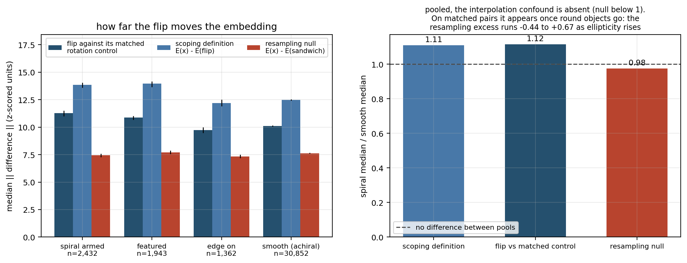
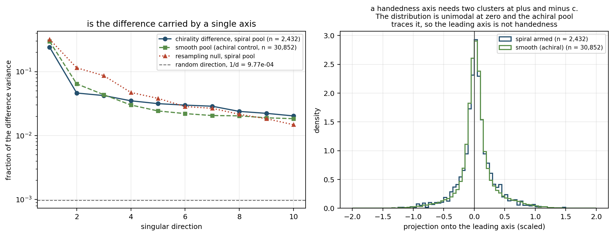
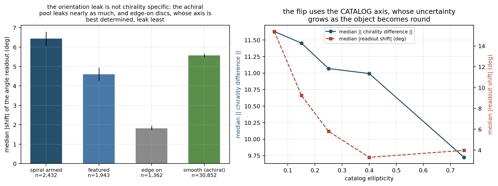

---

# Pillar II: Instrumental and observational systematics

The embedding is supposed to describe the source. Every image also records the conditions it was taken under, and none of that is a property of the object. This pillar quantifies that contamination. It does double duty: these numbers set the confound budget that qualifies every physical result in Pillar III, and they are the most directly usable results in the suite for anyone doing cross-survey work.

## 7. Diagnostic 4: Nuisance decodability and leakage · *descriptive*

**Science question.** How strongly does the embedding encode the observation rather than the object, and can it recover information that should be unavailable from the image entirely?

**Procedure as implemented.** *pending*

**Nulls.** *pending*: shuffled labels; the residualization drop compared against the drop from residualizing on random covariates of matched dimension.

**Results.** *pending*

**What it tells us.** *pending*

**Stated limitation.** The residualization drop compares R-squared on targets of different variance. It is a crude apportionment, not a mediation decomposition, and is reported as such.


**Artifacts.** `paper1/diagnostics/d4NuisanceLeakage.py`, `paper1/results/d4NuisanceLeakage.json`, `paper1/figures/d4*.png`

## 8. Diagnostic 5: Degradation response · *input-space causal*

**Science question.** Does the representation respond to controlled degradation the way the physics requires, and where does each physical readout break?

**Procedure as implemented.** *pending*

**Nulls.** *pending*: the unperturbed baseline; perturbations applied to a matched random subset of pixels rather than physically.

**Results.** *pending*

**What it tells us.** *pending*: the severity at which each physical readout loses half its accuracy is an effective operating limit, directly usable by anyone applying the model to a survey different from the training set.


**Artifacts.** `paper1/diagnostics/d5Degradation.py`, `paper1/results/d5Degradation.json`, `paper1/figures/d5*.png`

---

# Pillar III: Physical structure

Predicting stellar mass accurately is a statement about information content. Reconstructing the Hubble tuning fork, an ordered sequence that branches exactly where bars become possible and bends rather than running straight, is a statement about structure. The first is already established by downstream benchmarks. The second is not, and it is the stronger claim about whether a model has learned physics.

## 9. Diagnostic 6: Decodability battery · *descriptive, with two control arms*

**Science question.** Which physical quantities are linearly readable from pixels alone, particularly quantities the model never received as input?

**Procedure as implemented.** *pending*

**Nulls.** *pending*: shuffled labels; a raw-pixel-PCA floor requiring no model weights.

**Results.** *pending*

**What it tells us.** *pending*: quantities that are never model inputs in any substrate and still decode well are the cleanest evidence of learned physics rather than input recall. Any entry where the model ties the pixel floor is non-discriminating and is marked as such.


**Artifacts.** `paper1/diagnostics/d6Decodability.py`, `paper1/results/d6Decodability.json`, `paper1/figures/d6*.png`

## 10. Diagnostic 7: Concept geometry under a calibrated null · *descriptive with calibrated null (methods contribution)*

**Science question.** Do the directions encoding distinct physical properties sit further apart than the properties' own correlations require?

**Procedure as implemented.** *pending*

**Nulls.** *pending*: the pair-specific calibrated generative null, and the sanity anchors that gate whether its output can be trusted.

**Results.** *pending*

**What it tells us.** *pending*: with per-pair p-values this becomes an inferential statement rather than a descriptive contrast, and false-discovery control across the sweep becomes possible for the first time.

**Stated assumption.** The null assumes the model's linearly-decodable structure is adequately described by a linear-Gaussian generative model in the embedding. That is an assumption, but a stated one with testable consequences, which is a strict improvement on an uncalibrated contrast.


**Artifacts.** `paper1/diagnostics/d7ConceptGeometry.py`, `paper1/results/d7ConceptGeometry.json`, `paper1/figures/d7*.png`

## 11. Diagnostic 8: Structured relations · *descriptive*

**Science question.** Does the model organize physical relationships the way nature does, preserving ordering, regime-dependence, curvature and conditional structure, rather than merely encoding the marginal quantities?

**Procedure as implemented.** *pending*

**Nulls.** *pending*: shuffled labels for every fitted direction; a matched noise null for the curvature test; held-out evaluation for the fork; a non-branching control property.

**Instance gate.** Before any instance of 8d or 8e runs, the relation must be shown to be visible in label space with the sample actually in hand. The gate is stated in advance precisely so that dropping an instance is distinguishable from selecting the ones that worked. Gate outcomes are recorded here whether they pass or fail.

**Results.** *pending*

**What it tells us.** *pending*: this is where "encodes physics" is distinguished from "organizes physics".


**Artifacts.** `paper1/diagnostics/d8StructuredRelations.py`, `paper1/results/d8StructuredRelations.json`, `paper1/figures/d8*.png`

## 12. Diagnostic 9: Artificial redshifting · *input-space causal*

**Science question.** When an object is transformed to look like it sits at a higher redshift, does the embedding move along the empirically derived redshift direction, by the right magnitude, and without disturbing intrinsic properties?

**Procedure as implemented.** *pending*

**Nulls.** *pending*: matched-norm random directions; the untransformed baseline; real objects at the target redshift as the reference population.

**Results.** *pending*

**What it tells us.** *pending*: this upgrades an embedding-level translation result, where one merely adds a vector and inspects neighbours, into a genuine intervention on the input. The on-manifold check is what makes it credible.


**Artifacts.** `paper1/diagnostics/d9ArtificialRedshift.py`, `paper1/results/d9ArtificialRedshift.json`, `paper1/figures/d9*.png`

---

## 13. Findings index

One row per claim, with its section, key numbers, evidential tier and artifact. Rows are added as diagnostics land. No row is marked as a headline: that selection belongs to the manuscript.

| # | Claim | Section | Key numbers | Tier | Artifact |
|---|---|---|---|---|---|
| 1 | A linear readout recovers the axial angle from the image-only embedding on held-out galaxies | 4.4 | 2.027 deg [1.946, 2.116], n = 3,179; R2 0.9703 / 0.9658; 99.72 percent within 20 deg | descriptive | d1AngleReadout.json |
| 2 | Predictions land on the unit circle rather than collapsing toward its centre | 4.4 | loop radius 0.9886 [0.9836, 0.9928] | descriptive | d1AngleReadout.json |
| 3 | The readout is not an artifact of one partition | 4.10 | 10 splits: mean 1.989, sd 0.050, range [1.907, 2.040] | descriptive | d1AngleReadout.json |
| 4 | Fidelity degrades monotonically as the axis becomes ill-defined | 4.5 | 23.643 deg at ellipticity 0.00-0.05 to 1.646 deg above 0.70; Spearman -0.991, p = 3.8e-9 | descriptive | d1AngleReadout.json |
| 5 | Error scales inversely with elongation, as a geometric axis estimator does | 4.5 | log-log slope -0.974 against -1.109 for the catalog uncertainty; error x ellipticity about 0.88 deg | descriptive | d1AngleReadout.json |
| 6 | The readout saturates above ellipticity 0.6 | 4.5 | 1.694 and 1.646 deg in the two highest bins | descriptive | d1AngleReadout.json |
| 7 | The measurement is not limited by the uncertainty of its label | 4.8 | catalog sigma_PA median 0.111 deg, IQR [0.060, 0.194], against a readout error of 2.027 deg | descriptive | d1AngleReadout.json |
| 8 | One coordinate serves every brightness and morphology stratum tested | 4.7 | fixed probe 1.926 to 2.471 deg, radii 0.9603 to 0.9951, all intervals overlapping 2.027 | descriptive | d1AngleReadout.json |
| 9 | Readout error is unrelated to apparent brightness | 4.8 | Spearman +0.012 [-0.023, +0.043], p = 0.51 | descriptive | d1AngleReadout.json |
| 10 | The apparent angular-size trend is the elongation dependence | 4.8 | raw -0.067 [-0.103, -0.032]; partial with ellipticity held -0.025 [-0.061, +0.010] | descriptive | d1AngleReadout.json |
| 11 | A periodic quantity needs the circular treatment; a bounded companion does not | 4.6 | position angle 2.027 circular against 10.329 linear; inclination 1.565 linear against 1.529 circular | descriptive | d1AngleReadout.json |
| 12 | The angle coordinate is invisible to the dominant variance directions | 4.9 | top 2 components 43.198 deg at 34 percent of variance; chance 45; about 20 components needed to reach 4.28 | descriptive | d1AngleReadout.json |
| 13 | The machinery reports nothing when there is nothing | 4.9, 4.11 | shuffled labels 44.060 deg [42.47, 45.76] against a theoretical 45, loop radius 0.0487 | descriptive | d1AngleReadout.json |
| 14 | The angle coordinate is equivariant under rotation of the input, by intervention | 5.4 | slope -0.99896 [-0.99960, -0.99825]; held out -0.99902 [-1.00061, -0.99753], covering -1; max fit residual 0.053 deg | input-space causal | d2Equivariance.json |
| 15 | The mod-180 periodicity holds under intervention, not only by construction | 5.5 | half turn returns the readout to -0.006 deg; per-galaxy error 1.986 deg [1.912, 2.082] | input-space causal | d2Equivariance.json |
| 16 | The reflection reproduces the predicted shape, not merely a magnitude | 5.6 | displacement slope 0.9826 [0.9782, 0.9869] over n = 14,088; residual against the per-galaxy prediction 2.780 deg at the nodes and 3.016 deg at the antinodes | input-space causal | d2Equivariance.json |
| 17 | The reflection's constant offset is predicted from pixels and confirmed on embeddings | 5.2, 5.6 | frame offset 89.854 +/- 0.212 deg predicts +0.292 +/- 0.424; measured -0.094; agreement -0.91 sigma | input-space causal | d2Equivariance.json |
| 18 | The transformations compose as they do in the plane | 5.7 | mirror then 30 deg: 2.593 deg [2.541, 2.639]; held out 2.734 deg [2.585, 2.857] | input-space causal | d2Equivariance.json |
| 19 | Quantities carrying no orientation do not move when the input is turned | 5.8 | colour R2 0.9475 to 0.9454, morphology 0.7865 to 0.7618, stellar mass 0.6571 to 0.6693 (n = 261) under a 30 deg rotation | input-space causal | d2Equivariance.json |
| 20 | The residual movement of physical readouts is a resampling artifact, not a loss of invariance | 5.8 | morphology under a 30 deg rotation -0.0247 [-0.0374, -0.0128], excluding zero, against +0.0010 [-0.0093, +0.0107] under the exact mirror, covering zero | input-space causal | d2Equivariance.json |
| 21 | Physical readouts move less than half as far as an arbitrary direction of the same norm | 5.8, 5.9 | 0.144 to 0.220 of the readout's own spread against 0.456 for random directions under a 30 deg rotation | input-space causal | d2Equivariance.json |
| 22 | Both declared nulls reproduce their analytic values on both axes | 5.9 | random directions: slope -0.0058 [-0.139, +0.118] against 0, error 44.33 deg [37.88, 47.61] against 45 | input-space causal | d2Equivariance.json |
| 23 | The cached transformed encodes are the operators they claim and are row aligned | 5.3 | all eight reproduce on re-encoding with median absolute difference 0.0 and mean cosine 1.0000000; rolled control 0.210 to 0.218 | input-space causal | d2Equivariance.json |
| 24 | Rotation displaces the embedding further than galaxy identity holds it | 5.3 | nearest-neighbour self-match 0.840 at 180 deg, 0.055 at 90 deg, 0.045 at 120 deg | input-space causal | d2Equivariance.json |
| 25 | A parity inversion moves the representation more for spiral-armed galaxies than for matched non-spirals | 6.4 | +1.815 [1.615, 2.107] on 2,057 matched pairs, 19.4 per cent of the smooth median, 63.2 per cent of pairs positive, sign test p = 1.6e-33 | input-space causal | d3Chirality.json |
| 26 | That excess is specific to the parity inversion, not to the resampling it carries | 6.4 | the same pairs under the rotation-only null give -0.441 [-0.721, -0.226], the opposite sign | input-space causal | d3Chirality.json |
| 27 | The excess tracks resolved arms rather than being featured | 6.4 | arms 11.270 [11.005, 11.494]; featured without recorded arms 9.332 [9.002, 9.836]; edge-on discs 9.728 [9.466, 9.997], both below the smooth baseline of 10.106 | input-space causal | d3Chirality.json |
| 28 | Handedness is NOT encoded as a single direction, so no self-supervised label exists | 6.5 | leading variance fraction 0.2409 for spirals against 0.2966 for the achiral pool; only 0.245 of the difference lies along it; projections unimodal | input-space causal | d3Chirality.json |
| 29 | The chirality axis and the resampling axis are essentially orthogonal | 6.6 | cosine 0.0154 | input-space causal | d3Chirality.json |
| 30 | The operator's isolation degrades for round objects, because it flips about the catalog axis | 6.6 | readout shift 15.392 deg in the roundest bin falling to 3.310 deg above ellipticity 0.3; not chirality specific, since the achiral pool leaks 5.577 deg | input-space causal | d3Chirality.json |
| 31 | The frozen encoder is strongly sensitive to resampling | 6.7 | four rotations returning an image almost to itself move the embedding 10.149, which is 23.3 per cent of the distance between two unrelated galaxies | input-space causal | d3Chirality.json |
| 32 | The antisymmetry the scoping document treats as automatic holds in pixel space but not in embedding space | 6.7 | residual 11.232 against a four-rotation floor of 10.149, ratio 1.107, and 0.885 of d_spec; pixel-space involution verified above 0.999 correlation | input-space causal | d3Chirality.json |
| 33 | The absolute size of the flip difference is mostly resampling, so only matched differentials are interpretable | 6.7 | d_pure 10.352 against 10.730 for two independent resampling draws, reaching 0.965 of it | input-space causal | d3Chirality.json |

---

## Appendix A: validation and reproducibility

**Reproducing the suite.** The environment is pinned in `envInterp.txt` at the repository root (Python 3.11.14, NumPy 1.26.4, SciPy 1.17.0, scikit-learn 1.8.0). With the anchor data present under `data/`:

```
python -B paper1/runAll.py            status and provenance of every diagnostic
python -B paper1/runAll.py d1         run one diagnostic and render its figures
python -B paper1/runAll.py --verify   re-hash every recorded input and compare
python -B -m pytest paper1/tests -q   convention, null and cache-safety tests
python -B paper1/auditReport.py       check every number here against its artifact
```

The `-B` flag is not optional in practice. `config.py` disables bytecode writing once it is imported, but modules imported before it are already cached by then, so only `-B` at launch leaves the tree clean.

**Provenance.** Every results file carries the git revision and dirty flag, the UTC timestamp, wall-clock seconds, the seed, interpreter and package versions, the platform, and the SHA-256 and byte count of every input file read. `runAll.py --verify` re-hashes those inputs and reports any that have changed since the run, so a result can never be silently attributed to data it was not computed from.

**Test suite.** Seventy-three tests cover the three failure modes that would invalidate results without producing an error: an incorrect convention, an uncalibrated null, and a reused embedding that is not what it claims to be. Sixty-seven run by default in about four seconds and none of them is skipped. The remaining six need the model weights and a GPU, and are run deliberately with `PAPER1_GPU_TESTS=1`.

- *Conventions* (`tests/testConventions.py`): the ellipticity identities, the axial-doubling reconstruction, inclination from axis ratio, the exclusion of circular-by-construction models, uniformity of retained position angles, and the inverse-elongation scaling of the catalog angle uncertainty, all checked against the real catalog rather than against documentation.
- *Nulls and circular machinery* (`tests/testNulls.py`): the analytic chance floors of 45 and 90 degrees for axial and full-circle quantities, wrap symmetry across the seam, collapse of both error and loop radius under shuffled labels, recovery and radius on synthetic data of known signal strength, the loop-radius shrinkage identity at three signal levels, near-orthogonality of random directions in high dimension, determinism of the split, and boundedness of the error by the period.
- *Cache safety* (`tests/testEncode.py`): that the recorded recipe carries the frozen settings; that an adopted entry round trips; that **a cache hit requested with different parameters raises rather than returning the wrong array**; that adoption rejects a wrong row count, a wrong width, a wrong dtype and any non-finite value; and that the row-alignment statistic returns 1 for an aligned file and collapses when the rows are permuted. These failure paths never fire in a successful run, which is exactly why they are tested rather than assumed.
- *The encoder itself* (`tests/testEncodeGpu.py`, GPU only): that `encode` writes a complete cache entry; that encoding these galaxies unchanged reproduces the rows already in `E_img`, which an earlier and separate pipeline produced; that a second call is served from cache without rewriting the array; that an interrupted sweep **resumes from a partial file** and agrees exactly with an uninterrupted one; that a completed entry requested with other parameters raises; and that the encoder is **exactly reproducible within one process**. This is the only part of the cache library that writes embeddings, and it is the part Diagnostics 3, 5 and 9 will depend on.
- *Input-space operators* (`tests/testTransforms.py`): the rotation sign over a grid of start angles and rotations, on a synthetic bar of known angle and again on real cutouts; shape, dtype and the unresampled identity at a full turn; that the operator applies identically plane by plane on a stack; that the mirror is an exact pixel permutation, an involution, and preserves flux exactly where rotation does not; the mirror's fixed points and antinodes; the composition law; the boundedness of the axial wrap; the calibration of the concentration statistic against uniform and identical inputs; and, on the real catalog, that the array and catalog frames are same-handed with an offset of 90 degrees while the opposite pairing does not concentrate.

**Figure integrity.** Figure scripts read only the results file and the saved projection array, never the embeddings or labels, so no plotted value can differ from the recorded one.

**Numerical audit.** Each written section is checked against its artifact by an automated comparison before it is considered complete. `paper1/auditReport.py` reads this report, extracts every numeric token from the requested sections, and requires each one to match a value stored in a results file at the precision it is written to. Anything that does not match must be declared in the script with the reason it is not a measurement, such as a definition, a target value or arithmetic on two stored numbers, so every exception is visible rather than silently tolerated. The same pass scans for development-log vocabulary and reports which sections still hold placeholder markers.

```
python -B paper1/auditReport.py      every written section
python -B paper1/auditReport.py 5    one section
```

The audit exits non-zero if any number in the report fails to match a stored value. Counts are deliberately not quoted here: they change with every edit, and the condition that matters is that the unmatched count is zero.

**What the audit does not do**, stated because relying on it further than this would be a mistake. It checks that a written number exists somewhere in the artifacts at the precision it is written to. It does not check that the number is the right one for the sentence it sits in, so a value that is correct elsewhere in the artifact can pass while being wrong in context. It also cannot check arithmetic performed in the prose, such as a ratio of two stored values or the distance between an interval endpoint and a target. Those are verified by hand, and a claim of that kind that failed such a check is the reason this paragraph exists.

## Appendix B: glossary

| Term | Meaning here |
|---|---|
| anchor | The fixed sample of 48,398 galaxies on which every diagnostic is computed |
| substrate | The embedding a probe reads from: E_img (image tokens only) or E_full (image plus scalar flux and catalog redshift) |
| z-score | Per-dimension standardisation: subtract the mean, divide by the standard deviation |
| probe | A ridge fit reading a label out of an embedding, scored on held-out rows |
| fixed probe | A probe fit once and applied unchanged to other rows or to re-encoded inputs |
| R2 | Fraction of label variance explained; 1 is perfect, 0 is no better than the mean |
| axial quantity | A quantity identified with itself under a half turn, so its period is 180 degrees |
| doubled angle | Regressing (cos 2 theta, sin 2 theta) so an axial quantity becomes a point on a circle |
| circular error | Angular difference wrapped into the quantity's own period |
| chance floor | Median error of a readout carrying no information: 90/k degrees, so 45 for an axial quantity |
| loop radius | Length of the predicted (cos, sin) vector, whose truth counterpart is 1 by construction |
| mean resultant length | A concentration statistic for a set of angles; not the same object as loop radius |
| position angle | Sky direction of a source's long axis, defined modulo 180 degrees |
| ellipticity | Magnitude of the complex shape parameter, hypot(e1, e2) |
| axis ratio | b/a, the ratio of minor to major axis |
| inclination | Tilt of a disk toward the line of sight, arccos(b/a) |
| sigma_PA | Catalog uncertainty on position angle, propagated from the shape component variances |
| SER, DEV, EXP | Tractor model types carrying a fitted ellipticity |
| REX, PSF, DUP | Tractor model types that are circular by construction and carry no fitted ellipticity |
| seeing, psfsize | Width of the point-spread function, in arcsec |
| point-source depth, psfdepth | Survey depth in inverse nanomaggies squared |
| E(B-V) | Galactic extinction along the line of sight |
| bootstrap interval | Percentile interval from resampling held-out predictions |
| partial rank correlation | Spearman correlation after removing the rank of a confounder from both variables |
| evidential tier | Input-space causal, descriptive with a calibrated null, or descriptive |
| provenance block | Git revision, input hashes, seed, environment and timing recorded in every results file |
| equivariance | The property that transforming the input transforms the readout by the corresponding amount: theta_hat(T x) = T theta_hat(x) |
| O(2) | The group of rotations of the plane together with reflections; every element is a rotation, or a reflection followed by a rotation |
| array frame | Pixel coordinates of the cutout, with angles measured from the column axis toward the row axis |
| frame offset | The constant relating the array-frame angle to the catalog position angle; it cancels under rotation but not under reflection |
| fixed point | An angle a transformation leaves unchanged: 0 and 90 degrees under the mirror |
| antinode | An angle a transformation displaces maximally: 45 and 135 degrees under the mirror |
| adaptive moments | Second moments of an image computed with a Gaussian weight re-derived from the moments themselves each pass, so the window adapts to the source |
| interpolation-free operation | An image operation that permutes pixels without resampling, so it carries no interpolation error: the mirror, and to good approximation rotations by 90 and 180 degrees |

## Appendix C: artifact index

| Diagnostic | Script | Results | Figures |
|---|---|---|---|
| 1 | `diagnostics/d1AngleReadout.py`, `d1AngleReadoutFigures.py` | `results/d1AngleReadout.json`, `d1AngleReadoutProjection.npy` | `d1Loop`, `d1Elongation`, `d1Nulls`, `d1Invariance`, `d1Heteroscedasticity` |
| 2 | `diagnostics/d2Equivariance.py`, `d2EquivarianceFigures.py` | `results/d2Equivariance.json`, `d2EquivarianceArrays.npz` | `d2Rotation`, `d2Mirror`, `d2Invariance`, `d2Nulls` |
| 3 | `diagnostics/d3Chirality.py`, `d3ChiralityFigures.py` | `results/d3Chirality.json`, `d3ChiralityArrays.npz` | `d3Magnitude`, `d3Axis`, `d3Controls` |
| 4 | `diagnostics/d4NuisanceLeakage.py` | `results/d4NuisanceLeakage.json` | |
| 5 | `diagnostics/d5Degradation.py` | `results/d5Degradation.json` | |
| 6 | `diagnostics/d6Decodability.py` | `results/d6Decodability.json` | |
| 7 | `diagnostics/d7ConceptGeometry.py` | `results/d7ConceptGeometry.json` | |
| 8 | `diagnostics/d8StructuredRelations.py` | `results/d8StructuredRelations.json` | |
| 9 | `diagnostics/d9ArtificialRedshift.py` | `results/d9ArtificialRedshift.json` | |

## Appendix D: standing caveats

The first five are declared in the scoping document and apply to the whole suite. The sixth was measured by this suite rather than anticipated, and is recorded here because it constrains every diagnostic that intervenes by interpolating.

1. **Label noise.** Catalog labels are measurements with their own errors, not truth. Where a diagnostic scores the model on recovery of noisy labels, the achievable ceiling is unknown. The image interventions are the exception: those transformations are exactly controlled, which is why the causal diagnostics carry disproportionate weight.
2. **Bootstrap intervals** on held-out predictions capture test-set sampling only, not refitting or resplitting variation. They are narrower than total uncertainty.
3. **Photometric redshift labels** are largely colour-derived, so any image-to-redshift result partly rides through image-to-colour.
4. **Sparse-label subsamples** are catalog crossmatches, not random draws, and carry their own selection.
5. **Inference-time configuration** (token budget, pooling) differs from pretraining. Results are properties of the documented recipe and are labelled that way.
6. **Resampling sensitivity**, measured in Section 6.7. The encoder responds strongly to interpolation: four bilinear rotations that return an image almost exactly to itself still move the embedding by 23.3 per cent of the distance between two unrelated galaxies. Any intervention that resamples the input therefore carries a displacement of that order before the intended physical change is counted. Whole-vector distances between an interpolated condition and a non-interpolated one are dominated by it and cannot be read as a physical effect; comparisons in which both sides are resampled identically, or which read one targeted coordinate rather than the whole vector, are not. Of the diagnostics still to run, **Diagnostic 9 is directly subject** to it, because artificial redshifting rescales angular size and therefore resamples. Diagnostic 5 is not: its perturbations are convolution, noise, band ablation, flux scaling, reddening and an additive pedestal, none of which move light onto a new pixel grid. Diagnostic 5 inherits only the weaker and more general lesson, that this encoder moves a long way under input changes which leave the physics almost untouched, so severity should be read from targeted probes rather than from whole-vector distances.

## Appendix E: environment and provenance

Analysis environment, recorded in every results file rather than described here from memory: Python 3.11.14, NumPy 1.26.4, SciPy 1.17.0, scikit-learn 1.8.0, on Windows. The full lock is `envInterp.txt` at the repository root; the embedding and re-encoding steps additionally require PyTorch 2.10.0+cu128 and polymathic-aion 0.0.2.

Randomness is seeded throughout at seed 0, and train and test splits use that seed everywhere.

Diagnostics 1 to 9 read the frozen embeddings already on disk; those that transform inputs re-encode through the frozen model on one RTX 5070 Ti laptop GPU. The re-encoding rate is measured rather than recalled. Diagnostic 2 times each of its eight verification bursts and records the median rate, its range, and the implied cost of one full pass over the elongated population, under `consistency_checks.encode_throughput` in its artifact. The median sits in the middle teens of images per second, the first burst is much slower because it carries the model load, and every burst includes some warm-up, so the recorded figure is a lower bound on the steady-state rate of a long sweep. One full pass over the elongated population is on the order of twenty minutes.

Exact rates are deliberately not quoted in this report. Unlike every other number here they are timings, so they change from one execution to the next, and a report that quoted them would disagree with its own artifact the next time the diagnostic is executed. The artifact is the place to read them. Diagnostics that only probe existing embeddings are CPU-only.

Per-diagnostic wall-clock cost, from the provenance blocks:

| diagnostic | cost | hardware |
|---|---|---|
| d0 dataset and substrate audit | about 1 second | CPU |
| d1 angle readout characterization | about 2 minutes, including the ten-split sensitivity sweep | CPU |
| d2 O(2) equivariance | about 90 seconds, of which roughly 50 seconds is the GPU verification of the eight cached encodes | CPU, plus one GPU pass over 512 images |
| d3 chirality | about 30 seconds for the analysis, after roughly 45 minutes of GPU for each of the three conditions | one GPU sweep of 131,016 encodes, then CPU |

Diagnostic 2 reuses eight transformed encodes produced by an earlier run. Recomputing them is unnecessary but not impossible: the eight files are about 127,000 image encodes, which at the measured rate is roughly two and a half hours of GPU time.

`python paper1/runAll.py` prints the recorded revision, timestamp and cost for every diagnostic; `--verify` re-hashes every input file against the values stored at run time.

## Appendix F: references

Sources the suite relies on, with what each supports. Conventions are verified numerically against the data in `paper1/tests/testConventions.py` rather than taken on documentation alone.

**Diagnostic 1**

- Krumbein (1939); Fisher, *Statistical Analysis of Circular Data*, Cambridge University Press (1993); Mardia and Jupp, *Directional Statistics*, Wiley (2000): angle doubling as the standard treatment of axial data, and the mean resultant length as a concentration statistic distinct from the loop radius of Section 4.2.
- DESI Legacy Imaging Surveys, tractor catalog documentation, <https://www.legacysurvey.org/dr10/catalogs/>: the complex-ellipticity parameterisation and its conversions. The identities are verified on all 43,672 retained sources to 1e-9, and inclination to 1e-6.

**Diagnostic 2**

- DESI Legacy Imaging Surveys cutout service, `https://www.legacysurvey.org/viewer/fits-cutout`, layer `ls-dr10`: the origin of the image cutouts and hence of the array frame. The north-up, east-left orientation this implies is not taken on trust: Section 5.2 derives the consequent array-to-catalog offset of 90 degrees and then measures it at 89.854 ± 0.212 degrees on real galaxies, with the opposite handedness excluded at a resultant length of 0.035 against 0.987.
- SciPy `scipy.ndimage.rotate`, order 1, `reshape=False`, constant mode: the rotation operator. Its sign convention is not quoted from documentation: `tests/testTransforms.py` measures it on a synthetic bar of known angle and on real cutouts, and pins it at -phi.
- Fisher (1993); Mardia and Jupp (2000), as in Diagnostic 1: the mean resultant length used here as the statistic that decides frame handedness, and the circular mean used to recover the shift magnitude at 90 degrees where a signed median is undefined.
